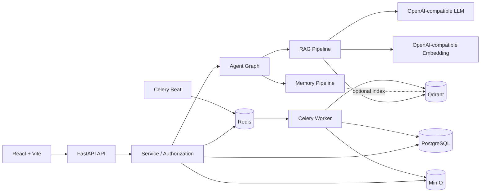

# Knowledge Work Assistant / Agentic RAG 企业知识工作助手

[](https://github.com/ShuoLiu0603/knowledge-work-assistant/actions/workflows/ci.yml)

[English](README_EN.md) | 简体中文

Knowledge Work Assistant 是一个面向企业知识场景的 Agentic RAG 工程化参考实现。项目将身份与权限、文档异步入库、混合检索、受控 Agent 编排、对话记忆、可追踪引用、后台任务恢复和治理审计整合为一套可运行的全栈系统。

**项目状态：工程参考实现，不是开箱即用的生产成品。** 当前代码适合架构研究、原型验证、内部技术评估和二次开发。API、数据模型及部署约定仍可能调整；面向真实业务上线前，必须完成本文列出的安全与运维加固。

> [!WARNING]
> 不要将开发 Compose 或示例凭据直接暴露到公网。开发模板包含本地默认密码，首个注册用户会成为引导管理员，前端当前将访问令牌与刷新令牌保存在 `localStorage`。生产部署必须替换全部密钥、限制网络入口、启用 TLS，并完成身份、令牌、监控、备份和灾难恢复设计。

## 产品能力

| 领域 | 当前实现 |
|---|---|
| 身份与权限 | 注册、登录、访问/刷新令牌、管理员角色、部门范围、知识库成员角色、L1-L5 文档密级 |
| 企业知识库 | 公开/私有知识库、成员管理、PDF/DOCX/TXT/Markdown/CSV 上传、文档状态与分块查看 |
| 知识问答 | Query Rewrite、子问题拆分、Dense + BM25、加权 RRF、上下文压缩、流式回答与引用 |
| Agent 编排 | `rag`、`memory`、`chat`、`summary`、`writing` 五类意图；LangGraph 或顺序执行后端 |
| 对话记忆 | Redis 短期记忆、会话增量摘要、PostgreSQL 长期记忆、可选 Qdrant 语义索引 |
| 记忆治理 | 自动候选、待审批、版本修订、软删除、恢复、永久删除、导出、索引校准与召回日志 |
| 管理与审计 | Agent trace、LLM 调用日志、检索日志、反馈、记忆事件、审计日志和管理指标 |

## 工程特性

- 固定 Agent 图和后端确定性路由约束，LLM 不具备任意工具调用权限。
- 权限过滤贯穿 Dense 与 BM25 两条检索链路，知识库证据与用户记忆严格分离。
- PostgreSQL 作为业务与长期记忆的权威数据源；Qdrant 仅承担可重建的向量索引。
- Celery durable job、幂等键、租约 fencing、指数退避和 Beat 扫描恢复覆盖主要异步失败窗口。
- 记忆写入包含证据约束、敏感信息检测、语义去重、乐观并发控制和完整事件记录。
- SSE 流式会话保留 Agent、检索、LLM 与消息之间的 provenance 关联。
- Alembic 迁移链、后端测试、Python 编译、前端构建和 Compose 校验由统一质量门禁执行。

## 架构



系统包含两条主要数据链路：

1. **文档入库**：上传原文到 MinIO，保存文档元数据，由 Celery 解析、切分、生成向量，并写入 PostgreSQL 与 Qdrant。
2. **对话执行**：提交用户消息，加载获准的会话与记忆上下文，识别意图，执行检索或相应 Agent 节点，流式返回回答，然后持久化日志、消息、摘要和记忆更新任务。

完整时序、事务边界、失败语义和数据模型见 [Agent 与记忆模块深度设计](docs/agent_memory_deep_dive.md)。

## 技术栈

- 后端：Python 3.12、FastAPI、SQLAlchemy 2、Alembic、Pydantic Settings、LangGraph、LangChain、Celery
- 前端：React 18、TypeScript、Vite、React Router、React Markdown、Nginx
- 基础设施：PostgreSQL 16、Redis 7、Qdrant、MinIO、Docker Compose
- 模型接口：OpenAI-compatible Chat Completions 与 Embeddings

## 前置条件

- Git
- Docker Engine 或 Docker Desktop，支持 Docker Compose v2
- 可访问的 OpenAI-compatible LLM API
- 可访问的 OpenAI-compatible Embedding API
- 执行本地质量门禁时还需要 Python 3.12、Node.js 22.12+ 和 npm

LLM 与 Embedding 不要求来自同一供应商。开发模板通过两组独立配置连接模型服务：`LLM_BASE_URL` / `LLM_API_KEY` / `LLM_MODEL` 与 `EMBEDDING_BASE_URL` / `EMBEDDING_API_KEY` / `EMBEDDING_MODEL`。

## 快速启动

### 1. 创建本地配置

PowerShell：

```powershell
Copy-Item .env.example .env
```

Bash：

```bash
cp .env.example .env
```

至少检查并替换以下模型配置：

```dotenv
LLM_BASE_URL=https://your-llm-service.example/v1
LLM_API_KEY=replace-me
LLM_MODEL=your-chat-model

EMBEDDING_BASE_URL=https://your-embedding-service.example/v1
EMBEDDING_API_KEY=replace-me
EMBEDDING_MODEL=your-embedding-model
EMBEDDING_DIMENSION=1024
```

`EMBEDDING_DIMENSION` 必须与模型实际输出一致。修改模型或维度后，需要重建对应的 Qdrant collection；已有向量不会自动迁移。

### 2. 启动开发环境

```bash
docker compose -f infra/docker-compose.yml --env-file .env up --build
```

| 服务 | 地址 |
|---|---|
| Web 应用 | http://localhost:5173 |
| 后端 API | http://localhost:8000/api |
| OpenAPI 文档 | http://localhost:8000/docs |
| 存活检查 | http://localhost:8000/api/health |
| 就绪检查 | http://localhost:8000/api/ready |
| Qdrant | http://localhost:6333 |
| MinIO Console | http://localhost:9001 |

停止服务：

```bash
docker compose -f infra/docker-compose.yml down
```

## 首次演示

1. 打开 http://localhost:5173 并注册用户。空数据库中的首个用户会成为引导管理员。
2. 创建一个私有知识库，例如“企业制度演示知识库”。
3. 上传 [demo/company_policy_demo.md](demo/company_policy_demo.md)，等待文档状态变为 `indexed`。
4. 在对话页面选择该知识库并提问：`住宿报销上限是多少？`
5. 检查回答引用、检索日志、Agent trace 和记忆面板，确认回答证据可追踪。

也可以在服务运行后执行自动化冒烟演示。脚本会创建临时用户和知识库，上传文档、提问、验证引用，并默认清理知识库：

```bash
python scripts/smoke_demo.py
```

## 配置

- [`.env.example`](.env.example)：本地开发模板，包含可运行的开发默认值和参数注释。
- [`.env.production.example`](.env.production.example)：生产参考模板，敏感项均为待替换占位符。
- [`config.py`](apps/backend/app/core/config.py)：后端配置类型、默认值、范围及跨参数校验的权威定义。

主要配置组包括应用与 CORS、PostgreSQL 连接池、Redis、Qdrant、MinIO、LLM、Embedding、Agent 并发与超时、混合检索、上下文压缩、短期/长期记忆、增量摘要、Celery 恢复、数据保留、文档切分和认证。

环境变量在进程启动时读取。修改后应重启 backend、worker 和 Beat。不要提交本地 `.env` 或任何真实凭据。


默认 Compose 流程假设配置文件是项目根目录的 `.env`。如果使用其他 `--env-file`，还必须将 `APP_ENV_FILE` 设为该文件相对 `infra/*.yml` 的路径，确保 Compose 插值与 backend/worker 读取同一份配置。

## 本地测试

安装后端和前端依赖：

```bash
python -m pip install -e apps/backend
npm --prefix apps/frontend ci
```

执行本地核心质量门禁：

```bash
python scripts/check_project.py
```

该命令运行后端测试、Python `compileall`、完整 Alembic 迁移验证、TypeScript/Vite 构建，以及开发与生产 Compose 配置校验。GitHub Actions 还会实际构建生产前端镜像，执行 Nginx 参数 preflight 和 `nginx -t`。服务已启动时可追加端到端冒烟测试：

```bash
python scripts/check_project.py --with-smoke
```

## 生产部署参考

生产 Compose 是单机部署参考，不是完整的平台化交付：

```bash
cp .env.production.example .env
docker compose -f infra/docker-compose.prod.yml --env-file .env config --quiet
docker compose -f infra/docker-compose.prod.yml --env-file .env up --build -d
```

启动链路会先执行 Alembic migration，再启动 backend、worker、单个 Beat 调度器和 Nginx 前端。详细说明见 [生产部署](docs/production_deployment.md)。

上线前至少完成以下工作：

- 使用密钥管理服务注入 PostgreSQL、MinIO、JWT、LLM 与 Embedding 凭据，并建立轮换流程。
- 在受控入口部署 TLS、精确 CORS、边缘限流/WAF；不要直接暴露数据库、Redis、Qdrant 或 MinIO 管理端口。
- 只向外发布前端/Nginx 入口，保持 backend 在内部网络，防止绕过代理限制与安全策略。
- 将刷新令牌迁移到 `Secure`、`HttpOnly`、适当 `SameSite` 的 Cookie，并评估 SSO/OIDC、MFA 与管理员治理。
- 建立集中日志、指标、分布式追踪、告警、审计归档和敏感数据脱敏。
- 为 PostgreSQL、MinIO、Qdrant 和 Redis 制定备份、恢复演练、保留周期和跨区域灾备策略。
- 固定并扫描容器镜像与依赖版本，补充 SBOM、漏洞扫描、文件恶意内容检测和供应链策略。
- 在真实基础设施上完成权限、并发、队列恢复、负载、故障注入和数据恢复测试。

## 目录结构

```text
apps/backend/app/   FastAPI、Agent、RAG、记忆、服务、数据模型与 Worker
apps/backend/tests/ 后端测试与回归测试
apps/frontend/src/  React 页面、组件、API client 与 SSE 处理
infra/              开发和生产 Docker Compose
docs/               可公开的架构、模块、API、评估与部署文档
demo/               演示文档与 RAG 评估数据
scripts/            质量门禁、迁移校验、冒烟演示与评估脚本
```

## 公开文档

- [Agent 与记忆模块深度设计](docs/agent_memory_deep_dive.md)
- [Agent 编排](docs/agent_orchestration.md)
- [RAG Pipeline](docs/rag_pipeline.md)
- [API 参考](docs/api.md)
- [架构图](docs/architecture_diagrams.md)
- [Prompt 设计](docs/prompts.md)
- [RAG 评估](docs/evaluation.md)
- [生产部署](docs/production_deployment.md)
- [演示数据](demo/README.md)

开发模式允许 `AUTO_CREATE_TABLES=true` 方便本地运行；生产必须使用 `AUTO_CREATE_TABLES=false` 和 Alembic。

## 已知限制

- 当前没有启用 cross-encoder reranker；检索融合依赖 Dense、BM25 与加权 RRF。
- 代码与开发模板默认关闭长期记忆 Qdrant 索引，生产模板默认开启；PostgreSQL 始终是权威数据源。
- 记忆只用于用户偏好、风格和对话连续性，不能作为企业事实证据。
- `summary` 与 `writing` 基于获准的知识库检索结果，不是任意粘贴文本处理器。
- Agent 流式并发限制按 Uvicorn 进程生效，不是跨副本的全局配额。
- 引用表示提供给模型的证据集合，不等同于逐句事实核验。
- 开发环境的首用户管理员机制仅适用于单实例引导；生产需要明确的管理员生命周期。
- 当前前端使用 `localStorage` 保存令牌；公网生产环境必须改造令牌存储与浏览器安全策略。
- 生产 Compose 面向单机参考场景，未提供多区域高可用、自动扩缩容或托管云资源编排。

## 许可证

仓库当前未包含开源许可证。在添加明确的 `LICENSE` 文件之前，源码默认不授予复制、修改或再分发许可。计划对外开放复用时，应先选择与依赖和发布目标一致的许可证。
