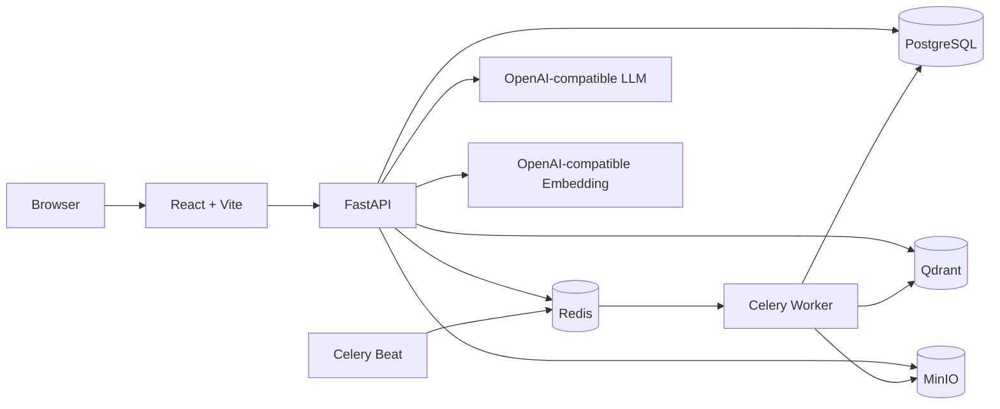

# Agentic RAG 企业知识库与长期记忆助手

[English](README_EN.md) | 简体中文

这是一个面向企业知识管理场景的全栈 Agentic RAG 项目。系统把用户与权限、文档异步入库、Hybrid Retrieval、可追溯引用、受控 Agent 编排、短期/长期记忆、异步可靠性和治理审计组合成一条可运行的工程链路。

本项目不是让 LLM 自由调用任意工具的开放式 Agent。Agent 只在固定图中完成记忆加载、意图识别、知识库检索、回答/总结/写作以及回答后的记忆更新，权限判断和持久化事务始终由后端控制。

## 核心能力

| 模块 | 能力 |
|---|---|
| 企业知识库 | 公开/私人知识库、成员角色、部门范围、L1-L5 文档密级 |
| 文档处理 | PDF、DOCX、TXT、Markdown、CSV，MinIO 原文存储，Celery 异步解析、切分和向量化 |
| RAG | Query Rewrite、子问题拆分、Dense + BM25、加权 RRF、上下文压缩、引用与 RetrievalLog |
| Agent | `rag / memory / chat / summary / writing` 五类意图，LangGraph 或顺序执行后端 |
| 记忆 | Redis 短期记忆、会话增量摘要、PostgreSQL 长期记忆、可选 Qdrant 记忆索引 |
| 记忆治理 | pending 审批、OCC revision、soft delete、restore、purge、export、reconcile、召回日志 |
| 可靠性 | durable memory jobs、幂等键、租约 fencing、指数退避、Celery Beat 恢复、外部清理任务 |
| 可观测性 | Agent trace、LLM 调用日志、检索候选与引用、记忆事件、召回指标、审计日志 |
| 前端 | 对话、知识库、文档、记忆管理和管理员控制台 |

## 系统架构



一次对话的主链路：

```text
提交 user Message
-> 加载会话摘要、最近消息与长期记忆
-> Supervisor 识别意图
-> RAG / Memory Answer / Chat / Summary / Writing
-> 保存 RetrievalLog、LLM logs 和 AgentRun
-> 保存 assistant Message 并补齐日志关联
-> 执行或投递长期记忆更新
-> 投递会话摘要更新
-> SSE done
```

完整状态、时序、失败语义和数据模型见 [Agent 与记忆模块深度设计文档](docs/agent_memory_deep_dive.md)。

## 技术栈

**后端**

- Python 3.12
- FastAPI、SQLAlchemy 2、Alembic、Pydantic Settings
- LangGraph、LangChain OpenAI-compatible adapters
- Celery、Redis
- PostgreSQL、Qdrant、MinIO

**前端**

- React 18、TypeScript、Vite
- React Router、React Markdown
- Nginx 生产静态服务与 `/api` 反向代理

## 快速启动

### 1. 准备环境变量

PowerShell：

```powershell
Copy-Item .env.example .env
```

Bash：

```bash
cp .env.example .env
```

至少替换以下值：

```dotenv
LLM_API_KEY=your-real-key
EMBEDDING_API_KEY=your-real-key
```

如果更换 Embedding 模型，必须同步修改 `EMBEDDING_DIMENSION`。已有 Qdrant collection 的向量维度不会自动迁移，模型或维度变更后应重建相关 collection 与索引。


### 2. 启动开发环境

```bash
docker compose -f infra/docker-compose.yml --env-file .env up --build
```

常用地址：

| 服务 | 地址 |
|---|---|
| Web 应用 | http://localhost:5173 |
| 管理员控制台 | http://localhost:5173/admin |
| 记忆管理 | http://localhost:5173/memories |
| 后端健康检查 | http://localhost:8000/api/health |
| 后端依赖就绪检查 | http://localhost:8000/api/ready |
| Qdrant | http://localhost:6333 |
| MinIO Console | http://localhost:9001 |

第一个注册用户会成为初始管理员。该行为用于单实例 bootstrap；正式部署后应立即建立明确的管理员治理流程。

停止服务：

```bash
docker compose -f infra/docker-compose.yml down
```

## 生产部署

```powershell
Copy-Item .env.production.example .env
```

必须替换 PostgreSQL、MinIO、JWT、LLM、Embedding 和 CORS 相关占位符。生产模式会拒绝默认密钥、SQLite、通配 CORS、`AUTO_CREATE_TABLES=true` 和占位凭证。

```bash
docker compose -f infra/docker-compose.prod.yml --env-file .env config --quiet
docker compose -f infra/docker-compose.prod.yml --env-file .env up --build -d
```

生产 Compose 会先执行 Alembic migration，然后启动 backend、worker、唯一一个 Beat 调度器和 Nginx 前端。Vite 的 `VITE_API_BASE_URL` 在镜像构建阶段注入，默认使用 Nginx 代理的 `/api`。

详细说明见 [生产部署文档](docs/production_deployment.md)。

## 环境变量与超参数

所有可调运行参数均集中在：

- [开发模板](.env.example)
- [生产模板](.env.production.example)
- 后端定义：[config.py](apps/backend/app/core/config.py)

| 参数组 | 示例 |
|---|---|
| 模型 | `LLM_MODEL`、各任务 temperature、timeout |
| Embedding | model、dimension、batch、timeout |
| Agent | stream concurrency、queue、deadline、conversation lease |
| Retrieval | Top-K、路线数、路线权重、RRF、BM25/Dense 预取 |
| Memory | TTL、召回阈值、上下文预算、编辑与候选上限 |
| Summary | token/message trigger、delta size、summary cap、lease |
| Worker | retries、backoff、visibility timeout、lease、恢复批量 |
| Storage | DB pool、Redis/Qdrant timeout、MinIO |
| Retention | AgentRun、LLM、Retrieval、Memory log/job 保留天数 |

以下内容有意不放入 `.env`：权限等级、状态机枚举、敏感信息正则、唯一记忆槽、数据库字段长度、Prompt、Qdrant payload 字段和 Redis Lua。这些属于安全规则或数据契约，修改它们通常需要代码审查和数据库迁移。

环境变量在进程启动时读取，修改后需要重启 backend、worker 和 Beat。

## 记忆控制

请求级 `memory_mode` 与部署级 `MEMORY_UPDATE_MODE` 是两套独立开关：

| 配置 | 含义 |
|---|---|
| `memory_mode=normal` | 本轮读取记忆，并允许短期记忆、摘要和长期更新 |
| `memory_mode=off` | 本轮不读取、不缓存、不摘要、不写长期记忆 |
| `memory_mode=auto` | 兼容旧客户端，根据“不要使用记忆”等文本标记决定 |
| `MEMORY_UPDATE_MODE=sync` | assistant 提交后在当前请求内更新长期记忆 |
| `MEMORY_UPDATE_MODE=async` | 创建 durable job，由 Celery 更新长期记忆 |
| `MEMORY_UPDATE_MODE=disabled` | 仍可读取记忆，但关闭长期记忆自动写入 |

记忆不会作为企业知识库事实证据。RAG、Summary 和 Writing 只能用经过权限校验的知识库检索结果支撑事实；记忆只影响风格、偏好和对话连续性。

## 数据库迁移

```bash
cd apps/backend
alembic upgrade head
```

开发模式允许 `AUTO_CREATE_TABLES=true` 方便本地运行；生产必须使用 `AUTO_CREATE_TABLES=false` 和 Alembic。


## 当前边界

- 当前没有真实 cross-encoder reranker，`reranker_enabled` 始终为 false。
- Qdrant 长期记忆索引默认关闭，PostgreSQL 始终是权威数据源。
- `summary` 和 `writing` 是基于知识库证据的任务，不是任意粘贴文本处理器。
- Agent stream concurrency 是每个 Uvicorn 进程的限制，不是跨实例全局配额。
- citations 表示提供给模型的证据集合，不等于逐句事实核验结果。
- 公网生产仍建议增加边缘限流、集中 metrics/tracing、真实基础设施集成测试和更安全的 refresh token Cookie 方案。
