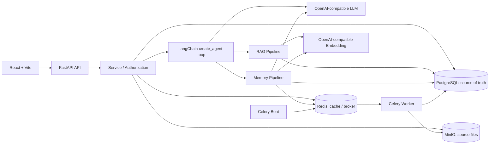

# Knowledge Work Assistant / Agentic RAG 企业知识工作助手

[](https://github.com/ShuoLiu0603/knowledge-work-assistant/actions/workflows/ci.yml)

English | [Chinese](README.md)

Knowledge Work Assistant is an engineering reference implementation for enterprise knowledge workflows. It combines identity and authorization, asynchronous document ingestion, hybrid retrieval, constrained Agent orchestration, conversational memory, traceable citations, background-job recovery, and governance auditing in a runnable full-stack system.

**Project status: engineering reference implementation, not turnkey production software.** It is intended for architecture study, prototyping, internal technical evaluation, and further development. Security, operational, load, and disaster-recovery validation is still required before handling real business data.

> [!WARNING]
> Do not expose the development Compose stack or example credentials to the public internet. The development template contains local defaults, the first registered user becomes the bootstrap administrator, and the frontend currently stores access and refresh tokens in `localStorage`. A production deployment must replace every secret, restrict network access, enable TLS, and establish identity, token, monitoring, backup, and disaster-recovery controls.

## Product Capabilities

| Area | Current implementation |
|---|---|
| Identity and authorization | Registration, login, access/refresh tokens, system administrators, one administrator per department, account lifecycle controls, department scope, knowledge-base membership, and L1-L5 document classification |
| Enterprise knowledge bases | Public/department/private knowledge bases; department knowledge bases are writable only by that department's administrator or a system administrator; PDF/DOCX/TXT/Markdown/CSV upload, document status, and chunk inspection |
| Knowledge assistance | Agent-authored search queries, Dense + BM25 retrieval, unweighted RRF, context compression, repeated retrieval, streaming answers, and citations |
| Agent orchestration | One LangChain `create_agent` loop; the model may answer directly or repeatedly call `memory(query)` and `rag(query)` as needed |
| Conversational memory | Redis short-term memory, incremental summaries, and long-term memory stored and recalled with PostgreSQL pgvector |
| Memory governance | Two-stage LLM candidate extraction and adjudication, pending approval, revisions, soft delete, restore, purge, export, index reconciliation, and recall logs |
| Administration and audit | Account creation, role/status/department management, safe deletion with external cleanup, department-administrator assignment, audit logs, and administrative metrics |

## Core Design

### Controlled Agent loop

- A single LangChain `create_agent` loop is used without a separate intent classifier. At each step, the model may answer directly or call `memory(query)` or `rag(query)`.
- Recent user/assistant turns are passed as typed message history. The dynamic System Prompt carries only the core profile, conversation summary, accumulated long-term memory, accumulated RAG evidence, and remaining budgets, avoiding duplicate conversation text.
- Full tool results remain in the current `AgentRunState` and are rebuilt into subsequent model context. Native `ToolMessage` objects carry only lightweight receipts to reduce duplicate tokens.
- The backend bounds model calls and filters available tools against total/per-tool budgets before every model call. It also disables parallel tool calls and removes tools from the final call; a second hard guard at tool execution remains a known limitation.

### Authorization-aware hybrid retrieval

```text
Agent query
→ knowledge-base / department / classification authorization
→ Dense(pgvector) + BM25(PostgreSQL)
→ unweighted RRF
→ context compression and token budget
→ accumulated evidence with stable citation numbers
→ final answer
```

Dense and BM25 apply the same authorization filters while building candidates. PostgreSQL stores documents, chunks, authorization truth, and embeddings; dense retrieval narrows the authorized scope before cosine ranking. Final citations can refer only to authorized chunks actually supplied to the model.

### Layered memory and two-stage writes

- Core Profile, conversation summary, and recent turns are loaded before answering. Ordinary long-term memory is recalled only when the Agent calls `memory(query)`.
- Ordinary memory uses PostgreSQL pgvector semantic recall by default and merges it with a bounded recent-candidate fallback. Repeated calls in one turn deduplicate by Memory ID before count and token budgets are applied.
- After the answer commits, the Candidate Extractor sees only the current turn. It receives no existing memories and cannot select a target ID.
- Every candidate is matched through exact hash, canonical key/category, pgvector related-memory retrieval, and bounded PostgreSQL candidate retrieval, then sent to a mandatory second Memory Judge for `independent/equivalent/refinement/replacement/uncertain/discard`; the service maps that relation to the final write action.
- Vector similarity only ranks a bounded top-K set. It has no relation threshold and cannot trigger an automatic semantic merge. `refinement/replacement` inherit the target memory's injection layer, slot, and canonical key; only `independent` uses the candidate classification to choose always-on or on-demand injection.
- Missing or invalid Judge decisions fail closed. Approved decisions still pass evidence, sensitivity, target ownership, exact-hash, revision, unique-constraint, and transaction checks.
- PostgreSQL is the sole store for long-term memories and their embeddings. Celery Beat can backfill missing or invalid active-memory embeddings daily.

Celery durable jobs, idempotency keys, fenced leases, exponential backoff, and Beat recovery scans cover the main asynchronous failure windows. SSE conversations preserve provenance across Agent runs, retrieval, LLM calls, and messages, while one quality gate covers migrations, backend regression, Python compilation, frontend builds, and Compose validation.

## Architecture



The system has three primary data paths:

1. **Document ingestion:** upload the source file to MinIO, persist document metadata, then let Celery parse, split, embed, and write the chunks and embeddings to PostgreSQL.
2. **Conversation execution:** commit the user message, load the core profile and authorized conversation context, then let the model answer directly or call Memory/RAG until it has enough evidence or reaches its budget.
3. **Post-answer memory update:** stage one extracts candidates only; the system retrieves related memories from PostgreSQL for each candidate; stage two adjudicates every candidate before deterministic backend rules and a database transaction may persist it.

See [Agent and Memory Deep Dive (Chinese)](docs/agent_memory_deep_dive.md) for the complete sequence, transaction boundaries, failure semantics, and data model.

## Evaluation and Reproducible Results

The table below presents only stable, clearly scoped results from the full rerun on 2026-07-15 that are suitable for a public project page. See [Project Metrics, Evaluation Protocols, and Resume Claims (Chinese)](docs/resume_metrics.md) for configuration, scoring rules, production-path diagnostics, and output files. Subset and LLM-judge results are not public leaderboard scores.

| Evaluation | Data scope | Current result | Measures |
|---|---|---:|---|
| BEIR/SciFact | Full test: 5,183 documents, 300 queries | Hybrid nDCG@10 **68.47%**, Recall@10 **83.22%**, MRR@10 **64.62%** | Dense/BM25/RRF retrieval ranking |
| Agent trajectory | 25 project golden cases × 3 runs | Strict trajectory **98.67% (74/75)**, tool type **100%** | Direct answers, Memory/RAG choice, repeated retrieval |
| RGB-derived Reader | Stratified 100-question subset | Overall success **84%**, official answer match **88%**, citation precision **99%** | Reading robustness with supplied documents |
| LongMemEval-S Reader | 30 questions, 14,841 historical turns | Turn Recall Any@5 **95.83%**, Recall All@5 **83.33%**, Top-5 QA **83.33%** | Single-pass memory retrieval and reading |
| Engineering quality gate | Production-container dependencies | **310/310** backend regressions, 24 Alembic revisions, production frontend build, and end-to-end smoke all passed | Reliability and deployability |

Primary reproduction commands:

```bash
python scripts/benchmark_beir_scifact.py --embedding-workers 8 --route-limit 15
python scripts/evaluate_agent_trajectory.py --workers 4
python scripts/evaluate_rgb_reader.py --per-task 25 --workers 4
python scripts/evaluate_longmemeval_memory.py --per-type 4 --abstention 6
```

`evaluate_rgb_agent_runtime.py` and `evaluate_longmemeval_agent_runtime.py` exercise the real production Agent/database/pgvector path. They require an isolated evaluation database. Never run evaluation seeding against production data.

## Technology Stack

- Backend: Python 3.12, FastAPI, SQLAlchemy 2, Alembic, Pydantic Settings, LangGraph, LangChain, and Celery
- Frontend: React 18, TypeScript, Vite, React Router, React Markdown, and Nginx
- Infrastructure: PostgreSQL 16 + pgvector, Redis 7, MinIO, and Docker Compose
- Model interfaces: OpenAI-compatible Chat Completions and Embeddings

## Prerequisites

- Git
- Docker Engine or Docker Desktop with Docker Compose v2
- Access to an OpenAI-compatible LLM API
- Access to an OpenAI-compatible Embedding API
- Python 3.12, Node.js 22.12+, and npm when running the quality gate locally

The LLM and Embedding services do not need to come from the same provider. The development template uses independent settings: `LLM_BASE_URL` / `LLM_API_KEY` / `LLM_MODEL` and `EMBEDDING_BASE_URL` / `EMBEDDING_API_KEY` / `EMBEDDING_MODEL`.

## Quick Start

### 1. Create the local configuration

PowerShell:

```powershell
Copy-Item .env.example .env
```

Bash:

```bash
cp .env.example .env
```

At minimum, review and replace the model settings:

```dotenv
LLM_BASE_URL=https://your-llm-service.example/v1
LLM_API_KEY=replace-me
LLM_MODEL=your-chat-model

EMBEDDING_BASE_URL=https://your-embedding-service.example/v1
EMBEDDING_API_KEY=replace-me
EMBEDDING_MODEL=your-embedding-model
EMBEDDING_DIMENSION=1024
```

`EMBEDDING_DIMENSION` must match the model output. Changing the model or dimension requires re-ingesting documents and regenerating long-memory embeddings; queries validate both model and dimension, so old vectors are not mixed in.


### 2. Start the development stack

```bash
docker compose -f infra/docker-compose.yml --env-file .env up --build
```

| Service | URL |
|---|---|
| Web application | http://localhost:5173 |
| Backend API | http://localhost:8000/api |
| OpenAPI documentation | http://localhost:8000/docs |
| Liveness | http://localhost:8000/api/health |
| Readiness | http://localhost:8000/api/ready |
| PostgreSQL + pgvector | localhost:5432 |
| MinIO Console | http://localhost:9001 |

Stop the stack:

```bash
docker compose -f infra/docker-compose.yml down
```

## First Demo

1. Open http://localhost:5173 and register a user. On an empty database, the first user becomes the bootstrap administrator.
2. Create a private knowledge base, for example `Enterprise Policy Demo`.
3. Upload [demo/company_policy_demo.md](demo/company_policy_demo.md) and wait until its status becomes `indexed`.
4. Select that knowledge base in the conversation page and ask: `住宿报销上限是多少？` (`What is the accommodation reimbursement limit?`).
5. Inspect the answer citations, retrieval log, Agent trace, and memory panel to verify evidence provenance.

With the stack running, the automated smoke demo creates a temporary user and knowledge base, uploads the document, asks the question, validates citations, and removes the knowledge base by default:

```bash
python scripts/smoke_demo.py
```

## Configuration

- [`.env.example`](.env.example): local development template with runnable defaults and parameter comments.
- [`.env.production.example`](.env.production.example): production reference template with placeholders for sensitive settings.
- [`config.py`](apps/backend/app/core/config.py): authoritative backend types, defaults, ranges, and cross-setting validation.

Configuration groups cover the application and CORS, PostgreSQL/pgvector pooling, Redis, MinIO, LLMs, Embeddings, Agent concurrency and deadlines, hybrid retrieval, context compression, short- and long-term memory, incremental summaries, Celery recovery, retention, document splitting, and authentication.

Key defaults in the current templates:

| Setting | Development / production template | Meaning |
|---|---:|---|
| `AGENT_MAX_MODEL_CALLS` | 6 | Hard model-call ceiling per turn; the final call is tool-free |
| `AGENT_MAX_TOOL_CALLS` | 4 | Declared combined Memory + RAG budget; tools are unbound before model calls |
| `AGENT_MAX_MEMORY_CALLS` / `AGENT_MAX_RAG_CALLS` | 2 / 3 | Declared per-tool budgets; a second hard guard at tool execution remains pending |
| `RETRIEVAL_TOP_K` / `RETRIEVAL_ROUTE_LIMIT` | 6 / 15 | Final evidence count / candidate depth per route |
| `SHORT_MEMORY_MAX_MESSAGES` | 16 | Recent-message cache window |
| `MEMORY_VECTOR_INDEX_ENABLED` | true | pgvector is used for answer recall and pre-update related-memory recall |
| `MEMORY_SEMANTIC_LIMIT` | 6 | Ordinary long-term memories returned per recall |
| `MEMORY_CONTEXT_MAX_LONG_MEMORIES` | 10 | Accumulated ordinary memories considered during formatting |
| `MEMORY_CONTEXT_MAX_TOKENS` | 1600 | Independent complete Memory-context budget |
| `MEMORY_UPDATE_MODE` | async | Durable Celery jobs by default; use `sync` only when debugging without a worker |

Environment variables are loaded at process startup. Restart the backend, worker, and Beat after changing them. Never commit a local `.env` file or real credentials.


The default Compose workflow assumes the configuration file is `.env` in the repository root. When using another `--env-file`, also set `APP_ENV_FILE` to that file's path relative to `infra/*.yml`; this keeps Compose interpolation and the backend/worker service environment on the same configuration source.

## Local Testing

Install backend and frontend dependencies:

```bash
python -m pip install -e apps/backend
npm --prefix apps/frontend ci
```

Run the local core quality gate:

```bash
python scripts/check_project.py
```

The gate currently runs 310 backend regression tests, Python `compileall`, full Alembic migration verification, the TypeScript/Vite build, and development/production Compose validation. The 2026-07-15 production-container run passed **310/310**. GitHub Actions additionally builds the production frontend image, runs the Nginx parameter preflight, and executes `nginx -t`. Add the end-to-end smoke demo when the stack is running:

```bash
python scripts/check_project.py --with-smoke
```

## Production Deployment Reference

The production Compose file is a single-host deployment reference, not a complete platform distribution:

```bash
cp .env.production.example .env
docker compose -f infra/docker-compose.prod.yml --env-file .env config --quiet
docker compose -f infra/docker-compose.prod.yml --env-file .env up --build -d
```

Startup runs Alembic migrations before the backend, worker, single Beat scheduler, and Nginx frontend. See [Production Deployment](docs/production_deployment.md) for operational details.

Complete at least the following hardening work before deployment:

- Inject PostgreSQL, MinIO, JWT, LLM, and Embedding credentials from a secret manager and establish rotation procedures.
- Put TLS, exact CORS, edge rate limiting, and a WAF in front of the application; do not expose database, Redis, or MinIO administration ports.
- Publish only the frontend/Nginx entry point and keep the backend on the internal network so proxy limits and security policy cannot be bypassed.
- Move refresh tokens to `Secure`, `HttpOnly` cookies with an appropriate `SameSite` policy, and evaluate SSO/OIDC, MFA, and administrator governance.
- Add centralized logs, metrics, distributed tracing, alerts, audit retention, and sensitive-data redaction.
- Define and test backup, restore, retention, and cross-region disaster-recovery procedures for PostgreSQL, MinIO, and Redis.
- Pin and scan container images and dependencies; add SBOM generation, vulnerability scanning, malicious-file inspection, and supply-chain controls.
- Run authorization, concurrency, queue recovery, load, fault-injection, and data-recovery tests against the target infrastructure.


## Repository Layout

```text
apps/backend/app/   FastAPI, Agent, RAG, memory, services, data models, and workers
apps/backend/tests/ Backend and regression tests
apps/frontend/src/ React pages, components, API client, and SSE handling
infra/              Development and production Docker Compose files
docs/               Public architecture, module, API, evaluation, and deployment docs
demo/               Demo documents and RAG evaluation data
scripts/            Quality gate, migration verification, smoke demo, and evaluation tools
```

## Public Documentation

- [Agent and Memory Deep Dive (Chinese)](docs/agent_memory_deep_dive.md)
- [Agent Orchestration (Chinese)](docs/agent_orchestration.md)
- [RAG Pipeline (Chinese)](docs/rag_pipeline.md)
- [API Reference (Chinese)](docs/api.md)
- [Architecture Diagrams (Chinese)](docs/architecture_diagrams.md)
- [Prompt Design (Chinese)](docs/prompts.md)
- [RAG Evaluation (Chinese)](docs/evaluation.md)
- [Project Metrics and Evaluation Protocols (Chinese)](docs/resume_metrics.md)
- [Production Deployment](docs/production_deployment.md)
- [Demo Data (Chinese)](demo/README.md)

## Limitations and deployment reminders

- No cross-encoder reranker is currently active; each `rag(query)` call fuses Dense and BM25 rankings with unweighted RRF.
- A pgvector memory-query failure falls back to a bounded PostgreSQL window, so a very old ordinary memory outside that window may be missed.
- Memory supports user preferences, style, and conversational continuity; it is never enterprise factual evidence.
- Tools are removed before a model call once their declared budgets are exhausted, but the tool execution entry point does not yet apply a second hard budget guard. A compatible model that repeats a historical tool call may exceed a declared per-tool budget; see the metrics document.
- Agent streaming concurrency is enforced per Uvicorn process, not as a global quota across replicas.
- Citations identify the evidence supplied to the model; they are not sentence-level fact verification.
- First-user administrator bootstrap is suitable only for single-instance initialization; production needs an explicit administrator lifecycle.
- The frontend currently stores tokens in `localStorage`; public production deployments require a hardened token and browser-security design.
- The production Compose stack targets a single-host reference scenario and does not provide multi-region high availability, autoscaling, or managed-cloud orchestration.

## License

MIT
