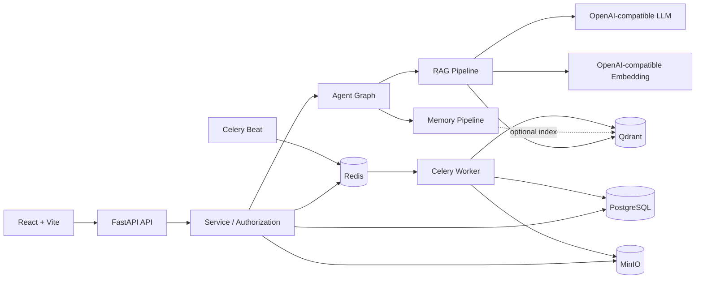

# Knowledge Work Assistant / Agentic RAG 企业知识工作助手

[](https://github.com/ShuoLiu0603/knowledge-work-assistant/actions/workflows/ci.yml)

English | [Chinese](README.md)

Knowledge Work Assistant is an engineering reference implementation for enterprise knowledge workflows. It combines identity and authorization, asynchronous document ingestion, hybrid retrieval, constrained Agent orchestration, conversational memory, traceable citations, background-job recovery, and governance auditing in a runnable full-stack system.

**Project status: engineering reference implementation, not turnkey production software.** The repository is intended for architecture study, prototyping, internal technical evaluation, and further development. APIs, data models, and deployment conventions may still change. Complete the security and operational hardening described below before using it with real business data.

> [!WARNING]
> Do not expose the development Compose stack or example credentials to the public internet. The development template contains local defaults, the first registered user becomes the bootstrap administrator, and the frontend currently stores access and refresh tokens in `localStorage`. A production deployment must replace every secret, restrict network access, enable TLS, and establish identity, token, monitoring, backup, and disaster-recovery controls.

## Product Capabilities

| Area | Current implementation |
|---|---|
| Identity and authorization | Registration, login, access/refresh tokens, administrator role, department scope, knowledge-base membership, L1-L5 document classification |
| Enterprise knowledge bases | Public/private knowledge bases, member management, PDF/DOCX/TXT/Markdown/CSV upload, document status, and chunk inspection |
| Knowledge assistance | Query rewriting, sub-question decomposition, Dense + BM25 retrieval, weighted RRF, context compression, streaming answers, and citations |
| Agent orchestration | Five intents: `rag`, `memory`, `chat`, `summary`, and `writing`; LangGraph or sequential execution backend |
| Conversational memory | Redis short-term memory, incremental summaries, PostgreSQL long-term memory, and an optional Qdrant semantic index |
| Memory governance | Automatic candidates, pending approval, revisions, soft delete, restore, purge, export, index reconciliation, and recall logs |
| Administration and audit | Agent traces, LLM call logs, retrieval logs, feedback, memory events, audit logs, and administrative metrics |

## Engineering Characteristics

- A fixed Agent graph and deterministic backend routing constrain model behavior; the LLM cannot invoke arbitrary tools.
- Authorization filters apply to both Dense and BM25 retrieval, while enterprise evidence remains separate from user memory.
- PostgreSQL is authoritative for business data and long-term memory; Qdrant contains rebuildable vector indexes.
- Celery durable jobs, idempotency keys, fenced leases, exponential backoff, and Beat recovery scans cover key asynchronous failure windows.
- Memory writes use evidence constraints, sensitive-data detection, semantic deduplication, optimistic concurrency control, and event history.
- SSE conversations preserve provenance across Agent runs, retrieval, LLM calls, and persisted messages.
- A single quality gate verifies Alembic migrations, backend behavior, Python compilation, frontend builds, and Compose configuration.

## Architecture



The system has two primary data paths:

1. **Document ingestion:** upload the source file to MinIO, persist document metadata, then let Celery parse, split, embed, and write data to PostgreSQL and Qdrant.
2. **Conversation execution:** commit the user message, load authorized conversation and memory context, classify intent, execute retrieval or the selected Agent node, stream the response, and persist logs, messages, summaries, and memory update jobs.

See [Agent and Memory Deep Dive (Chinese)](docs/agent_memory_deep_dive.md) for the complete sequence, transaction boundaries, failure semantics, and data model.

## Technology Stack

- Backend: Python 3.12, FastAPI, SQLAlchemy 2, Alembic, Pydantic Settings, LangGraph, LangChain, and Celery
- Frontend: React 18, TypeScript, Vite, React Router, React Markdown, and Nginx
- Infrastructure: PostgreSQL 16, Redis 7, Qdrant, MinIO, and Docker Compose
- Model interfaces: OpenAI-compatible Chat Completions and Embeddings

## Prerequisites

- Git
- Docker Engine or Docker Desktop with Docker Compose v2
- Access to an OpenAI-compatible LLM API
- Access to an OpenAI-compatible Embedding API
- Python 3.12, Node.js 22.12+, and npm when running the quality gate locally

The LLM and Embedding services do not need to come from the same provider. The development template uses independent settings: `LLM_BASE_URL` / `LLM_API_KEY` / `LLM_MODEL` and `EMBEDDING_BASE_URL` / `EMBEDDING_API_KEY` / `EMBEDDING_MODEL`.

## Quick Start

### 1. Create the local configuration

PowerShell:

```powershell
Copy-Item .env.example .env
```

Bash:

```bash
cp .env.example .env
```

At minimum, review and replace the model settings:

```dotenv
LLM_BASE_URL=https://your-llm-service.example/v1
LLM_API_KEY=replace-me
LLM_MODEL=your-chat-model

EMBEDDING_BASE_URL=https://your-embedding-service.example/v1
EMBEDDING_API_KEY=replace-me
EMBEDDING_MODEL=your-embedding-model
EMBEDDING_DIMENSION=1024
```

`EMBEDDING_DIMENSION` must match the model output. Changing the model or dimension requires rebuilding the corresponding Qdrant collection; existing vectors are not migrated automatically.


### 2. Start the development stack

```bash
docker compose -f infra/docker-compose.yml --env-file .env up --build
```

| Service | URL |
|---|---|
| Web application | http://localhost:5173 |
| Backend API | http://localhost:8000/api |
| OpenAPI documentation | http://localhost:8000/docs |
| Liveness | http://localhost:8000/api/health |
| Readiness | http://localhost:8000/api/ready |
| Qdrant | http://localhost:6333 |
| MinIO Console | http://localhost:9001 |

Stop the stack:

```bash
docker compose -f infra/docker-compose.yml down
```

## First Demo

1. Open http://localhost:5173 and register a user. On an empty database, the first user becomes the bootstrap administrator.
2. Create a private knowledge base, for example `Enterprise Policy Demo`.
3. Upload [demo/company_policy_demo.md](demo/company_policy_demo.md) and wait until its status becomes `indexed`.
4. Select that knowledge base in the conversation page and ask: `住宿报销上限是多少？` (`What is the accommodation reimbursement limit?`).
5. Inspect the answer citations, retrieval log, Agent trace, and memory panel to verify evidence provenance.

With the stack running, the automated smoke demo creates a temporary user and knowledge base, uploads the document, asks the question, validates citations, and removes the knowledge base by default:

```bash
python scripts/smoke_demo.py
```

## Configuration

- [`.env.example`](.env.example): local development template with runnable defaults and parameter comments.
- [`.env.production.example`](.env.production.example): production reference template with placeholders for sensitive settings.
- [`config.py`](apps/backend/app/core/config.py): authoritative backend types, defaults, ranges, and cross-setting validation.

Configuration groups cover the application and CORS, PostgreSQL pooling, Redis, Qdrant, MinIO, LLMs, Embeddings, Agent concurrency and deadlines, hybrid retrieval, context compression, short- and long-term memory, incremental summaries, Celery recovery, retention, document splitting, and authentication.

Environment variables are loaded at process startup. Restart the backend, worker, and Beat after changing them. Never commit a local `.env` file or real credentials.


The default Compose workflow assumes the configuration file is `.env` in the repository root. When using another `--env-file`, also set `APP_ENV_FILE` to that file's path relative to `infra/*.yml`; this keeps Compose interpolation and the backend/worker service environment on the same configuration source.
=======

## Local Testing

Install backend and frontend dependencies:

```bash
python -m pip install -e apps/backend
npm --prefix apps/frontend ci
```

Run the local core quality gate:

```bash
python scripts/check_project.py
```

The gate runs backend tests, Python `compileall`, full Alembic migration verification, the TypeScript/Vite build, and development/production Compose validation. GitHub Actions additionally builds the production frontend image, runs the Nginx parameter preflight, and executes `nginx -t`. Add the end-to-end smoke demo when the stack is running:

```bash
python scripts/check_project.py --with-smoke
```

## Production Deployment Reference

The production Compose file is a single-host deployment reference, not a complete platform distribution:

```bash
cp .env.production.example .env
docker compose -f infra/docker-compose.prod.yml --env-file .env config --quiet
docker compose -f infra/docker-compose.prod.yml --env-file .env up --build -d
```

Startup runs Alembic migrations before the backend, worker, single Beat scheduler, and Nginx frontend. See [Production Deployment](docs/production_deployment.md) for operational details.

Complete at least the following hardening work before deployment:

- Inject PostgreSQL, MinIO, JWT, LLM, and Embedding credentials from a secret manager and establish rotation procedures.
- Put TLS, exact CORS, edge rate limiting, and a WAF in front of the application; do not expose database, Redis, Qdrant, or MinIO administration ports.
- Publish only the frontend/Nginx entry point and keep the backend on the internal network so proxy limits and security policy cannot be bypassed.
- Move refresh tokens to `Secure`, `HttpOnly` cookies with an appropriate `SameSite` policy, and evaluate SSO/OIDC, MFA, and administrator governance.
- Add centralized logs, metrics, distributed tracing, alerts, audit retention, and sensitive-data redaction.
- Define and test backup, restore, retention, and cross-region disaster-recovery procedures for PostgreSQL, MinIO, Qdrant, and Redis.
- Pin and scan container images and dependencies; add SBOM generation, vulnerability scanning, malicious-file inspection, and supply-chain controls.
- Run authorization, concurrency, queue recovery, load, fault-injection, and data-recovery tests against the target infrastructure.

<<<<<<< HEAD
## Repository Layout

```text
apps/backend/app/   FastAPI, Agent, RAG, memory, services, data models, and workers
apps/backend/tests/ Backend and regression tests
apps/frontend/src/ React pages, components, API client, and SSE handling
infra/              Development and production Docker Compose files
docs/               Public architecture, module, API, evaluation, and deployment docs
demo/               Demo documents and RAG evaluation data
scripts/            Quality gate, migration verification, smoke demo, and evaluation tools
```

## Public Documentation

- [Agent and Memory Deep Dive (Chinese)](docs/agent_memory_deep_dive.md)
- [Agent Orchestration (Chinese)](docs/agent_orchestration.md)
- [RAG Pipeline (Chinese)](docs/rag_pipeline.md)
- [API Reference (Chinese)](docs/api.md)
- [Architecture Diagrams (Chinese)](docs/architecture_diagrams.md)
- [Prompt Design (Chinese)](docs/prompts.md)
- [RAG Evaluation (Chinese)](docs/evaluation.md)
- [Production Deployment](docs/production_deployment.md)
- [Demo Data (Chinese)](demo/README.md)
=======
## Known Limitations

- No cross-encoder reranker is currently active; retrieval fusion relies on Dense, BM25, and weighted RRF.
- The code and development template disable the long-term memory Qdrant index by default, while the production template enables it; PostgreSQL remains authoritative in both cases.
- Memory supports user preferences, style, and conversational continuity; it is never enterprise factual evidence.
- `summary` and `writing` operate on authorized knowledge-base retrieval, not arbitrary pasted text.
- Agent streaming concurrency is enforced per Uvicorn process, not as a global quota across replicas.
- Citations identify the evidence supplied to the model; they are not sentence-level fact verification.
- First-user administrator bootstrap is suitable only for single-instance initialization; production needs an explicit administrator lifecycle.
- The frontend currently stores tokens in `localStorage`; public production deployments require a hardened token and browser-security design.
- The production Compose stack targets a single-host reference scenario and does not provide multi-region high availability, autoscaling, or managed-cloud orchestration.

## License

This repository currently has no open-source license. Until an explicit `LICENSE` file is added, no permission to copy, modify, or redistribute the source code should be assumed. Select a license compatible with the dependencies and distribution goals before inviting external reuse.
