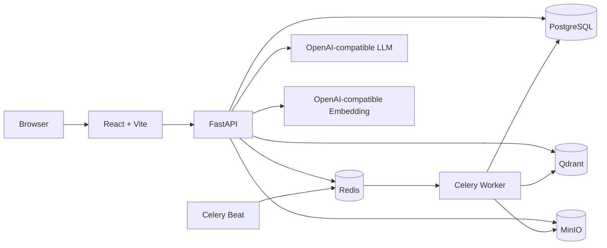

# Agentic RAG Enterprise Knowledge and Long-Term Memory Assistant

English | [简体中文](README.md)

This is a full-stack Agentic RAG project for enterprise knowledge management. It combines identity and access control, asynchronous document ingestion, hybrid retrieval, traceable citations, controlled Agent orchestration, short- and long-term memory, durable background jobs, and governance auditing.

The Agent is deliberately constrained. It does not allow an LLM to select arbitrary tools. A fixed graph loads memory, classifies intent, retrieves authorized evidence, answers or drafts content, and updates memory after the response. Authorization and transaction boundaries always remain in backend code.

## Capabilities

| Area | Capabilities |
|---|---|
| Enterprise knowledge | Public/private knowledge bases, membership roles, department scope, L1-L5 document classification |
| Document ingestion | PDF, DOCX, TXT, Markdown, CSV, MinIO storage, Celery parsing, chunking, and embedding |
| RAG | Query rewriting, sub-questions, Dense + BM25, weighted RRF, context compression, citations, RetrievalLog |
| Agent | Five intents: `rag / memory / chat / summary / writing`; LangGraph or sequential backend |
| Memory | Redis short-term history, incremental summaries, PostgreSQL long-term memory, optional Qdrant index |
| Governance | Pending approval, revision OCC, soft delete, restore, purge, export, reconcile, recall logs |
| Reliability | Durable jobs, idempotency keys, fenced leases, backoff, Celery Beat recovery, cleanup jobs |
| Observability | Agent traces, LLM logs, retrieval candidates, memory events, recall metrics, audit logs |
| Frontend | Chat, knowledge bases, documents, memory management, and administration |

## Architecture



Main conversation path:

```text
commit user Message
-> load summary, recent messages, and long-term memory
-> classify intent
-> RAG / Memory Answer / Chat / Summary / Writing
-> persist RetrievalLog, LLM logs, and AgentRun
-> commit assistant Message and attach logs
-> execute or enqueue long-term memory update
-> enqueue incremental conversation summary
-> SSE done
```

See [Agent and Memory Deep Dive](docs/agent_memory_deep_dive.md) for the complete state model, sequence, invariants, and failure semantics.

## Technology

**Backend:** Python 3.12, FastAPI, SQLAlchemy 2, Alembic, Pydantic Settings, LangGraph, LangChain, Celery, Redis, PostgreSQL, Qdrant, and MinIO.

**Frontend:** React 18, TypeScript, Vite, React Router, React Markdown, and Nginx for production.

## Quick Start

Create the local environment file:

```powershell
Copy-Item .env.example .env
```

Or on Bash:

```bash
cp .env.example .env
```

At minimum, replace:

```dotenv
LLM_API_KEY=your-real-key
EMBEDDING_API_KEY=your-real-key
```

When changing the embedding model, update `EMBEDDING_DIMENSION` as well. Existing Qdrant collections are not migrated automatically when the vector dimension changes.

Start the development stack:

```bash
docker compose -f infra/docker-compose.yml --env-file .env up --build
```

| Service | URL |
|---|---|
| Web application | http://localhost:5173 |
| Admin console | http://localhost:5173/admin |
| Memory management | http://localhost:5173/memories |
| Backend liveness | http://localhost:8000/api/health |
| Backend readiness | http://localhost:8000/api/ready |
| Qdrant | http://localhost:6333 |
| MinIO Console | http://localhost:9001 |

The first registered user becomes the bootstrap administrator. Establish an explicit administrator governance process for production.

Stop the stack:

```bash
docker compose -f infra/docker-compose.yml down
```

## Production

```powershell
Copy-Item .env.production.example .env
```

Replace every PostgreSQL, MinIO, JWT, LLM, embedding, and CORS placeholder. Production validation rejects default secrets, SQLite, wildcard CORS, `AUTO_CREATE_TABLES=true`, and placeholder credentials.

```bash
docker compose -f infra/docker-compose.prod.yml --env-file .env config --quiet
docker compose -f infra/docker-compose.prod.yml --env-file .env up --build -d
```

The production stack runs Alembic before starting the backend, worker, exactly one Beat scheduler, and the Nginx frontend. `VITE_API_BASE_URL` is injected at image build time and defaults to the Nginx `/api` proxy.

See [Production Deployment](docs/production_deployment.md).

## Environment Variables and Hyperparameters

All runtime tuning is defined in:

- [Development template](.env.example)
- Backend schema: [config.py](apps/backend/app/core/config.py)

| Group | Examples |
|---|---|
| Models | `LLM_MODEL`, per-task temperatures, timeouts |
| Embeddings | model, dimension, batch size, timeout |
| Agent | stream concurrency, queue size, deadline, conversation lease |
| Retrieval | Top-K, route count, weights, RRF, BM25/Dense prefiltering |
| Memory | TTL, recall thresholds, context budget, editor and candidate limits |
| Summary | token/message triggers, delta size, summary cap, lease |
| Worker | retries, backoff, visibility timeout, leases, recovery batch size |
| Storage | database pool, Redis/Qdrant timeouts, MinIO |
| Retention | AgentRun, LLM, retrieval, memory log, and job retention |

Security rules and data contracts are intentionally not environment variables. This includes permission levels, state-machine labels, sensitive-data regular expressions, singleton memory slots, database field lengths, prompts, Qdrant payload fields, and Redis Lua scripts. Changing those requires code review and often a migration.

Environment variables are read at process startup. Restart the backend, worker, and Beat after changing them.

## Memory Controls

Request-level `memory_mode` and deployment-level `MEMORY_UPDATE_MODE` are independent:

| Setting | Meaning |
|---|---|
| `memory_mode=normal` | Read memory and allow cache, summary, and long-term update for this turn |
| `memory_mode=off` | Do not read, cache, summarize, or update memory for this turn |
| `memory_mode=auto` | Legacy compatibility using no-memory text markers |
| `MEMORY_UPDATE_MODE=sync` | Update long-term memory after the assistant Message commits |
| `MEMORY_UPDATE_MODE=async` | Persist a durable job and let Celery update long-term memory |
| `MEMORY_UPDATE_MODE=disabled` | Memory can still be read, but automatic long-term writes are disabled |

Memory is never enterprise evidence. RAG, Summary, and Writing may use only authorized knowledge-base retrieval results for factual claims. Memory can affect style, preferences, and conversational continuity.

## Migrations and Quality Gate

```bash
cd apps/backend
alembic upgrade head
```

Development may use `AUTO_CREATE_TABLES=true`. Production must use `AUTO_CREATE_TABLES=false` and Alembic.

Run the complete quality gate:

```bash
python scripts/check_project.py
```

With a running stack, include the end-to-end smoke test:

```bash
python scripts/check_project.py --with-smoke
```

The gate covers backend tests, Python compileall, the Alembic migration chain, TypeScript/Vite build, and development/production Compose validation.


## Current Boundaries

- There is no active cross-encoder reranker; `reranker_enabled` is always false.
- The long-term memory Qdrant index is optional and disabled by default. PostgreSQL remains authoritative.
- `summary` and `writing` operate on retrieved knowledge-base evidence, not arbitrary pasted text.
- Agent stream concurrency is enforced per Uvicorn process, not globally across replicas.
- Citations represent evidence supplied to the model, not post-hoc sentence-level fact verification.
- Public deployments should still add edge rate limiting, centralized metrics/tracing, real-infrastructure integration tests, and a safer HttpOnly refresh-token cookie design.
