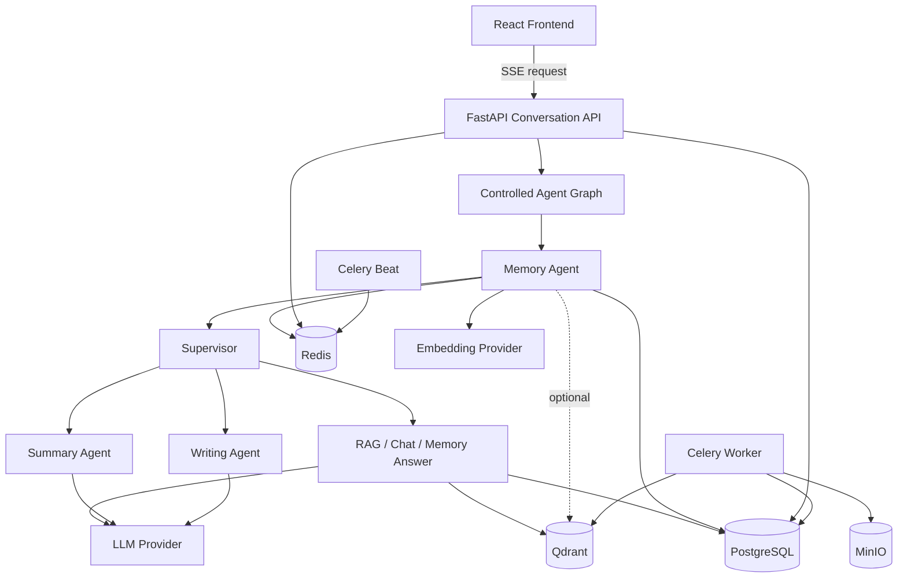
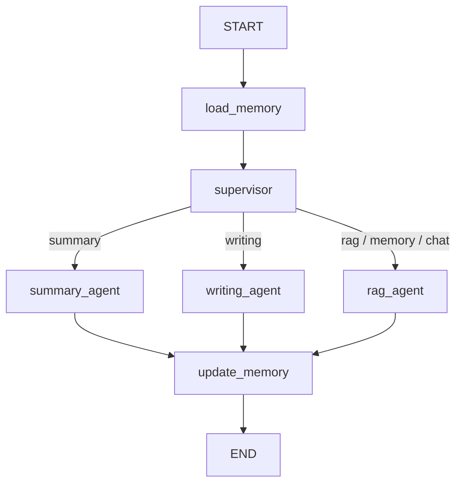
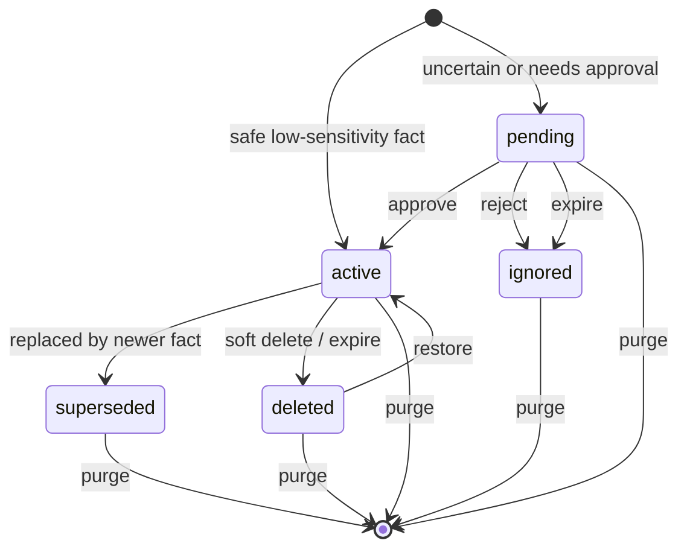
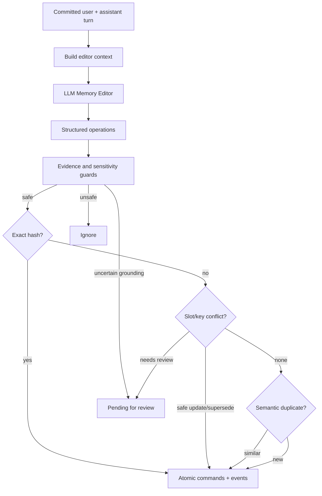

# Agent 与记忆模块深度设计文档

> 本文以当前代码实现为唯一事实来源，描述 Agent 编排、意图识别、一次对话的完整时序，以及记忆模块的数据模型、读写策略、隐私边界、异步可靠性和失败语义。
>
> 关键实现目录：`apps/backend/app/agents`、`apps/backend/app/memory`、`apps/backend/app/services`、`apps/backend/app/workers`。

## 1. 设计定位

本项目的 Agent 是受控的工作流编排层，不是开放式自主 Agent：

- LLM 不能任意选择工具或绕过服务层。
- 图结构、可走分支和每个节点的职责固定在代码中。
- 知识库范围、成员权限、文档密级和历史 provenance 由后端校验。
- PostgreSQL 是业务数据和长期记忆的权威来源。
- Redis 用于短期缓存、Celery broker、会话协调租约和任务状态。
- Qdrant 用于文档向量检索，也可作为长期记忆的可选加速索引。
- MinIO 保存上传的原始文档。
- Celery Worker 执行文档、记忆、摘要、清理和保留任务；Celery Beat 负责周期恢复。

核心不变量：

1. 记忆不是企业事实证据。
2. Agent 不能扩大当前用户的知识库访问范围。
3. `rag`、`summary`、`writing` 成功完成时必须存在真实 RetrievalLog。
4. 自动记忆只接受来自当前 user Message 的证据。
5. PostgreSQL memory row 是真相，Qdrant memory point 只是可重建索引。
6. 用户选择不使用记忆的对话轮不能进入记忆上下文或会话摘要。
7. 异步任务的重试不能让旧 worker 覆盖新 worker 的结果。

## 2. 总体架构



### 2.1 存储角色

| 组件 | 权威性 | 用途 | 失败后的行为 |
|---|---|---|---|
| PostgreSQL | 权威 | 用户、会话、消息、知识库、chunk、AgentRun、日志、长期记忆、任务 | 核心路径失败 |
| Redis | 非权威缓存 + 协调 | 短期记忆、Celery、会话租约、摘要租约 | 开发可部分降级；生产会话协调 fail-closed |
| Qdrant 文档 collection | 检索索引 | Dense 文档召回 | RAG 无法正常执行 Dense 路线 |
| Qdrant memory collection | 可选索引 | 长期记忆向量加速 | 回退 PostgreSQL 候选和本地排序 |
| MinIO | 原文存储 | 上传文档与删除清理 | 文档入库或原文操作失败 |

## 3. Agent 模块

### 3.1 关键文件

| 文件 | 职责 |
|---|---|
| `agents/state.py` | AgentGraphState、trace、取消和 deadline 检查 |
| `agents/graph.py` | LangGraph 与 sequential 两种执行后端 |
| `agents/supervisor.py` | 意图识别和路由归一化 |
| `agents/rag_agent.py` | RAG、Memory Answer、Chat 三类处理 |
| `agents/summary_agent.py` | 基于知识库证据的摘要 |
| `agents/writing_agent.py` | 基于知识库证据的写作 |
| `agents/memory_agent.py` | 回答前加载记忆、回答后更新记忆 |
| `services/agent_service.py` | 创建状态、运行图、保存 AgentRun、provenance 校验 |
| `services/conversation_service.py` | SSE、消息事务、线程、队列、并发和会话租约 |

### 3.2 AgentGraphState

一次 Agent run 的主要状态字段：

| 分组 | 字段 | 含义 |
|---|---|---|
| 身份 | `user_id` | 当前用户 |
| 检索范围 | `knowledge_base_id`、`search_scope`、`search_department_id` | 请求目标与范围 |
| 当前轮 | `input`、`conversation_id`、`message_id`、`top_k` | 用户问题和来源 user Message |
| 路由 | `intent` | `rag/memory/chat/summary/writing` |
| 回答 | `answer`、`citations` | 最终文本和引用 |
| 检索 | `retrieval_log_id`、`searched_knowledge_base_ids` | 真实检索记录和来源库 |
| LLM | `llm_log_id`、`llm_log_ids` | 本轮可计入的 LLM 日志 |
| 记忆输入 | `short_term_memory`、`profile_memories`、`long_term_memories`、`conversation_summary` | 四类记忆来源 |
| Prompt 上下文 | `memory_context` | 预算裁剪后的文本 |
| 记忆输出 | `memory_actions`、`defer_memory_update`、`memory_enabled` | 本轮记忆决定 |
| 控制 | `token_callback`、`cancel_event`、`deadline_monotonic` | 流式输出、取消和超时 |
| 可追溯性 | `trace`、`status`、`error_message` | 节点轨迹与结果 |

`ensure_agent_run_active()` 在关键节点前后检查：

- `cancel_event` 已设置时抛出 `AgentRunCancelled`。
- 当前 monotonic time 超过 deadline 时抛出 `AgentRunTimeout`。

完整 trace 的结构为：

```json
{
  "node": "supervisor",
  "action": "classify_intent",
  "input": {},
  "output": {}
}
```

### 3.3 图结构

实际 LangGraph：



注意：

- `memory` 和 `chat` 没有单独的 LangGraph 节点；它们都进入 `rag_agent`，再在节点内部按 intent 分支。
- `AGENT_GRAPH_BACKEND=sequential` 使用相同节点顺序，只是不依赖 LangGraph invoke。
- 非法 backend 名称会归一化回 `langgraph`。
- 当前每次运行都会构建并编译图，没有全局缓存 compiled graph。

### 3.4 意图识别

合法标签：

| Intent | 使用场景 | 是否检索知识库 |
|---|---|---|
| `rag` | 企业事实、制度、流程、文档问题；不确定时的默认值 | 是 |
| `memory` | 用户询问系统记住了自己的什么、姓名、偏好、项目背景 | 否 |
| `chat` | 寒暄、感谢、闲聊、情绪交流 | 否 |
| `summary` | 明确要求根据知识库信息总结 | 是 |
| `writing` | 明确要求根据知识库证据写邮件、报告、方案或文章 | 是 |

识别顺序：

1. Supervisor 先检查 full-memory-recall marker，例如“你记得我什么”“what do you remember”。命中后直接返回 `memory`。
2. 其他请求调用 `LlmProvider.classify_intent_with_metadata()`。
3. Provider 优先使用 `with_structured_output(IntentOutput)`。
4. 结构化调用失败时，退回普通 completion，再执行 Pydantic coercion。
5. 非法或无法归一化的标签回退为 `rag`。
6. 分类调用保存 `LlmCallLog(agent_name="supervisor")`。

分类温度由 `LLM_INTENT_TEMPERATURE` 控制，默认 `0.0`。

当前分类器只输出标签，不输出 confidence 和 reason。`normalize_intent(raw_intent, text)` 目前不会根据原始用户文本做第二次规则裁决；除 full-memory-recall marker 外，主要保护来自分类 Prompt、结构化 schema 和非法值回退 `rag`。

### 3.5 各意图执行语义

#### RAG

`rag_agent` 调用 `qa_service.build_rag_answer()`：

1. 解析用户可访问的检索范围。
2. 执行高级检索。
3. 把选中 chunk 组成受限上下文。
4. 调用 grounded answer Prompt。
5. 返回 answer、citations、RetrievalLog 和 LLM log。

#### Memory Answer

- 不搜索知识库。
- 只使用 `memory_context` 回答用户自身信息。
- 不返回知识库 citation。
- Prompt 禁止从记忆回答企业制度或文档事实。

#### Chat

- 不搜索知识库。
- 记忆只能用于语言、语气和连续性。
- 如果输入实际包含企业事实问题，Prompt 要求提示用户使用知识库检索，而不是猜测。

#### Summary

- 先按用户请求检索知识库证据。
- 再由 summarizer 对证据生成摘要。
- 记忆只影响语言、格式和详略。
- 当前不是任意粘贴文本摘要器；用户请求本身被当作检索问题。

#### Writing

- 先检索知识库证据，再生成草稿。
- 证据不足的事实应标记 `[needs evidence]` 或使用占位表达。
- 记忆只控制风格，不提供业务事实。

### 3.6 RAG 检索细节

```text
原始问题
-> 结构化 Query Rewrite
-> rewritten query + 最多 N 个 sub-query
-> 截断为 RETRIEVAL_MAX_ROUTE_QUERIES
-> 每条 query 同时走 Dense 与 BM25
-> SQL hydration 再校验 KB、document.status、security_level
-> 加权 RRF
-> Top-K
-> chunk 压缩
-> 总回答上下文裁剪
-> grounded answer
```

默认权重：

- original query：`1.2`
- rewritten query：`1.1`
- sub-query：`1.0`

`QUERY_REWRITE_MAX_SUBQUERIES=3` 理论上可产生 original + rewrite + 3 sub-query，但 `RETRIEVAL_MAX_ROUTE_QUERIES=4` 默认只保留前四条。这是显式的质量/成本上限。

Dense 命中不会直接信任 Qdrant payload。系统会按 chunk id 回 PostgreSQL hydration，并再次校验：

- chunk 属于目标知识库；
-文档状态为 `indexed`；
- 公开知识库文档密级不高于当前用户；
- 当前用户仍具有知识库访问权限。

当前没有真实 reranker，`reranker_enabled` 始终为 `false`。

### 3.7 Provenance 与 fail-closed

RetrievalLog 保存：

- scope 类型；
- 实际搜索的知识库 ID；
- 原始问题、rewrite、sub-questions 和 expanded queries；
- Dense/BM25 路线；
- candidates、selected chunks、RRF score、security level；
- 压缩节省字符数；
- 关联 conversation、source user Message，最终再关联 assistant Message。

Agent 图完成后，`run_agent()` 会重新读取真实 RetrievalLog，并用日志中的来源更新 `searched_knowledge_base_ids`。

对于 `rag`、`summary`、`writing`：

- 如果状态准备标记为 completed，但没有真实 RetrievalLog，run 会被改为 failed。
- answer 和 citations 会清空。
- 失败状态被持久化后再向调用方抛错。

历史读取也会重新校验 provenance。用户失去任一来源知识库权限后，对应 AgentRun、RetrievalLog 或 conversation history 会 fail-closed；列表接口过滤不可见项。无法恢复来源的旧多库记录同样不会放行。

## 4. 一次流式对话的完整流程

入口：

```http
POST /api/conversations/{conversation_id}/messages/stream
Authorization: Bearer <access-token>
Content-Type: application/json

{
  "question": "...",
  "top_k": 5,
  "memory_mode": "normal"
}
```

### 4.1 请求预处理

1. 去除问题首尾空白；空问题直接发送 SSE `error`。
2. 解析请求级 `memory_mode`：
   - `off` -> `memory_enabled=false`；
   - `normal` -> `memory_enabled=true`；
   - `auto` -> 根据 no-memory/do-not-remember marker 决定。
3. 读取 conversation，并校验它属于当前用户。
4. 重新校验 conversation 历史 provenance，避免撤权后继续读取旧内容。
5. 获取 conversation 级协调租约。
6. 获取当前 Uvicorn 进程的 stream capacity slot。

容量和租约都在 user Message 提交前获取，因此 busy、协调服务不可用或容量耗尽不会制造半轮消息。

### 4.2 会话协调与并发

同一 conversation 使用 Redis：

```text
SET agent:conversation:{conversation_id}:lease <random-token> NX EX <ttl>
```

释放时使用 Lua 比较 token，只有租约持有者能够删除 key。

默认 TTL：

```text
max(AGENT_STREAM_MIN_TIMEOUT_SECONDS,
    LLM_TIMEOUT_SECONDS * AGENT_STREAM_TIMEOUT_LLM_CALLS)
+ CONVERSATION_LEASE_GRACE_SECONDS
```

生产环境 Redis 协调失败返回 503，不回退到不安全的进程锁；开发环境允许使用单进程 Lock。

`AGENT_STREAM_MAX_CONCURRENCY` 是每个 Uvicorn 进程的容量上限。生产镜像默认两个 worker，因此默认主机理论上限为 `2 * AGENT_STREAM_MAX_CONCURRENCY`，它不是跨实例的全局限流器。

### 4.3 提交 user Message

1. 首轮问题用于生成 conversation title。
2. 创建 user Message，保存 `memory_enabled`。
3. 提交事务。
4. 发送 SSE `conversation`。
5. 发送 SSE `user_message`。
6. 如果本轮允许记忆，把 user 文本 best-effort 写入 Redis 短期缓存。
7. 发送粗粒度 SSE trace：`agent_graph started`。

user Message 在模型调用前提交。这样后续 Agent 失败仍能留下可审计的用户请求，但取消或断连也可能留下单独 user Message。

### 4.4 启动 Agent worker thread

主请求为 Agent 创建独立 SQLAlchemy Session 和 daemon Thread：

```text
SSE generator/main DB session
        |
        | bounded Queue
        v
Agent worker thread/worker DB session
```

Queue 容量由 `AGENT_STREAM_QUEUE_MAXSIZE` 控制。token producer 使用阻塞 put，消费者变慢时形成背压，不会无限积累 token。

Worker 调用：

```python
run_agent(
    ...,
    defer_memory_update=True,
    memory_enabled=memory_enabled,
    on_token=enqueue_token,
    cancel_event=cancel_event,
    deadline_monotonic=deadline,
)
```

流式会话始终先 defer 长期记忆写入，确保 assistant Message 提交前不会把未完成回答沉淀成用户记忆。

### 4.5 图内执行

#### 第一步：load_memory

Memory Agent：

1. 读取 Conversation.summary。
2. 从 PostgreSQL 读取 summary cursor 之后的消息，并至少覆盖最近 `SHORT_MEMORY_MAX_MESSAGES`。
3. Redis 只在数据库没有可用消息时作为 fallback。
4. 过滤 private/no-memory user + assistant 整轮。
5. 删除当前已提交的 user Message，避免同时出现在 `input` 和 history。
6. 召回 Profile 与相关长期记忆。
7. 写 UserMemoryRecallLog。
8. 按 token/char 预算组成 `memory_context`。

#### 第二步：supervisor

执行 full-memory marker 旁路或 LLM 结构化意图分类，保存 Supervisor LLM log。

#### 第三步：intent handler

- `rag`：高级检索 + grounded answer；
- `memory`：只基于 memory context 回答；
- `chat`：非知识库对话；
- `summary`：检索证据后总结；
- `writing`：检索证据后写作。

#### 第四步：update_memory

因为 `defer_memory_update=True`，这里只写：

```json
{
  "action": "deferred",
  "memory_id": null,
  "reason": "memory update deferred until the conversation turn is committed"
}
```

#### 第五步：持久化 AgentRun

`run_agent()`：

1. 验证状态和 RetrievalLog 不变量。
2. 创建 AgentRun。
3. 保存 answer、citations、intent、trace、state 和日志 ID。
4. 提交 AgentRun。
5. 把 run id 放入 Queue。

正常执行期间不会提前插入 `status=running` 的 AgentRun，因此数据库不能直接显示正在运行的请求。

### 4.6 主线程接收输出

主线程不断从 Queue 读取：

- `token` -> SSE `token`；
- `agent_run_id` -> 记录最终 run；
- `cancelled` -> 抛出取消；
- `error` -> 记录错误；
- `done` -> worker 已退出。

只有 RAG 最终回答当前使用 provider 的真实 streaming。Chat 和 Memory Answer 先获得完整 completion，再在本地拆分为 token；Summary/Writing 当前通常把完整结果作为一次 callback。

如果 provider 没有产生 token，conversation service 会把完整 answer 本地拆分，并以很短的间隔模拟流式显示。该模拟只影响传输体验，不改变持久化内容。

### 4.7 保存 assistant Message 与补齐关联

主 session 重新读取 AgentRun，然后：

1. 发送完整图 trace/status。
2. 发送第一次 `agent_run`。
3. 如有 RetrievalLog，发送 `retrieval_log`。
4. 发送 `citations`。
5. 创建 assistant Message，复制 answer、citations、Agent trace、token usage、error 和 `memory_enabled`。
6. 提交 assistant Message。
7. 把 `AgentRun.message_id` 从 source user Message 改为 assistant Message。
8. 把 `RetrievalLog.message_id` 改为 assistant Message。

两个 message id 的含义不同：

| 位置 | 最终指向 |
|---|---|
| `AgentRun.message_id` | assistant Message |
| `AgentRun.state.message_id` | source user Message |
| `RetrievalLog.message_id` | assistant Message |
| UserMemory provenance | source user Message |
| MemoryRecallLog | source user Message |
| MemoryUpdateJob | source user Message |

### 4.8 执行 deferred memory

assistant Message 与 AgentRun/RetrievalLog 关联提交后，`apply_deferred_memory_update()`：

1. 从 `AgentRun.state` 恢复 source user Message id。
2. 读取 user Message 的 `memory_enabled`。
3. 恢复 input、answer、intent 和检索来源。
4. 再次调用 `update_user_memories()`。
5. 把真实 `create/update/supersede/pending/ignore/queued` actions 写回 run state 和 trace。
6. 提交更新后的 AgentRun。

部署级模式：

- `sync`：当前请求内直接执行 Memory Editor 和数据库变更。
- `async`：创建 durable UserMemoryUpdateJob，再发送 Celery。
- `disabled`：写入 ignore action，不修改长期记忆。

Beat 的 deferred recovery 现在同时覆盖 `sync` 和 `async`：只要 assistant Message 已经提交、run 仍保留 deferred action，恢复任务就会补齐关联并重放。`disabled` 模式不会恢复写入。

### 4.9 短期记忆与摘要投递

若本轮允许记忆：

1. assistant 文本追加到 Redis 短期记忆。
2. conversation id 放入进程内有界摘要投递队列。
3. daemon dispatcher 调用 Celery summary task。

投递队列满、线程启动失败或 broker 暂时失败都不让主回答失败。Beat 会扫描 PostgreSQL 的 `message_count > summary_message_count`，恢复遗漏的摘要任务。

### 4.10 SSE 完成顺序

典型顺序：

```text
conversation
user_message
trace(started)
token*
trace(completed)
agent_run
retrieval_log?
citations
assistant_message
agent_run
retrieval_log?
done
```

第一次 AgentRun/检索日志用于尽快展示推理结果，第二次 payload 反映 assistant 关联和 deferred memory 更新后的最终状态。

### 4.11 事务边界

一轮对话不是单一大事务：

```text
user Message commit
-> RetrievalLog commit
-> retrieval audit commit
-> Supervisor/final LLM log commits
-> AgentRun commit
-> assistant Message commit
-> AgentRun association commit
-> RetrievalLog association commit
-> memory update/job commit
-> summary task commit
```

优点：长时间模型调用不会持有一个巨大事务，日志和恢复任务也有稳定落点。

代价：进程崩溃可能留下部分完成状态，因此需要 deferred action、幂等 memory job、消息关联恢复和 Beat 扫描补偿。

### 4.12 取消、超时与断连

- 总 deadline 为 `max(AGENT_STREAM_MIN_TIMEOUT_SECONDS, LLM_TIMEOUT_SECONDS * AGENT_STREAM_TIMEOUT_LLM_CALLS)`。
- 取消是协作式的，无法强制中断已经阻塞在第三方 SDK 内部的网络调用。
- SSE generator 关闭会设置 cancel event。
- capacity slot 转移给 worker 后，必须等 worker 真正退出才释放。
- 取消不会持久化 partial assistant answer。
- 断连可能留下单独 user Message。
- 如果 AgentRun 已提交但 assistant 尚未提交，run 可能暂时仍指向 user Message；deferred recovery 会等待 committed assistant，不会把不完整轮写入记忆。

### 4.13 主要错误响应

| 场景 | 行为 |
|---|---|
| Conversation busy | SSE error，409，不创建 Message |
| Stream capacity exhausted | SSE error，503，不创建 Message |
| 生产 Redis coordination unavailable | 503，不使用进程锁 |
| Agent timeout | 取消 worker，主请求失败 |
| 通用图异常 | 保存 failed AgentRun；流式路径尝试保存 failed assistant Message |
| Provenance 缺失 | 强制 run failed，清空 answer/citations |
| Memory 更新失败 | 主回答保持成功，action/trace 记录失败或 job failed |
| Summary 失败 | 主回答保持成功，Celery/Beat 重试 |

## 5. 记忆模块

### 5.1 模块定位

当前记忆系统是项目自研的分层 subsystem。LangGraph 负责执行顺序，但没有使用 LangGraph Store 或 checkpointer 作为长期记忆库。

```text
Working memory       Redis recent messages + PostgreSQL fallback
Conversation state   Conversation.summary + summary_message_count
Long-term memory     PostgreSQL UserMemory
Recall index         optional Qdrant memory collection
Governance           events, recall logs, update jobs, audit, retention
```

### 5.2 代码边界

| 模块 | 职责 |
|---|---|
| `memory/policy.py` | 状态、层、marker、分类、敏感检测、grounding、安全阈值 |
| `memory/short_term.py` | Redis 短期消息与 PostgreSQL fallback |
| `memory/context.py` | token/char 预算和四段上下文格式化 |
| `memory/retrieval.py` | sticky、semantic、lexical、vector 召回与去重 |
| `memory/repository.py` | 有界 SQL 查询和 recall log 写入 |
| `memory/editor.py` | candidate、operation、冲突决策与自动写入编排 |
| `memory/commands.py` | 原子 memory row 变更和事件记录 |
| `memory/events.py` | append-only UserMemoryEvent |
| `memory/jobs.py` | durable job 创建、dispatch claim、失败记录 |
| `memory/vector_index.py` | 可选 Qdrant memory point 增删查 |
| `memory/reconcile.py` | 过期、重复、冲突和向量漂移检查/修复 |
| `services/memory_service.py` | 兼容门面、跨模块事务和 API 用例 |
| `workers/memory_tasks.py` | job worker、summary worker、Beat recovery |

### 5.3 四类持久对象

#### UserMemory

主要字段：

| 字段 | 含义 |
|---|---|
| `id/user_id` | memory identity 与 owner |
| `content/normalized_content/content_hash` | 正文、规范化正文和 SHA-256 去重键 |
| `status` | active、pending、superseded、ignored、deleted |
| `kind/category` | preference/profile/project/instruction 与细分类 |
| `canonical_key` | 同一事实槽的稳定键 |
| `memory_layer` | profile/semantic/episodic/procedural |
| `profile_slot` | language、response_detail、current_role 等唯一槽 |
| `scope_type/scope_id` | 预留的作用域字段 |
| `pinned` | 是否按 sticky profile 对待 |
| `revision` | 乐观并发版本 |
| `expires_at` | 可选过期时间 |
| `source_conversation_id/source_message_id/source_text` | 来源 provenance |
| `embedding/embedding_model/embedding_dimension` | PostgreSQL 中的语义向量及元数据 |
| `merge_count/touched_count` | 合并和重复确认计数 |
| `superseded_by_id` | 替代该记忆的新 memory |
| `valid_at/invalid_at/created_at/updated_at/last_touched_at` | 生命周期时间 |
| `extra_metadata` | importance、reason 和治理扩展 |

#### UserMemoryEvent

每次 durable mutation 追加事件，记录 action、actor、reason 和治理快照。普通 memory event 可以包含正文快照，用于用户级导出和历史解释。

用户手工治理同时写全局 AuditLog，但 AuditLog 不保存 memory 正文、source text 或 content hash，降低管理员日志的敏感暴露。

#### UserMemoryRecallLog

一次召回记录：

- query；
- recall mode；
- requested/actual limit；
- active/selected count；
- threshold；
- 所有 candidate 的 route、score、selected；
- selected memory ids；
- conversation 和 source message provenance。

#### UserMemoryUpdateJob

异步写入任务保存：

- user/assistant 当前轮文本；
- conversation/message provenance；
- status、attempts、actions 和 error；
- lease token/expiry；
- dispatched/started/completed 时间。

`(user_id, message_id)` 唯一约束保证同一 user Message 最多对应一个 durable job。

### 5.4 当前真实的作用域与层

允许的 layer：

- `profile`
- `semantic`
- `episodic`
- `procedural`

但当前自动分类只生成 `profile` 或 `semantic`。`episodic/procedural` 目前主要是数据标签，召回时与其他 non-profile memory 走同一相关性路径，尚未形成独立存储或不同衰减策略。

`scope_type/scope_id` 已存在于数据库和 Qdrant payload，但公开创建 API 不允许用户选择 scope，正常创建默认：

```text
scope_type = user
scope_id   = user_id
```

当前召回也只按 `user_id` 隔离。因此项目已经有扩展基础，但不能宣称已经完整支持 project/thread/organization scoped memory。

`expires_at` 同样已建模，reconcile 能处理过期记录，但普通创建/编辑 API 暂未暴露该字段。

### 5.5 状态机



语义：

- `active`：可召回。
- `pending`：等待用户审批，不进入正常回答上下文。
- `superseded`：保留历史，但不再召回。
- `ignored`：明确拒绝或过期的提议。
- `deleted`：soft delete，可恢复，不召回。
- `purge`：物理删除 UserMemory row，并触发向量清理。

### 5.6 请求级与部署级开关

#### 请求级 memory_mode

| 值 | Message.memory_enabled | 会话层行为 |
|---|---:|---|
| `off` | false | 跳过读取、Redis、长期写入和摘要 |
| `normal` | true | 显式启用正常记忆流程 |
| `auto` | 按 marker | 兼容旧客户端文本控制 |

前端目前只发送 `normal` 或 `off`。

策略层仍把“不要记住 / do not remember”作为硬写入阻断：即使 Message flag 为 true，`process_user_memory()` 也返回 ignore。历史和摘要过滤还会识别 no-memory/do-not-remember marker，避免显式隐私文本重新进入 Prompt。这是 defense-in-depth；因此 `normal` 表示启用流程，不代表强制保存任何内容。

#### 部署级 MEMORY_UPDATE_MODE

| 值 | 长期记忆读取 | 长期记忆写入 |
|---|---:|---|
| `sync` | 是 | assistant 提交后同步执行 |
| `async` | 是 | durable job + Celery |
| `disabled` | 是 | 关闭自动写入 |

该参数只控制长期写入，不等价于用户的临时/无记忆模式。

### 5.7 短期记忆

Redis key：

```text
memory:short:{user_id}:{conversation_id}
```

写入操作：

```text
LPUSH payload
LTRIM 0 SHORT_MEMORY_MAX_MESSAGES-1
EXPIRE SHORT_MEMORY_TTL_SECONDS
```

每条内容最多 `SHORT_MEMORY_CONTENT_MAX_CHARS`。payload 包含 role、content、created_at。

关键边界：

- Redis 是缓存，不是对话权威来源。
- Redis 失败静默，回答继续使用 PostgreSQL Message。
- conversation 已有数据库消息时，历史窗口以数据库为准。
- 删除 conversation 后 best-effort 删除 Redis key。

### 5.8 会话历史窗口

读取逻辑不是简单固定最近 N 条：

1. 计算 conversation 总消息数。
2. 从 `summary_message_count` 之后开始，避免重复注入已经摘要的长历史。
3. 同时确保至少覆盖最近 `SHORT_MEMORY_MAX_MESSAGES`。
4. 过滤 `memory_enabled=false` 的 user/assistant pair。
5. 过滤 no-memory marker 对应的整轮。
6. 移除当前 source user Message，避免重复。

结果既保留尚未摘要的上下文，又限制 Prompt 无界增长。

### 5.9 会话增量摘要

Conversation 保存：

- `summary`
- `summary_message_count`

触发任一条件：

1. 未处理 token >= `CONVERSATION_SUMMARY_TRIGGER_TOKENS`；
2. 未处理 token >= `CONVERSATION_SUMMARY_MIN_TOKENS` 且消息数 >= `CONVERSATION_SUMMARY_MIN_MESSAGES`；
3. 未处理消息数 >= `CONVERSATION_SUMMARY_MAX_UNPROCESSED`。

处理规则：

- 最后一个尚无 assistant 的 user Message 暂不处理，也不推进 cursor。
- private/no-memory 整轮不进入摘要。
- 如果一批消息全部被过滤，保留旧 summary，但 cursor 可以前进，避免反复扫描。
- delta 按 `MEMORY_SUMMARY_DELTA_MAX_CHARS` 分批。
- 每批把 previous summary 与新 delta 交给 summarizer，形成滚动摘要。
- 最终 summary 截断到 `CONVERSATION_SUMMARY_MAX_CHARS`。
- `summary_message_count` 使用条件更新，旧任务不能覆盖新 cursor。

摘要投递有两层可靠性：

1. 请求内有界 dispatch queue 负责低延迟投递。
2. Beat 扫描数据库 cursor，恢复丢失的进程内或 broker 投递。

摘要 Celery task 使用每 conversation 的 Redis token lease，避免并发 LLM 调用。lease 时长至少为 `CONVERSATION_SUMMARY_LEASE_MIN_SECONDS`，并按 LLM timeout、最大未处理消息和 grace 动态放大。

### 5.10 长期记忆召回

Agent 目标召回：

- Profile/sticky：最多 `MEMORY_PROFILE_LIMIT`；
- 非 Profile semantic：目标 `MEMORY_SEMANTIC_LIMIT`；
- 本地 fallback 候选池：最多 `MEMORY_RECALL_CANDIDATE_LIMIT`。

#### Sticky/Profile 判定

满足任一条件即按 Profile/sticky 处理：

- `memory_layer=profile`；
- `pinned=true`；
- 存在 profile_slot；
- category 属于语言、格式、详略、身份、当前项目等 sticky 集合；
- kind 为 profile 或 instruction。

这些记忆优先进入上下文，不依赖当前 query 的相似度。

#### 默认语义阈值

写入合并阈值：

```text
MEMORY_SEMANTIC_THRESHOLD = 0.82
```

召回阈值：

```text
clamp(
  MEMORY_SEMANTIC_THRESHOLD * MEMORY_RECALL_THRESHOLD_FACTOR,
  MEMORY_RECALL_THRESHOLD_MIN,
  MEMORY_RECALL_THRESHOLD_MAX
)
```

默认结果为 `clamp(0.82 * 0.35, 0.20, 0.45) = 0.287`。

合并阈值高于召回阈值：召回可以容忍相关但不相同的内容；自动 merge 必须更保守。

#### Qdrant 关闭或无命中

1. PostgreSQL 读取 Profile 与 bounded recent active candidates。
2. 计算 query embedding。
3. 对 memory.embedding 做 cosine similarity。
4. 选择高于 recall threshold 的非 Profile memory。
5. sticky 在前，semantic 在后，按 recall limit 截断。

#### Qdrant 开启

1. query embedding。
2. Qdrant 按 `user_id + status=active` 过滤。
3. 只返回超过 threshold 的 point。
4. PostgreSQL 按 id 再校验 owner、status 和 expiry。
5. vector 结果与 bounded semantic 结果合并为 `hybrid`。

#### Embedding/Qdrant 失败

- Qdrant 失败 -> 本地 semantic。
- query embedding 失败 -> lexical ranking。
- lexical 无关 -> 只保留 sticky。
- 不会因为失败而把全部最近记忆无条件注入 Prompt。

#### Full recall

“你记得我什么”等 full recall marker：

- 跳过相关性阈值；
- sticky 优先；
- 最终 limit 至少 `MEMORY_FULL_RECALL_LIMIT`；
- 仍只返回 active、未过期、属于当前用户的记录。

可能的 recall mode：

```text
empty
full_recall
sticky_only
fallback_no_embedding
semantic
vector
hybrid
```

### 5.11 记忆上下文预算

最终 Prompt 中的 memory context 有四段：

```text
Stable preferences and profile
Relevant long-term memories
Conversation summary
Recent conversation
```

双重上限：

- `MEMORY_CONTEXT_MAX_TOKENS`
- `MEMORY_CONTEXT_MAX_CHARS`

默认权重：

| Section | Weight |
|---|---:|
| Profile | 0.25 |
| Long-term | 0.35 |
| Summary | 0.20 |
| Recent | 0.20 |

有内容的 section 至少得到 `MEMORY_CONTEXT_MIN_SECTION_TOKENS` 或 `MEMORY_CONTEXT_MIN_SECTION_CHARS`。空 section 只保留最小占位文本，剩余预算按 active section 权重重新分配。

裁剪顺序：

- Profile 按语言、格式、回复详略、身份和当前项目等优先级排序。
- 其他长期记忆按 category、kind、importance 排序。
- Recent 从最新向前选择，再恢复时间正序。
- 注入 LLM 的每条 memory 只包含 content；id、source 和 score 保留在 state/recall log，不进入最终 Prompt。

### 5.12 自动写入总流程



#### Editor 输入

LLM 收到：

- 当前 user Message；
- 当前 assistant answer；
- Profile memories；
- 相关 active candidates；
- pending memories；
- backward-compatible existing union。

允许 action：

```text
create
update
supersede
pending
ignore
```

允许 kind：

```text
preference
profile
project
instruction
```

LLM schema 可以返回多个 operation，但服务最多执行 `MEMORY_MAX_OPERATIONS`。

### 5.13 后端确定性安全校验

系统不信任 LLM 对 evidence、sensitivity 和 action 的自报结果。

#### Evidence 必须来自 user Message

1. evidence 与 user text 进行 Unicode NFKC、casefold 和空白归一化。
2. evidence 必须是 user Message 的精确子串。
3. assistant 文本不能成为用户事实来源。

#### Content 必须与 evidence 有实质重合

通过条件：

- content 包含 evidence；或
- evidence 包含 content；或
- 归一化英文词项/CJK bigram 的共享比例达到 `MEMORY_GROUNDING_OVERLAP_THRESHOLD`。

默认阈值为 `1/3`。

#### Sensitivity 必须为 low

- `low` 才可能自动 active/pending。
- `medium/high` 自动聊天写入一律 ignore。
- 未知 sensitivity 按 high fail-closed。

#### 确定性敏感检测

Marker/regex 拦截：

- token、password、secret、private key；
- 邮箱、电话、详细地址；
- 身份证、护照、私有标识符；
- 银行账户、银行卡、SWIFT/routing 信息；
- 医疗诊断和处方；
- 薪资和其他明显私密信息。

手工创建敏感 memory 必须显式 `confirm_sensitive=true`。自动聊天不能通过勾选或 LLM 输出绕过这一规则。

#### 安全决策

| 条件 | 结果 |
|---|---|
| evidence 不在 user Message | ignore |
| low、evidence 真实、content grounding 不足 | pending |
| medium/high 或命中敏感规则 | ignore |
| low、evidence 与 content 均 grounded | 进入去重/冲突流程 |

### 5.14 去重、touch、merge 与 supersede

#### Exact hash

相同 normalized content/hash：

- 不创建重复 row；
- `touched_count += 1`；
- 更新 last_touched_at/revision；
- 安全 create 命中 pending 时可以激活为 active。

#### Canonical key/Profile singleton

同 canonical key 或同 profile singleton slot 表示可能属于同一事实槽。

系统可以调用第二次 LLM conflict review，但 reviewer 只能：

```text
update
supersede
pending
ignore
```

它只能引用提供给它的 target id，不能 create 或猜测 id。review 失败、target 不合法或结论不安全时降级 pending。

#### Semantic merge

同 category 且 cosine similarity >= `MEMORY_SEMANTIC_THRESHOLD`，或属于同方向的语言/回复详略偏好时，可以 merge：

- 合并 content；
- 重新 embedding；
- `merge_count += 1`；
- `revision += 1`；
- 写 event。

#### Supersede

新事实明确替代旧 active memory 时：

- 创建/激活新 memory；
- 旧 memory -> superseded；
- 旧 memory.superseded_by_id -> 新 memory；
- 写双方事件。

数据库部分唯一索引为 active canonical key 和 active profile singleton 提供最后一道并发防线。

### 5.15 乐观并发控制

Memory Editor 上下文包含每条 memory 的 revision。

- 自动 update/supersede 在执行前校验 expected revision；陈旧操作不覆盖新状态。
- 手工 PATCH 必须携带 `expected_revision`。
- revision 不匹配返回 HTTP 409。

一轮 LLM 返回的多个 operation 共用一个事务。后续 operation 失败时，前面已执行的修改一并回滚，避免半批记忆。

### 5.16 Durable memory job

异步模式顺序：

```text
create/return idempotent job
-> commit job
-> atomic dispatch claim
-> broker delay(job_id)
-> worker atomic lease claim
-> Memory Editor transaction
-> complete/fail with matching lease token
```

#### 创建与幂等

- 先持久化 job，再尝试 broker dispatch。
- `(user_id,message_id)` 唯一；重复恢复返回同一 job。
- broker 失败不会删除 job，只清理 dispatch claim 并保存 error。

#### 同一用户顺序

worker 在处理某个 job 前检查该用户是否存在更早的 queued/processing job。后续 job 等待前序结束，避免“旧偏好”在“新偏好”之后落库。

#### 租约 fencing

claim 时：

- queued 或 lease 已过期的 processing -> processing；
- attempts++；
- 写随机 lease_token 和 lease_expires_at。

complete/fail 必须匹配当前 lease token。旧 worker 即使恢复运行，也不能覆盖新 worker 的结果。

#### 重试

- 业务异常按 `CELERY_TASK_MAX_RETRIES` 重试。
- delay 使用指数退避，受 initial/max backoff 控制。
- queue contention 或更早 job 未完成时不会误标永久失败。

生产校验要求：

```text
MEMORY_UPDATE_JOB_LEASE_SECONDS
>= (1 + MEMORY_MAX_OPERATIONS) * LLM_TIMEOUT_SECONDS
```

`1` 是首轮 Memory Editor，后续每个 operation 最坏可能触发一次 conflict review。

#### Beat 恢复

Beat 扫描：

- queued 且从未成功 dispatch；
- 明确 broker dispatch failure；
- processing lease 已过期；
- assistant 已提交但 AgentRun 仍为 deferred。

dispatch claim 和 lease 防止连续扫描造成投递风暴。

#### 用户重试

用户可以重试自己的 failed、明确未投递 queued 或过期 processing job。但只要存在更新的同用户 job，重放旧 job 返回 409，避免历史任务覆盖新事实。

### 5.17 Qdrant memory index 与 reconcile

Qdrant memory index 默认关闭：

```dotenv
MEMORY_VECTOR_INDEX_ENABLED=false
```

开启后 point payload 至少包含 user_id、memory_id、status、category、kind、canonical_key、layer、scope 和 revision。

写入顺序以 PostgreSQL 为先：

1. 数据库事务提交 memory。
2. best-effort upsert/delete Qdrant point。
3. 向量失败不回滚 PostgreSQL。

这会允许短暂漂移，因此提供 reconcile：

- 检查 missing point；
- 检查 stale revision/content；
- 检查 unexpected point；
- 检查过期 memory；
- 检查 exact/profile/semantic duplicate；
- dry-run 只报告；
- apply 执行修复并写 vector_sync/vector_delete event/audit。

当前 reconcile 不是 Beat 定时任务，需要用户或管理员显式调用。

### 5.18 删除、恢复与 purge

#### Soft delete

`DELETE /memories/{id}`：

- status -> deleted；
- 保留正文、事件、来源和审计；
- 不再召回；
- 可以 restore。

#### Restore

只接受 deleted memory：

- 重新执行治理字段推断；
- 处理 active canonical/profile 冲突；
- status -> active；
- revision++；
- 写 restore event/audit。

#### Purge

`DELETE /memories/{id}/purge`：

1. 把关联 event payload 改为 erased 摘要并解除 memory_id。
2. 从 recall log candidates/selected ids 去掉该 memory。
3. 脱敏能通过 memory id 关联的 job actions 与 job user/assistant text。
4. 递归脱敏 AgentRun state/trace 中的关联数据。
5. 物理删除 UserMemory row。
6. 创建 external cleanup job 删除 Qdrant point。
7. 保留不含正文/hash/source 的治理审计事实。

Purge 不删除原始聊天消息，也不能保证删除所有无法通过 memory id 建立关联的文本副本。

#### Conversation 删除

- Conversation 删除会 cascade Message。
- Redis short-term key best-effort 清理。
- UserMemory 的 source conversation/message FK 使用 `SET NULL`，长期记忆仍然存在，只是失去来源外键。

#### User 删除

UserMemory、event、recall log 和 update job 因 user_id cascade 删除。

### 5.19 保留策略

默认保留期：

| 数据 | 默认天数 |
|---|---:|
| LLM call logs | 90 |
| Retrieval logs | 90 |
| Agent runs | 90 |
| Memory recall logs | 90 |
| Memory update jobs | 30 |
| External cleanup jobs | 30 |

值为 `0` 表示关闭该目标的自动删除。

queued/processing memory jobs 不参与普通 retention；否则可能删除尚未完成的工作。UserMemoryEvent 当前没有独立自动 retention。

### 5.20 Memory API

| Method | Endpoint | 语义 |
|---|---|---|
| GET | `/api/memories` | 当前用户 memory 列表，可按 status |
| POST | `/api/memories` | 手工创建；敏感内容需确认 |
| PATCH | `/api/memories/{id}` | 带 expected_revision 编辑 |
| POST | `/api/memories/{id}/approve` | pending -> active |
| POST | `/api/memories/{id}/reject` | pending -> ignored |
| POST | `/api/memories/{id}/restore` | deleted -> active |
| DELETE | `/api/memories/{id}` | soft delete |
| DELETE | `/api/memories/{id}/purge` | 物理删除和外部清理 |
| GET | `/api/memories/export` | 导出 memories/events/recall logs/jobs |
| GET | `/api/memories/recall-metrics` | 用户级召回指标 |
| POST | `/api/memories/reconcile` | dry-run/apply 漂移和重复修复 |
| GET | `/api/memories/update-jobs` | 分页查看异步 job |
| POST | `/api/memories/update-jobs/{id}/retry` | 受顺序约束的重试 |

所有接口按 current user 过滤；不存在和越权统一返回 404。

`GET /memories` 不传 status 时只排除 deleted，仍可能返回 pending、superseded 和 ignored。前端完整记忆页默认显式筛选 active。

### 5.21 前端能力

完整 Memories 页面支持：

- 新增 content/category/kind；
- 敏感内容保存确认；
- 编辑 content/category/kind/status；
- 提交 revision；
- approve/reject/restore；
- soft delete/purge；
- status filter；
- export；
- 查看 queued/processing/failed job 并 retry。

高级 `canonical_key/memory_layer/profile_slot/pinned` 已进入 API 类型，但普通页面没有完整输入控件。Recall metrics 和 reconcile 目前也没有独立页面入口。

Chat 侧简化 MemoryPanel 的“删除”调用 soft delete；真正物理删除只在完整记忆治理页的 purge 操作中发生。

## 6. 失败语义

| 故障 | 主回答 | 回退/恢复 |
|---|---|---|
| Redis short cache 失败 | 继续 | PostgreSQL history |
| Redis conversation lease 在生产失败 | 拒绝 | HTTP 503，防止并发错序 |
| Memory Qdrant 失败 | 继续 | PostgreSQL semantic/lexical |
| Embedding 失败 | 继续或写入失败 | Recall 保留 sticky/lexical；写入按 sync/async 语义记录失败 |
| Recall log 写失败 | 继续 | rollback 日志事务，不丢回答 |
| Memory Editor LLM 失败 | 继续 | sync 写 ignore/trace；async retry 后 failed |
| Conflict reviewer 失败 | 继续 | 降 pending，不冒险 active |
| Memory DB transaction 失败 | 继续回答 | 整批 operation 回滚 |
| Qdrant memory sync 失败 | 继续 | PostgreSQL 保持成功；手工 reconcile |
| Summary dispatch 失败 | 继续 | Beat 按 cursor 恢复 |
| Summary LLM 失败/空结果 | 继续 | Celery retry + Beat |
| Broker dispatch memory job 失败 | 继续 | durable queued job + Beat |
| Worker 在 lease 期间死亡 | 继续 | lease 过期后重新 claim |
| Purge Qdrant 删除失败 | DB purge 成功 | external cleanup job failed/retryable |
| RAG RetrievalLog 缺失 | 不继续 | AgentRun failed，answer/citations 清空 |
| 撤销知识库权限 | 历史不可见 | fail-closed 404 或列表过滤 |

## 7. 环境变量与超参数

完整可复制值见项目根目录 `.env.example` 和 `.env.production.example`。Pydantic 会在启动时验证数值范围和跨参数关系。

### 7.1 应用、数据库和基础设施

| 变量 | 默认值 | 作用 |
|---|---:|---|
| `APP_ENV` | development | development/production 行为 |
| `APP_NAME` | agentic-rag-platform | FastAPI 应用名称 |
| `API_PREFIX` | /api | API 前缀 |
| `BACKEND_CORS_ORIGINS` | localhost origins | CORS 白名单 |
| `DATABASE_URL` | local SQLite | SQLAlchemy URL |
| `AUTO_CREATE_TABLES` | true | 开发自动建表；生产必须 false |
| `DATABASE_POOL_SIZE` | 5 | PostgreSQL pool 基础连接数 |
| `DATABASE_MAX_OVERFLOW` | 10 | pool 临时溢出连接数 |
| `DATABASE_POOL_TIMEOUT_SECONDS` | 30 | 等待连接超时 |
| `DATABASE_POOL_RECYCLE_SECONDS` | -1 | 连接回收；-1 关闭 |
| `DATABASE_POOL_PRE_PING` | true | 借出前检查连接 |
| `REDIS_URL` | localhost:6379/0 | cache、broker、lease |
| `REDIS_SOCKET_CONNECT_TIMEOUT_SECONDS` | 3 | Redis 建连超时 |
| `REDIS_SOCKET_TIMEOUT_SECONDS` | 3 | Redis 操作超时 |
| `QDRANT_URL` | localhost:6333 | Qdrant 地址 |
| `QDRANT_COLLECTION` | knowledge_chunks | 文档向量 collection |
| `MEMORY_QDRANT_COLLECTION` | user_memories | 记忆向量 collection |
| `MEMORY_VECTOR_INDEX_ENABLED` | false | 是否启用记忆 Qdrant 索引 |
| `QDRANT_TIMEOUT_SECONDS` | 10 | Qdrant SDK 超时 |
| `HEALTHCHECK_TIMEOUT_SECONDS` | 3 | readiness 外部依赖超时 |
| `MINIO_ENDPOINT` | localhost:9000 | MinIO 地址 |
| `MINIO_BUCKET` | documents | 原文 bucket |
| `MINIO_SECURE` | false | MinIO TLS |
| `TRANSFORMERS_VERBOSITY` | error | Transformer 依赖日志级别 |

`POSTGRES_*`、`MINIO_ACCESS_KEY/SECRET_KEY` 和 `VITE_API_BASE_URL` 也是 Compose/前端部署输入；它们不属于后端模型超参，但模板中同样完整列出。

### 7.2 LLM 与 Embedding

| 变量 | 默认值 | 作用 |
|---|---:|---|
| `LLM_PROVIDER` | openai_compatible | LLM adapter |
| `LLM_BASE_URL` | OpenAI API | 兼容端点 |
| `LLM_MODEL` | gpt-4o-mini | Chat model |
| `LLM_TIMEOUT_SECONDS` | 30 | 单次 LLM 请求超时 |
| `LLM_DEFAULT_TEMPERATURE` | 0.1 | 未指定任务温度 |
| `LLM_INTENT_TEMPERATURE` | 0.0 | 意图分类 |
| `LLM_SUMMARY_TEMPERATURE` | 0.2 | 摘要 |
| `LLM_WRITING_TEMPERATURE` | 0.3 | 写作 |
| `LLM_CHAT_TEMPERATURE` | 0.2 | Chat |
| `LLM_RAG_TEMPERATURE` | 0.2 | RAG answer |
| `LLM_MEMORY_ANSWER_TEMPERATURE` | 0.2 | Memory Answer |
| `LLM_MEMORY_EDITOR_TEMPERATURE` | 0.0 | Memory Editor/conflict/reconcile |
| `LLM_QUERY_REWRITE_TEMPERATURE` | 0.0 | Query planner |
| `EMBEDDING_PROVIDER` | openai_compatible | Embedding adapter |
| `EMBEDDING_MODEL` | text-embedding-3-small | Embedding model |
| `EMBEDDING_DIMENSION` | 384 | 向量维度 |
| `EMBEDDING_BATCH_SIZE` | 10 | 每批文本数 |
| `EMBEDDING_TIMEOUT_SECONDS` | 30 | Embedding 请求超时 |

生产模板中 API key 是强制替换的占位符，不应提交真实密钥。
