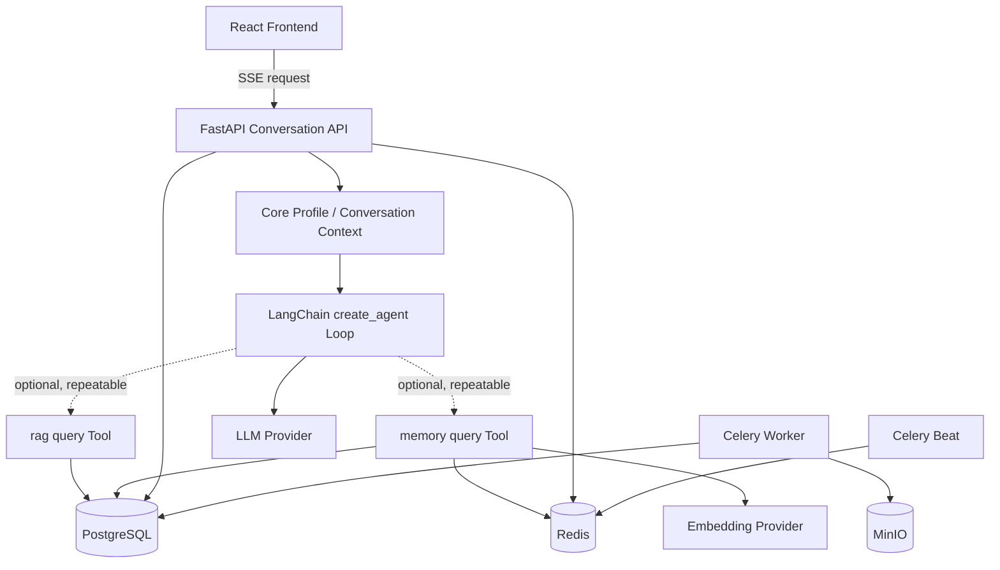
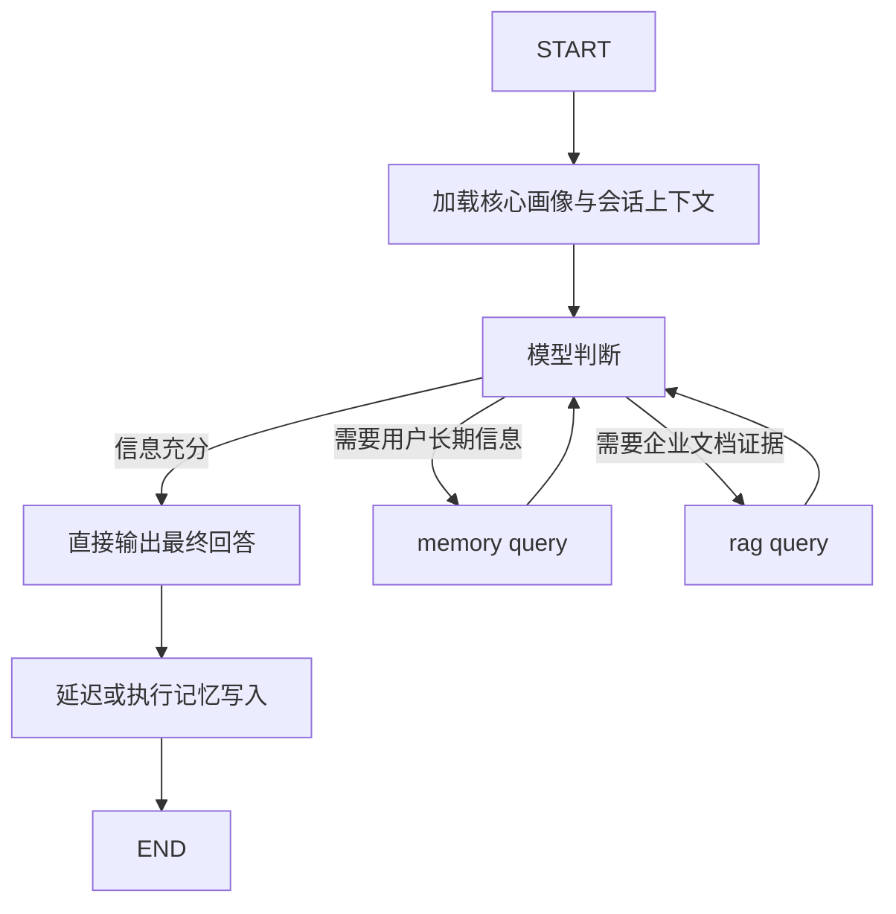
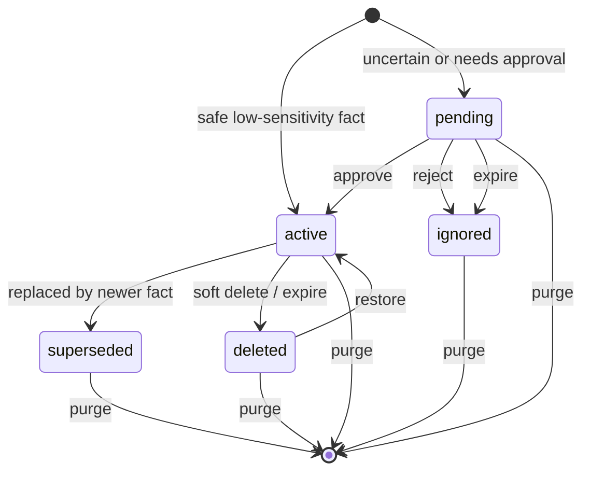
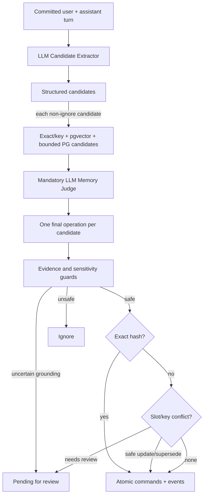

# Agent 与记忆模块深度设计文档

> 本文以当前代码实现为唯一事实来源，描述单 Agent 工具循环、一次对话的完整时序，以及记忆模块的数据模型、读写策略、隐私边界、异步可靠性和失败语义。
>
> 关键实现目录：`apps/backend/app/agents`、`apps/backend/app/memory`、`apps/backend/app/services`、`apps/backend/app/workers`。

## 1. 设计定位

本项目使用有边界的 Agentic 工具循环：

- LLM 可以直接回答，也可以多次调用 `memory(query)` 和 `rag(query)`；不存在独立意图分类器。
- LLM 不能增加工具、扩大检索范围或绕过服务层；模型调用有硬上限，工具总预算与分预算在每次模型调用前通过解绑工具实施。工具执行入口尚无第二道硬预算校验，这是当前已知边界。
- 知识库范围、成员权限、文档密级和历史 provenance 由后端校验。
- PostgreSQL 是业务数据和长期记忆的权威来源。
- Redis 用于短期缓存、Celery broker、会话协调租约和任务状态。
- PostgreSQL 的 pgvector 列用于文档与长期记忆的向量存储和检索；长期记忆语义召回默认启用，也可通过配置关闭。
- MinIO 保存上传的原始文档。
- Celery Worker 执行文档、记忆、摘要、清理和保留任务；Celery Beat 负责周期恢复。

核心不变量：

1. 记忆不是企业事实证据。
2. Agent 不能扩大当前用户的知识库访问范围。
3. 每次成功执行 `rag(query)` 都必须产生真实 RetrievalLog；发生过 RAG 的 completed run 必须保留检索 provenance。
4. 自动记忆只接受来自当前 user Message 的证据。
5. PostgreSQL memory row 与 embedding 在同一事务中保存，是长期记忆的唯一事实来源。
6. 用户选择不使用记忆的对话轮不能进入记忆上下文或会话摘要。
7. 异步任务的重试不能让旧 worker 覆盖新 worker 的结果。

## 2. 总体架构



### 2.1 存储角色

| 组件 | 权威性 | 用途 | 失败后的行为 |
|---|---|---|---|
| PostgreSQL + pgvector | 权威 | 用户、会话、消息、知识库、chunk、embedding、AgentRun、日志、长期记忆、任务 | 核心路径失败 |
| Redis | 非权威缓存 + 协调 | 短期记忆、Celery、会话租约、摘要租约 | 开发可部分降级；生产会话协调 fail-closed |
| MinIO | 原文存储 | 上传文档与删除清理 | 文档入库或原文操作失败 |

## 3. Agent 模块

### 3.1 关键文件

| 文件 | 职责 |
|---|---|
| `agents/state.py` | `AgentRunState`、trace、取消和 deadline 检查 |
| `agents/runtime.py` | LangChain `create_agent`、两个工具、动态 Prompt、预算和最终回答 |
| `agents/memory_agent.py` | 回答前只加载核心画像/会话上下文，工具调用时召回普通长期记忆，回答后更新记忆 |
| `services/qa_service.py` | 单次 RAG 工具调用的授权范围、混合检索、压缩和 RetrievalLog |
| `services/agent_service.py` | 创建状态、运行 Agent、保存 AgentRun、provenance 校验 |
| `services/conversation_service.py` | SSE、消息事务、线程、队列、并发和会话租约 |

### 3.2 AgentRunState

一次 Agent run 的主要状态字段：

| 分组 | 字段 | 含义 |
|---|---|---|
| 身份 | `user_id` | 当前用户 |
| 检索范围 | `knowledge_base_id`、`search_scope`、`search_department_id` | 请求目标与范围 |
| 当前轮 | `input`、`conversation_id`、`message_id`、`top_k` | 用户问题和来源 user Message |
| 回答 | `answer`、`citations` | 最终文本和引用 |
| 检索 | `retrieval_log_id`、`retrieval_log_ids`、`rag_chunks`、`rag_queries`、`searched_knowledge_base_ids` | 多次 RAG 的证据、日志和来源库 |
| LLM | `llm_log_id`、`llm_log_ids` | 本轮可计入的 LLM 日志 |
| 记忆输入 | `short_term_memory`、`profile_memories`、`long_term_memories`、`conversation_summary` | 四类记忆来源 |
| Prompt 上下文 | `short_term_memory`、`memory_context` | 前者转换为带角色的历史消息；后者是预算裁剪后的画像、摘要与按需长期记忆文本 |
| 循环 | `model_call_count`、`tool_call_count`、`memory_tool_call_count`、`rag_tool_call_count` | 总预算与分工具预算计数 |
| 工具历史 | `memory_queries`、`rag_queries`、`tool_observations`、`executed_tool_calls` | 防重复、审计和动态 Prompt 输入 |
| 记忆输出 | `memory_actions`、`defer_memory_update`、`memory_enabled` | 本轮记忆决定 |
| 控制 | `token_callback`、`cancel_event`、`deadline_monotonic` | 流式输出、取消和超时 |
| 可追溯性 | `trace`、`status`、`error_message` | 节点轨迹与结果 |

`ensure_agent_run_active()` 在关键节点前后检查：

- `cancel_event` 已设置时抛出 `AgentRunCancelled`。
- 当前 monotonic time 超过 deadline 时抛出 `AgentRunTimeout`。

完整 trace 的结构为：

```json
{
  "node": "agent_tool",
  "action": "rag",
  "input": {"query": "差旅审批制度", "tool_call": 2},
  "output": {"status": "success", "result_count": 5, "retrieval_log_id": "..."}
}
```

### 3.3 单 Agent 循环

`runtime.py` 用 LangChain `create_agent` 构建一个运行时；LangChain 内部使用 LangGraph 执行模型与工具之间的循环，但项目不再维护自定义 Graph、Supervisor 或多个 answer agent。



关键约束：

- 工具调用不是必经步骤；模型文本且没有 tool call 时即为最终回答。
- 每个模型回合最多保留一个 tool call，并设置 `parallel_tool_calls=false`。
- 同一工具的同一标准化 query 不会再次执行，但仍消耗总工具预算，防止坏循环。
- 默认配置为 6 次模型调用、4 次总工具调用，其中 Memory 2 次、RAG 3 次。模型调用是硬上限；工具预算在下一次模型调用前通过解绑工具实施。
- 最后一次模型调用以及检测到总工具预算耗尽后的下一次模型调用会移除全部工具，并要求基于已有上下文收口。兼容模型若重复发出历史 tool call，当前执行入口缺少二次硬校验，可能越过声明的工具分预算。

### 3.4 模型如何选择工具

没有独立 intent 标签、分类 Prompt 或路由器。每一轮模型调用都会获得：

- 原始用户请求；
- 作为真实 user/assistant 消息传入的最近对话；
- 动态 system Prompt 中的固定核心画像与会话摘要；
- 已按需召回的普通长期记忆；
- 所有 RAG 调用累计的企业证据与稳定引用编号；
- 前序 Memory/RAG query；
- 当前剩余的模型、总工具和分工具预算；
- 当前真正可用的工具集合。

工具执行后的完整结果保存在本轮 `AgentRunState` 中，并进入下一轮动态上下文；原生 `ToolMessage` 只返回 query、状态、结果数量、重复数量、错误和日志 ID 等轻量回执，避免与动态上下文重复携带正文。

Prompt 明确要求：画像或当前上下文已经足够时直接回答；个人事实缺失才调用 Memory；企业事实缺失才调用 RAG；Memory miss 不能成为搜索个人信息到 RAG 的理由。模型对检索结果不满意时可以用实质不同的 query 再查，但不能做只有同义词变化的无效重试。

### 3.5 两个工具的执行语义

#### `memory(query)`

- 只搜索当前用户的普通长期记忆，不包含已经固定注入的核心画像。
- 适用于项目、技术栈、历史决策、事件、工作流和普通偏好。
- 不搜索知识库，不产生企业引用，也不能作为企业制度事实证据。
- 每次调用会写召回日志，并把新命中的记忆合并到后续动态上下文。

#### `rag(query)`

- 只搜索服务层已经解析并授权的知识库范围，模型不能传入或修改 KB ID、部门或密级。
- 每次调用使用模型提供的一条独立 query，执行 Dense + BM25 + RRF，并产生独立 RetrievalLog。
- 多次调用的 chunk 按 ID 去重后累计；最终上下文在不同检索批次之间轮询取证，避免后一次检索挤掉前一次的关键证据。
- 企业声明只能来自这些证据，并使用稳定的 `[1]`、`[2]` 引用编号。

### 3.6 RAG 检索细节

```text
模型调用 rag(query)
-> 该 query 同时走 Dense 与 BM25
-> SQL hydration 再校验 KB、document.status、security_level
-> 无权重 RRF
-> Top-K
-> 必要时做可验证的抽取式压缩
-> 返回 Agent 循环重新判断
```

检索层不再执行 LLM Query Rewrite 或子问题拆解；换 query 和是否继续检索由外层 Agent 循环决定。每次 RAG 调用内部只处理一条 query，因此检索逻辑保持为清晰的“两路召回、一次融合”。

Dense 命中直接来自 PostgreSQL 的 chunk 行；融合前系统仍按 chunk id 读取权威数据，并再次校验：

- chunk 属于目标知识库；
- 文档状态为 `indexed`；
- 公开知识库文档密级不高于当前用户；
- 当前用户仍具有知识库访问权限。

当前没有真实 reranker，`reranker_enabled` 始终为 `false`。

### 3.7 Provenance 与 fail-closed

RetrievalLog 保存：

- scope 类型；
- 实际搜索的知识库 ID；
- 本次工具调用实际使用的 query；
- Dense/BM25 路线；
- candidates、selected chunks、RRF score、security level；
- 压缩节省字符数；
- 关联 conversation、source user Message，最终再关联 assistant Message。

Agent 完成后，`run_agent()` 保留全部 `retrieval_log_ids`，合并每次检索的 `searched_knowledge_base_ids`，并把所有日志关联到最终 assistant Message。

对于发生过 RAG 的 run：

- 如果状态准备标记为 completed，但没有真实 RetrievalLog，run 会被改为 failed。
- answer 和 citations 会清空。
- 失败状态被持久化后再向调用方抛错。

历史读取也会重新校验 provenance。用户失去任一来源知识库权限后，对应 AgentRun、RetrievalLog 或 conversation history 会 fail-closed；列表接口过滤不可见项。无法恢复来源的旧多库记录同样不会放行。

## 4. 一次流式对话的完整流程

入口：

```http
POST /api/conversations/{conversation_id}/messages/stream
Authorization: Bearer <access-token>
Content-Type: application/json

{
  "question": "...",
  "top_k": 5,
  "memory_mode": "normal"
}
```

### 4.1 请求预处理

1. 去除问题首尾空白；空问题直接发送 SSE `error`。
2. 解析请求级 `memory_mode`：
   - `off` -> `memory_enabled=false`；
   - `normal` -> `memory_enabled=true`；
   - `auto` -> 根据 no-memory/do-not-remember marker 决定。
3. 读取 conversation，并校验它属于当前用户。
4. 重新校验 conversation 历史 provenance，避免撤权后继续读取旧内容。
5. 获取 conversation 级协调租约。
6. 获取当前 Uvicorn 进程的 stream capacity slot。

容量和租约都在 user Message 提交前获取，因此 busy、协调服务不可用或容量耗尽不会制造半轮消息。

### 4.2 会话协调与并发

同一 conversation 使用 Redis：

```text
SET agent:conversation:{conversation_id}:lease <random-token> NX EX <ttl>
```

释放时使用 Lua 比较 token，只有租约持有者能够删除 key。

默认 TTL：

```text
max(AGENT_STREAM_MIN_TIMEOUT_SECONDS,
    LLM_TIMEOUT_SECONDS * AGENT_STREAM_TIMEOUT_LLM_CALLS)
+ CONVERSATION_LEASE_GRACE_SECONDS
```

生产环境 Redis 协调失败返回 503，不回退到不安全的进程锁；开发环境允许使用单进程 Lock。

`AGENT_STREAM_MAX_CONCURRENCY` 是每个 Uvicorn 进程的容量上限。生产镜像默认两个 worker，因此默认主机理论上限为 `2 * AGENT_STREAM_MAX_CONCURRENCY`，它不是跨实例的全局限流器。

### 4.3 提交 user Message

1. 首轮问题用于生成 conversation title。
2. 创建 user Message，保存 `memory_enabled`。
3. 提交事务。
4. 发送 SSE `conversation`。
5. 发送 SSE `user_message`。
6. 如果本轮允许记忆，把 user 文本 best-effort 写入 Redis 短期缓存。
7. 发送粗粒度 SSE trace：`agent_runtime started`。

user Message 在模型调用前提交。这样后续 Agent 失败仍能留下可审计的用户请求，但取消或断连也可能留下单独 user Message。

### 4.4 启动 Agent worker thread

主请求为 Agent 创建独立 SQLAlchemy Session 和 daemon Thread：

```text
SSE generator/main DB session
        |
        | bounded Queue
        v
Agent worker thread/worker DB session
```

Queue 容量由 `AGENT_STREAM_QUEUE_MAXSIZE` 控制。token producer 使用阻塞 put，消费者变慢时形成背压，不会无限积累 token。

Worker 调用：

```python
run_agent(
    ...,
    defer_memory_update=True,
    memory_enabled=memory_enabled,
    on_token=enqueue_token,
    cancel_event=cancel_event,
    deadline_monotonic=deadline,
)
```

流式会话始终先 defer 长期记忆写入，确保 assistant Message 提交前不会把未完成回答沉淀成用户记忆。

### 4.5 Agent 内执行

#### 第一步：加载核心记忆上下文

`load_core_memory_context()`：

1. 读取 Conversation.summary。
2. 从 PostgreSQL 读取 summary cursor 之后的消息，并至少覆盖最近 `SHORT_MEMORY_MAX_MESSAGES`。
3. Redis 只在数据库没有可用消息时作为 fallback。
4. 过滤 private/no-memory user + assistant 整轮。
5. 删除当前已提交的 user Message，避免同时出现在 `input` 和 history。
6. 只加载核心 Profile；普通长期记忆保持为空。
7. 将过滤后的最近对话保留为带角色的消息，并按 token/char 预算组成不含最近对话正文的初始 `memory_context`。

#### 第二步：模型与工具循环

模型先判断当前上下文是否足以回答。需要用户长期信息时调用 `memory(query)`；需要企业证据时调用 `rag(query)`；每次工具返回后重新综合判断。所有模型调用记录 `LlmCallLog(agent_name="agent_runtime")`，每次 RAG 与 Memory 分别保留检索/召回日志。

#### 第三步：最终回答

模型不再调用 answer 工具；没有 tool call 的模型文本就是最终回答。若达到预算，最后一次调用没有工具，只能基于当前画像、召回记忆和累计 RAG 证据回答，证据不足时必须明确说明未检索到足够信息。

#### 第四步：update_memory

因为 `defer_memory_update=True`，这里只写：

```json
{
  "action": "deferred",
  "memory_id": null,
  "reason": "memory update deferred until the conversation turn is committed"
}
```

#### 第五步：持久化 AgentRun

`run_agent()`：

1. 验证状态和 RetrievalLog 不变量。
2. 创建 AgentRun。
3. 保存 answer、citations、trace、state、全部 LLM log ID 和 RetrievalLog ID。
4. 提交 AgentRun。
5. 把 run id 放入 Queue。

正常执行期间不会提前插入 `status=running` 的 AgentRun，因此数据库不能直接显示正在运行的请求。

### 4.6 主线程接收输出

主线程不断从 Queue 读取：

- `token` -> SSE `token`；
- `agent_run_id` -> 记录最终 run；
- `cancelled` -> 抛出取消；
- `error` -> 记录错误；
- `done` -> worker 已退出。

当前 Agent 通过非流式模型调用获得完整最终回答，再由 `emit_final_answer()` 和 conversation service 将文本分块发送为 SSE `token`。因此这里的“流式”是传输层渐进展示，不是 provider 原生 token streaming；它不改变最终持久化内容。

### 4.7 保存 assistant Message 与补齐关联

主 session 重新读取 AgentRun，然后：

1. 发送完整图 trace/status。
2. 发送第一次 `agent_run`。
3. 如有 RetrievalLog，发送 `retrieval_log`。
4. 发送 `citations`。
5. 创建 assistant Message，复制 answer、citations、Agent trace、token usage、error 和 `memory_enabled`。
6. 提交 assistant Message。
7. 把 `AgentRun.message_id` 从 source user Message 改为 assistant Message。
8. 把 `RetrievalLog.message_id` 改为 assistant Message。

两个 message id 的含义不同：

| 位置 | 最终指向 |
|---|---|
| `AgentRun.message_id` | assistant Message |
| `AgentRun.state.message_id` | source user Message |
| `RetrievalLog.message_id` | assistant Message |
| UserMemory provenance | source user Message |
| MemoryRecallLog | source user Message |
| MemoryUpdateJob | source user Message |

### 4.8 执行 deferred memory

assistant Message 与 AgentRun/RetrievalLog 关联提交后，`apply_deferred_memory_update()`：

1. 从 `AgentRun.state` 恢复 source user Message id。
2. 读取 user Message 的 `memory_enabled`。
3. 恢复 input、answer、memory_enabled 和检索来源。
4. 再次调用 `update_user_memories()`。
5. 把真实 `create/update/supersede/pending/ignore/queued` actions 写回 run state 和 trace。
6. 提交更新后的 AgentRun。

部署级模式：

- `sync`：当前请求内直接执行 Candidate Extractor、逐候选 Memory Judge 和数据库变更。
- `async`：创建 durable UserMemoryUpdateJob，再发送 Celery。
- `disabled`：写入 ignore action，不修改长期记忆。

Beat 的 deferred recovery 现在同时覆盖 `sync` 和 `async`：只要 assistant Message 已经提交、run 仍保留 deferred action，恢复任务就会补齐关联并重放。`disabled` 模式不会恢复写入。

### 4.9 短期记忆与摘要投递

若本轮允许记忆：

1. assistant 文本追加到 Redis 短期记忆。
2. conversation id 放入进程内有界摘要投递队列。
3. daemon dispatcher 调用 Celery summary task。

投递队列满、线程启动失败或 broker 暂时失败都不让主回答失败。Beat 会扫描 PostgreSQL 的 `message_count > summary_message_count`，恢复遗漏的摘要任务。

### 4.10 SSE 完成顺序

典型顺序：

```text
conversation
user_message
trace(started)
token*
trace(completed)
agent_run
retrieval_log?
citations
assistant_message
agent_run
retrieval_log?
done
```

第一次 AgentRun/检索日志用于尽快展示推理结果，第二次 payload 反映 assistant 关联和 deferred memory 更新后的最终状态。

### 4.11 事务边界

一轮对话不是单一大事务：

```text
user Message commit
-> RetrievalLog commit
-> retrieval audit commit
-> agent_runtime LLM log commits
-> AgentRun commit
-> assistant Message commit
-> AgentRun association commit
-> RetrievalLog association commit
-> memory update/job commit
-> summary task commit
```

优点：长时间模型调用不会持有一个巨大事务，日志和恢复任务也有稳定落点。

代价：进程崩溃可能留下部分完成状态，因此需要 deferred action、幂等 memory job、消息关联恢复和 Beat 扫描补偿。

### 4.12 取消、超时与断连

- 总 deadline 为 `max(AGENT_STREAM_MIN_TIMEOUT_SECONDS, LLM_TIMEOUT_SECONDS * AGENT_STREAM_TIMEOUT_LLM_CALLS)`。
- 取消是协作式的，无法强制中断已经阻塞在第三方 SDK 内部的网络调用。
- SSE generator 关闭会设置 cancel event。
- capacity slot 转移给 worker 后，必须等 worker 真正退出才释放。
- 取消不会持久化 partial assistant answer。
- 断连可能留下单独 user Message。
- 如果 AgentRun 已提交但 assistant 尚未提交，run 可能暂时仍指向 user Message；deferred recovery 会等待 committed assistant，不会把不完整轮写入记忆。

### 4.13 主要错误响应

| 场景 | 行为 |
|---|---|
| Conversation busy | SSE error，409，不创建 Message |
| Stream capacity exhausted | SSE error，503，不创建 Message |
| 生产 Redis coordination unavailable | 503，不使用进程锁 |
| Agent timeout | 取消 worker，主请求失败 |
| 通用图异常 | 保存 failed AgentRun；流式路径尝试保存 failed assistant Message |
| Provenance 缺失 | 强制 run failed，清空 answer/citations |
| Memory 更新失败 | 主回答保持成功，action/trace 记录失败或 job failed |
| Summary 失败 | 主回答保持成功，Celery/Beat 重试 |

## 5. 记忆模块

### 5.1 模块定位

当前记忆系统是项目自研的分层 subsystem。LangGraph 负责执行顺序，但没有使用 LangGraph Store 或 checkpointer 作为长期记忆库。

```text
Working memory       Redis recent messages + PostgreSQL fallback
Conversation state   Conversation.summary + summary_message_count
Long-term memory     PostgreSQL UserMemory
Recall index         default-enabled PostgreSQL pgvector query
Governance           events, recall logs, update jobs, audit, retention
```

### 5.2 代码边界

| 模块 | 职责 |
|---|---|
| `memory/policy.py` | 状态、层、marker、分类、敏感检测和 grounding 安全规则 |
| `memory/short_term.py` | Redis 短期消息与 PostgreSQL fallback |
| `memory/context.py` | token/char 预算和四段上下文格式化 |
| `memory/retrieval.py` | sticky、semantic、lexical、vector 召回与去重 |
| `memory/repository.py` | 有界 SQL 查询和 recall log 写入 |
| `memory/editor.py` | candidate、operation、冲突决策与自动写入编排 |
| `memory/commands.py` | 原子 memory row 变更和事件记录 |
| `memory/events.py` | append-only UserMemoryEvent |
| `memory/jobs.py` | durable job 创建、dispatch claim、失败记录 |
| `memory/vector_index.py` | 基于 PostgreSQL pgvector 的 active memory 语义查询与 SQLite 测试回退 |
| `memory/reconcile.py` | 过期、重复、冲突及缺失/无效 embedding 检查与回填 |
| `services/memory_service.py` | 兼容门面、跨模块事务和 API 用例 |
| `workers/memory_tasks.py` | job worker、summary worker、Beat recovery |

### 5.3 四类持久对象

#### UserMemory

主要字段：

| 字段 | 含义 |
|---|---|
| `id/user_id` | memory identity 与 owner |
| `content/normalized_content/content_hash` | 正文、规范化正文和 SHA-256 去重键 |
| `status` | active、pending、superseded、ignored、deleted |
| `kind/category` | preference/profile/project/instruction 与细分类 |
| `canonical_key` | 同一事实槽的稳定键 |
| `memory_layer` | profile/semantic/episodic/procedural |
| `profile_slot` | language、response_detail、current_role 等唯一槽 |
| `scope_type/scope_id` | 预留的作用域字段 |
| `pinned` | 核心 Profile 的治理标记；本身不能把按需记忆提升为固定注入 |
| `revision` | 乐观并发版本 |
| `expires_at` | 可选过期时间 |
| `source_conversation_id/source_message_id/source_text` | 来源 provenance |
| `embedding/embedding_model/embedding_dimension` | PostgreSQL 中的语义向量及元数据 |
| `merge_count/touched_count` | 原位更新和重复确认计数（字段名保留历史兼容） |
| `superseded_by_id` | 替代该记忆的新 memory |
| `valid_at/invalid_at/created_at/updated_at/last_touched_at` | 生命周期时间 |
| `extra_metadata` | importance、reason 和治理扩展 |

#### UserMemoryEvent

每次 durable mutation 追加事件，记录 action、actor、reason 和治理快照。普通 memory event 可以包含正文快照，用于用户级导出和历史解释。

用户手工治理同时写全局 AuditLog，但 AuditLog 不保存 memory 正文、source text 或 content hash，降低管理员日志的敏感暴露。

#### UserMemoryRecallLog

一次召回记录：

- query；
- recall mode；
- requested/actual limit；
- active/selected count；
- threshold 兼容字段；当前无阈值召回固定为 null；
- 所有 candidate 的 route、score、selected；
- selected memory ids；
- conversation 和 source message provenance。

#### UserMemoryUpdateJob

异步写入任务保存：

- user/assistant 当前轮文本；
- conversation/message provenance；
- status、attempts、actions 和 error；
- lease token/expiry；
- dispatched/started/completed 时间。

`(user_id, message_id)` 唯一约束保证同一 user Message 最多对应一个 durable job。

### 5.4 当前真实的作用域与层

允许的 layer：

- `profile`
- `semantic`
- `episodic`
- `procedural`

但当前自动分类只生成 `profile` 或 `semantic`。`episodic/procedural` 目前主要是数据标签，召回时与其他 non-profile memory 走同一相关性路径，尚未形成独立存储或不同衰减策略。

`scope_type/scope_id` 存在于数据库行中，但公开创建 API 不允许用户选择 scope，正常创建默认：

```text
scope_type = user
scope_id   = user_id
```

当前召回也只按 `user_id` 隔离。因此项目已经有扩展基础，但不能宣称已经完整支持 project/thread/organization scoped memory。

`expires_at` 同样已建模，reconcile 能处理过期记录，但普通创建/编辑 API 暂未暴露该字段。

### 5.5 状态机



语义：

- `active`：可召回。
- `pending`：等待用户审批，不进入正常回答上下文。
- `superseded`：保留历史，但不再召回。
- `ignored`：明确拒绝或过期的提议。
- `deleted`：soft delete，可恢复，不召回。
- `purge`：物理删除 UserMemory row，并触发向量清理。

### 5.6 请求级与部署级开关

#### 请求级 memory_mode

| 值 | Message.memory_enabled | 会话层行为 |
|---|---:|---|
| `off` | false | 跳过读取、Redis、长期写入和摘要 |
| `normal` | true | 显式启用正常记忆流程 |
| `auto` | 按 marker | 兼容旧客户端文本控制 |

前端目前只发送 `normal` 或 `off`。

策略层仍把“不要记住 / do not remember”作为硬写入阻断：即使 Message flag 为 true，`process_user_memory()` 也返回 ignore。历史和摘要过滤还会识别 no-memory/do-not-remember marker，避免显式隐私文本重新进入 Prompt。这是 defense-in-depth；因此 `normal` 表示启用流程，不代表强制保存任何内容。

#### 部署级 MEMORY_UPDATE_MODE

| 值 | 长期记忆读取 | 长期记忆写入 |
|---|---:|---|
| `sync` | 是 | assistant 提交后同步执行 |
| `async` | 是 | durable job + Celery |
| `disabled` | 是 | 关闭自动写入 |

该参数只控制长期写入，不等价于用户的临时/无记忆模式。

### 5.7 短期记忆

Redis key：

```text
memory:short:{user_id}:{conversation_id}
```

写入操作：

```text
LPUSH payload
LTRIM 0 SHORT_MEMORY_MAX_MESSAGES-1
EXPIRE SHORT_MEMORY_TTL_SECONDS
```

每条内容最多 `SHORT_MEMORY_CONTENT_MAX_CHARS`。payload 包含 role、content、created_at。

关键边界：

- Redis 是缓存，不是对话权威来源。
- Redis 失败静默，回答继续使用 PostgreSQL Message。
- conversation 已有数据库消息时，历史窗口以数据库为准。
- 删除 conversation 后 best-effort 删除 Redis key。

### 5.8 会话历史窗口

读取逻辑不是简单固定最近 N 条：

1. 计算 conversation 总消息数。
2. 从 `summary_message_count` 之后开始，避免重复注入已经摘要的长历史。
3. 同时确保至少覆盖最近 `SHORT_MEMORY_MAX_MESSAGES`。
4. 过滤 `memory_enabled=false` 的 user/assistant pair。
5. 过滤 no-memory marker 对应的整轮。
6. 移除当前 source user Message，避免重复。

结果既保留尚未摘要的上下文，又限制 Prompt 无界增长。

### 5.9 会话增量摘要

Conversation 保存：

- `summary`
- `summary_message_count`

触发任一条件：

1. 未处理 token >= `CONVERSATION_SUMMARY_TRIGGER_TOKENS`；
2. 未处理 token >= `CONVERSATION_SUMMARY_MIN_TOKENS` 且消息数 >= `CONVERSATION_SUMMARY_MIN_MESSAGES`；
3. 未处理消息数 >= `CONVERSATION_SUMMARY_MAX_UNPROCESSED`。

处理规则：

- 最后一个尚无 assistant 的 user Message 暂不处理，也不推进 cursor。
- private/no-memory 整轮不进入摘要。
- 如果一批消息全部被过滤，保留旧 summary，但 cursor 可以前进，避免反复扫描。
- delta 按 `MEMORY_SUMMARY_DELTA_MAX_CHARS` 分批。
- 每批把 previous summary 与新 delta 交给 summarizer，形成结构化工作状态摘要：当前目标、有效约束与决策、已确认事实与完成项、重要产物、未决问题或阻塞。
- Prompt 不要求模型估算或命中某个 token 数；程序在输出后计算实际 token。超限时使用独立的“压紧现有摘要”提示词重试，最终再按保护优先级执行确定性安全收口。
- 最终保险优先级是：有效约束与纠正、当前目标、未决问题/阻塞、下一步、已确认事实与完成项、重要产物。程序先尽量保留每个非空区段的一条完整信息，再按同一优先级装入其余完整单元，不从句子中间截断。
- `summary_message_count` 使用条件更新，旧任务不能覆盖新 cursor。

摘要投递有两层可靠性：

1. 请求内有界 dispatch queue 负责低延迟投递。
2. Beat 扫描数据库 cursor，恢复丢失的进程内或 broker 投递。

摘要 Celery task 使用每 conversation 的 Redis token lease，避免并发 LLM 调用。lease 时长至少为 `CONVERSATION_SUMMARY_LEASE_MIN_SECONDS`，并按 LLM timeout、最大未处理消息和 grace 动态放大。

### 5.10 长期记忆召回

Agent 目标召回：

- 核心 Profile：最多 `MEMORY_PROFILE_LIMIT`；
- 按需长期记忆：目标 `MEMORY_SEMANTIC_LIMIT`；
- 本地 fallback 候选池：最多 `MEMORY_RECALL_CANDIDATE_LIMIT`。

#### 核心 Profile 判定

当前行满足任一条件即按核心 Profile 处理：

- `memory_layer=profile`；
- category 属于姓名、称呼、当前角色、语言、格式、详略、语气、无障碍或全局指令等核心集合（兼容旧数据）。

`pinned`、importance、kind 或普通 `profile_slot` 不能把按需记忆提升为固定注入；项目、技术栈、兴趣、事件和工作流仍通过 `memory(query)` 召回。核心 Profile 不依赖当前 query 的相似度。

#### 无阈值语义排序

Embedding 与 pgvector 只负责对 bounded candidates 排序，不以相似度分数直接判断记忆是否相关、重复、补充或冲突。回答链路把 top-K 候选交给 Agent，更新链路把 top-K 候选交给 Memory Judge；语义关系由 LLM 在结构化契约内判断。

#### pgvector 关闭或无命中

1. PostgreSQL 读取 Profile 与 bounded recent active candidates。
2. 计算 query embedding。
3. 对 memory.embedding 做 cosine similarity。
4. 按 cosine similarity 排序非 Profile memory。
5. sticky 在前，ranked candidates 在后，按 recall limit 截断。

#### pgvector 开启

1. query embedding。
2. PostgreSQL 按 `user_id + status=active`、expiry、模型和维度过滤。
3. pgvector 返回 bounded top-K memory id，不设置 score threshold。
4. PostgreSQL 按 id 再校验 owner、status 和 expiry。
5. vector 结果与 bounded semantic 结果合并为 `hybrid`。

#### Embedding/pgvector 查询失败

- pgvector 查询失败 -> 有界 PostgreSQL semantic 候选。
- query embedding 失败 -> lexical ranking。
- lexical ranking 保留 bounded top-K，由后续 LLM 判断是否相关。
- 候选数量仍受 recall limit 和 candidate limit 约束。

#### Full recall

“你记得我什么”等 full recall marker：

- 不做语义关系裁决；
- sticky 优先；
- 最终 limit 至少 `MEMORY_FULL_RECALL_LIMIT`；
- 仍只返回 active、未过期、属于当前用户的记录。

可能的 recall mode：

```text
empty
full_recall
sticky_only
fallback_no_embedding
semantic
vector
hybrid
```

### 5.11 记忆上下文预算

最终 Prompt 中的 memory context 有四段：

```text
Stable preferences and profile
Relevant long-term memories
Conversation summary
Recent conversation
```

生产回答使用 `MEMORY_CONTEXT_MAX_TOKENS` 作为独立预算。原始上下文超限时，模型按提示词中的目标 token 压缩，并通过 source id、受保护事实覆盖和输出 token 复核；失败时回退到确定性完整单元装箱。`MEMORY_CONTEXT_MAX_CHARS` 仅保留给显式字符模式调用。

默认权重：

| Section | Weight |
|---|---:|
| Profile | 0.25 |
| Long-term | 0.35 |
| Summary | 0.20 |
| Recent | 0.20 |

有内容的 section 至少得到 `MEMORY_CONTEXT_MIN_SECTION_TOKENS` 或 `MEMORY_CONTEXT_MIN_SECTION_CHARS`。空 section 只保留最小占位文本，剩余预算按 active section 权重重新分配。

裁剪顺序：

- Profile 按语言、格式、回复详略、身份和当前项目等优先级排序。
- 其他长期记忆按 category、kind、importance 排序。
- Recent 从最新向前选择，再恢复时间正序。
- 注入 LLM 的每条 memory 只包含 content；id、source 和 score 保留在 state/recall log，不进入最终 Prompt。

### 5.12 自动写入总流程



#### 第一阶段：Candidate Extractor

Extractor 只收到：

- 当前 user Message；
- 当前 assistant answer；
- 强制为空的现有记忆区段。

它不得指定 target memory id，也不得决定 update/supersede；每条潜在长期事实用 `create` 表示“提交候选”，`ignore` 或空 operations 表示不提交。服务最多接收 `MEMORY_MAX_OPERATIONS` 条候选。

#### 候选相关记忆召回

每条候选使用候选的独立 content，而不是整段用户消息，组合：

- PostgreSQL exact content hash；
- PostgreSQL canonical key、category 与 pending；
- PostgreSQL pgvector 当前用户 active memory 语义近邻；
- 最近 PostgreSQL Editor candidates 作为有界回退。

结果按 memory id 去重，exact、canonical 和 pgvector 命中优先，最终最多 `MEMORY_EDITOR_CONTEXT_LIMIT` 条。

#### 第二阶段：Memory Judge

每条非 ignore 候选都必须进入 Judge，即使相关记忆为空。Judge 收到候选、相关记忆、当前 user/assistant turn，并返回恰好一个抽象关系：

```text
independent
equivalent
refinement
replacement
uncertain
discard
```

服务层机械映射为 `create/ignore/update/supersede/pending/ignore`。`equivalent/refinement/replacement` 的 target id 必须来自本次相关记忆集合；`independent/discard` 不允许携带 target。首次返回空或非法结构时带校验反馈重试一次，仍失败则 fail-closed 为 ignore，不允许第一阶段候选直接写库。

存储层是独立于关系判断的注入策略：`independent` 根据候选分类创建核心 Profile 或按需长期记忆；`refinement/replacement` 绑定已有事实身份，继承目标的 category、kind、`memory_layer`、`profile_slot`、scope、pinned 与 canonical key，避免一次分类波动改变后续注入方式。带目标的 `uncertain` 若进入 pending，也继承同一存储身份。

允许 kind：

```text
preference
profile
project
instruction
```

Judge 通过后仍需经过后端确定性校验；它没有物理删除或 purge 权限。

### 5.13 后端确定性安全校验

系统不信任 LLM 对 evidence、sensitivity 和 action 的自报结果。

#### Evidence 必须来自 user Message

1. evidence 与 user text 进行 Unicode NFKC、casefold 和空白归一化。
2. evidence 必须是 user Message 的精确子串。
3. assistant 文本不能成为用户事实来源。

#### Content 必须与 evidence 有实质重合

通过条件：

- content 包含 evidence；或
- evidence 包含 content；或
- 归一化英文词项/CJK bigram 至少存在一个可归因的共享实义词项。

#### Sensitivity 必须为 low

- `low` 才可能自动 active/pending。
- `medium/high` 自动聊天写入一律 ignore。
- 未知 sensitivity 按 high fail-closed。

#### 确定性敏感检测

Marker/regex 拦截：

- token、password、secret、private key；
- 邮箱、电话、详细地址；
- 身份证、护照、私有标识符；
- 银行账户、银行卡、SWIFT/routing 信息；
- 医疗诊断和处方；
- 薪资和其他明显私密信息。

手工创建敏感 memory 必须显式 `confirm_sensitive=true`。自动聊天不能通过勾选或 LLM 输出绕过这一规则。

#### 安全决策

| 条件 | 结果 |
|---|---|
| evidence 不在 user Message | ignore |
| low、evidence 真实、content grounding 不足 | pending |
| medium/high 或命中敏感规则 | ignore |
| low、evidence 与 content 均 grounded | 进入 exact/冲突与一致性校验 |

### 5.14 去重、touch 与 supersede

#### Exact hash

相同 normalized content/hash：

- 不创建重复 row；
- `touched_count += 1`；
- 更新 last_touched_at/revision；
- 安全 create 命中 pending 时可以激活为 active。

#### Canonical key/Profile singleton

同 canonical key 或同 profile singleton slot 表示可能属于同一事实槽。

这些候选在第二阶段 Judge 前已经通过 PostgreSQL 精确槽位查询加载。Judge 只能引用提供给它的 target id；如果裁决后出现新的并发冲突，后端 conflict gate 降级 pending，而不是覆盖未审阅的新状态。

#### Semantic relation

相似度不会触发 merge。向量近邻、同 category、canonical key 和最近候选只构成 Judge 上下文；是否为独立事实、等价事实、补充或替换完全由结构化关系判断。Judge 之后服务层不会再通过相似度覆盖裁决。

#### Supersede

新事实明确替代旧 active memory 时：

- 创建/激活新 memory；
- 旧 memory -> superseded；
- 旧 memory.superseded_by_id -> 新 memory；
- 写双方事件。

数据库部分唯一索引为 active canonical key 和 active profile singleton 提供最后一道并发防线。

### 5.15 乐观并发控制

Memory Judge 的相关记忆上下文包含每条 memory 的 revision。

- 自动 update/supersede 在执行前校验 expected revision；陈旧操作不覆盖新状态。
- 手工 PATCH 必须携带 `expected_revision`。
- revision 不匹配返回 HTTP 409。

一轮 LLM 返回的多个 operation 共用一个事务。后续 operation 失败时，前面已执行的修改一并回滚，避免半批记忆。

### 5.16 Durable memory job

异步模式顺序：

```text
create/return idempotent job
-> commit job
-> atomic dispatch claim
-> broker delay(job_id)
-> worker atomic lease claim
-> Candidate Extractor + per-candidate Memory Judge transaction
-> complete/fail with matching lease token
```

#### 创建与幂等

- 先持久化 job，再尝试 broker dispatch。
- `(user_id,message_id)` 唯一；重复恢复返回同一 job。
- broker 失败不会删除 job，只清理 dispatch claim 并保存 error。

#### 同一用户顺序

worker 在处理某个 job 前检查该用户是否存在更早的 queued/processing job。后续 job 等待前序结束，避免“旧偏好”在“新偏好”之后落库。

#### 租约 fencing

claim 时：

- queued 或 lease 已过期的 processing -> processing；
- attempts++；
- 写随机 lease_token 和 lease_expires_at。

complete/fail 必须匹配当前 lease token。旧 worker 即使恢复运行，也不能覆盖新 worker 的结果。

#### 重试

- 业务异常按 `CELERY_TASK_MAX_RETRIES` 重试。
- delay 使用指数退避，受 initial/max backoff 控制。
- queue contention 或更早 job 未完成时不会误标永久失败。

生产校验要求：

```text
MEMORY_UPDATE_JOB_LEASE_SECONDS
>= (1 + MEMORY_MAX_OPERATIONS) * LLM_TIMEOUT_SECONDS
```

`1` 是首轮 Candidate Extractor，后续每个候选固定触发一次 Memory Judge。

#### Beat 恢复

Beat 扫描：

- queued 且从未成功 dispatch；
- 明确 broker dispatch failure；
- processing lease 已过期；
- assistant 已提交但 AgentRun 仍为 deferred。

dispatch claim 和 lease 防止连续扫描造成投递风暴。

#### 用户重试

用户可以重试自己的 failed、明确未投递 queued 或过期 processing job。但只要存在更新的同用户 job，重放旧 job 返回 409，避免历史任务覆盖新事实。

### 5.17 PostgreSQL pgvector memory embedding 与 reconcile

PostgreSQL pgvector 记忆语义召回在代码、开发模板和生产模板中均默认开启：

```dotenv
MEMORY_VECTOR_INDEX_ENABLED=true
```

PostgreSQL 是记忆内容和 embedding 的唯一存储。回答阶段的 `memory(query)` 与更新阶段的候选相关记忆召回都会优先使用 pgvector 查询，失败时回退 PostgreSQL 有界候选。

开启后查询按 user_id、status、expiry、embedding model/dimension 过滤；memory row 本身保存 category、kind、canonical_key、layer、scope 和 revision。

写入顺序以 PostgreSQL 为先：

1. 数据库事务提交 memory 及其 embedding。
2. active memory 的 pgvector 查询直接读取该行。
3. 不存在跨服务同步或由异步任务覆盖独立向量副本的窗口。

reconcile 用于处理历史数据、嵌入模型迁移或异常写入后的缺失/无效 embedding：

- 检查 missing embedding；
- 检查 embedding dimension 或内容异常；
- 检查过期 memory；
- 检查 exact/profile duplicate 与 semantic relation candidate；
- dry-run 只报告；
- apply 重新生成 embedding 并写 `embedding_backfill` event/audit。

Celery Beat 每日在 operational retention 之后执行一次全用户 embedding reconcile，自动回填 active memory 的 missing/invalid embedding，不自动合并或删除 PostgreSQL 记忆。用户或管理员仍可显式调用完整 reconcile 检查过期、exact/profile duplicate 和待 LLM 审阅的 semantic relation candidate。

### 5.18 删除、恢复与 purge

#### Soft delete

`DELETE /memories/{id}`：

- status -> deleted；
- 保留正文、事件、来源和审计；
- 不再召回；
- 可以 restore。

#### Restore

只接受 deleted memory：

- 重新执行治理字段推断；
- 处理 active canonical/profile 冲突；
- status -> active；
- revision++；
- 写 restore event/audit。

#### Purge

`DELETE /memories/{id}/purge`：

1. 把关联 event payload 改为 erased 摘要并解除 memory_id。
2. 从 recall log candidates/selected ids 去掉该 memory。
3. 脱敏能通过 memory id 关联的 job actions 与 job user/assistant text。
4. 递归脱敏 AgentRun state/trace 中的关联数据。
5. 物理删除 UserMemory row。
6. 保留不含正文/hash/source 的治理审计事实。

Purge 不删除原始聊天消息，也不能保证删除所有无法通过 memory id 建立关联的文本副本。

#### Conversation 删除

- Conversation 删除会 cascade Message。
- Redis short-term key best-effort 清理。
- UserMemory 的 source conversation/message FK 使用 `SET NULL`，长期记忆仍然存在，只是失去来源外键。

#### User 删除

UserMemory、event、recall log 和 update job 因 user_id cascade 删除。

### 5.19 保留策略

默认保留期：

| 数据 | 默认天数 |
|---|---:|
| LLM call logs | 90 |
| Retrieval logs | 90 |
| Agent runs | 90 |
| Memory recall logs | 90 |
| Memory update jobs | 30 |
| External cleanup jobs | 30 |

值为 `0` 表示关闭该目标的自动删除。

queued/processing memory jobs 不参与普通 retention；否则可能删除尚未完成的工作。UserMemoryEvent 当前没有独立自动 retention。

### 5.20 Memory API

| Method | Endpoint | 语义 |
|---|---|---|
| GET | `/api/memories` | 当前用户 memory 列表，可按 status |
| POST | `/api/memories` | 手工创建；敏感内容需确认 |
| PATCH | `/api/memories/{id}` | 带 expected_revision 编辑 |
| POST | `/api/memories/{id}/approve` | pending -> active |
| POST | `/api/memories/{id}/reject` | pending -> ignored |
| POST | `/api/memories/{id}/restore` | deleted -> active |
| DELETE | `/api/memories/{id}` | soft delete |
| DELETE | `/api/memories/{id}/purge` | 物理删除和外部清理 |
| GET | `/api/memories/export` | 导出 memories/events/recall logs/jobs |
| GET | `/api/memories/recall-metrics` | 用户级召回指标 |
| POST | `/api/memories/reconcile` | dry-run/apply 漂移和重复修复 |
| GET | `/api/memories/update-jobs` | 分页查看异步 job |
| POST | `/api/memories/update-jobs/{id}/retry` | 受顺序约束的重试 |

所有接口按 current user 过滤；不存在和越权统一返回 404。

`GET /memories` 不传 status 时只排除 deleted，仍可能返回 pending、superseded 和 ignored。前端完整记忆页默认显式筛选 active。

### 5.21 前端能力

完整 Memories 页面支持：

- 新增 content/category/kind；
- 敏感内容保存确认；
- 编辑 content/category/kind/status；
- 提交 revision；
- approve/reject/restore；
- soft delete/purge；
- status filter；
- export；
- 查看 queued/processing/failed job 并 retry。

高级 `canonical_key/memory_layer/profile_slot/pinned` 已进入 API 类型，但普通页面没有完整输入控件。Recall metrics 和 reconcile 目前也没有独立页面入口。

Chat 侧简化 MemoryPanel 的“删除”调用 soft delete；真正物理删除只在完整记忆治理页的 purge 操作中发生。

## 6. 失败语义

| 故障 | 主回答 | 回退/恢复 |
|---|---|---|
| Redis short cache 失败 | 继续 | PostgreSQL history |
| Redis conversation lease 在生产失败 | 拒绝 | HTTP 503，防止并发错序 |
| Memory pgvector 查询失败 | 继续 | 有界 PostgreSQL semantic/lexical |
| Embedding 失败 | 继续或写入失败 | Recall 保留 sticky/lexical；写入按 sync/async 语义记录失败 |
| Recall log 写失败 | 继续 | rollback 日志事务，不丢回答 |
| Candidate Extractor / Memory Judge 失败 | 继续 | Judge fail-closed ignore；async job 异常按 worker 策略重试 |
| Memory Judge 返回不确定关系 | 继续 | 可裁决 pending；Judge 异常或非法目标则 fail-closed ignore |
| Memory DB transaction 失败 | 继续回答 | 整批 operation 回滚 |
| Memory embedding backfill 失败 | 继续 | 保留 reconcile finding，等待下一次修复 |
| Summary dispatch 失败 | 继续 | Beat 按 cursor 恢复 |
| Summary LLM 失败/空结果 | 继续 | Celery retry + Beat |
| Broker dispatch memory job 失败 | 继续 | durable queued job + Beat |
| Worker 在 lease 期间死亡 | 继续 | lease 过期后重新 claim |
| Purge memory | DB purge 成功 | memory row 与 embedding 在同一事务中删除 |
| RAG RetrievalLog 缺失 | 不继续 | AgentRun failed，answer/citations 清空 |
| 撤销知识库权限 | 历史不可见 | fail-closed 404 或列表过滤 |

## 7. 环境变量与超参数

完整可复制值见项目根目录 `.env.example` 和 `.env.production.example`。Pydantic 会在启动时验证数值范围和跨参数关系。

下表的“默认值”指 `apps/backend/app/core/config.py` 在没有环境变量时使用的代码 fallback。实际 Compose 会读取配置模板；当前两份模板把 `RETRIEVAL_TOP_K`、`SHORT_MEMORY_MAX_MESSAGES`、`MEMORY_CONTEXT_MAX_CHARS`、`MEMORY_CONTEXT_MAX_LONG_MEMORIES`、`MEMORY_SEMANTIC_LIMIT` 分别设为 `6、16、6000、10、6`，并为开发/生产选择不同的 Embedding 维度和 Memory 更新模式。排查运行值时应以进程实际环境为准。

### 7.1 应用、数据库和基础设施

| 变量 | `config.py` fallback | 作用 |
|---|---:|---|
| `APP_ENV_FILE` | ../.env | Compose service `env_file` 路径，相对 `infra/*.yml` |
| `APP_ENV` | development | development/production 行为 |
| `APP_NAME` | knowledge-work-assistant | FastAPI 应用名称 |
| `API_PREFIX` | /api | API 前缀；生产 Nginx 启动时渲染 |
| `BACKEND_CORS_ORIGINS` | localhost origins | CORS 白名单 |
| `VITE_API_BASE_URL` | localhost API | Vite 开发/构建时 API 基地址 |
| `NGINX_MAX_BODY_SIZE_MB` | 52 | 生产 Nginx multipart request body 上限 |
| `NGINX_PROXY_TIMEOUT_SECONDS` | 300 | Nginx upstream read/send timeout |
| `POSTGRES_DB` | rag_app | 空 volume 首次初始化的数据库名 |
| `POSTGRES_USER` | rag_user | 空 volume 首次初始化的数据库用户 |
| `POSTGRES_PASSWORD` | rag_password | 开发密码；生产必须替换 |
| `DATABASE_URL` | local SQLite | SQLAlchemy URL |
| `AUTO_CREATE_TABLES` | true | 开发自动建表；生产必须 false |
| `DATABASE_POOL_SIZE` | 5 | PostgreSQL pool 基础连接数 |
| `DATABASE_MAX_OVERFLOW` | 10 | pool 临时溢出连接数 |
| `DATABASE_POOL_TIMEOUT_SECONDS` | 30 | 等待连接超时 |
| `DATABASE_POOL_RECYCLE_SECONDS` | -1 | 连接回收；-1 关闭 |
| `DATABASE_POOL_PRE_PING` | true | 借出前检查连接 |
| `REDIS_URL` | localhost:6379/0 | cache、broker、lease |
| `REDIS_SOCKET_CONNECT_TIMEOUT_SECONDS` | 3 | Redis 建连超时 |
| `REDIS_SOCKET_TIMEOUT_SECONDS` | 3 | Redis 操作超时 |
| `MEMORY_VECTOR_INDEX_ENABLED` | true | 是否启用基于 PostgreSQL pgvector 的记忆召回；回答召回与更新前相关记忆召回共用 |
| `HEALTHCHECK_TIMEOUT_SECONDS` | 3 | readiness 外部依赖超时 |
| `MINIO_ENDPOINT` | localhost:9000 | MinIO 地址 |
| `MINIO_ACCESS_KEY` | minioadmin | MinIO 访问凭据 |
| `MINIO_SECRET_KEY` | minioadmin | MinIO 秘钥 |
| `MINIO_BUCKET` | documents | 原文 bucket |
| `MINIO_SECURE` | false | MinIO TLS |
| `TRANSFORMERS_VERBOSITY` | error | Transformer 依赖日志级别 |

`POSTGRES_DB/USER/PASSWORD`、`MINIO_ACCESS_KEY/SECRET_KEY` 和 `VITE_API_BASE_URL` 也是 Compose/前端部署输入；它们不属于后端模型超参，但模板中同样完整列出。`POSTGRES_*` 只在 PostgreSQL 空数据卷首次初始化时生效，`DATABASE_URL` 需要与之保持一致。

### 7.2 LLM 与 Embedding

| 变量 | `config.py` fallback | 作用 |
|---|---:|---|
| `LLM_PROVIDER` | openai_compatible | LLM adapter |
| `LLM_BASE_URL` | OpenAI API | 兼容端点 |
| `LLM_API_KEY` | empty | LLM 访问凭据 |
| `LLM_MODEL` | gpt-4o-mini | Chat model |
| `LLM_TIMEOUT_SECONDS` | 30 | 单次 LLM 请求超时 |
| `LLM_DEFAULT_TEMPERATURE` | 0.1 | 未指定任务温度 |
| `LLM_SUMMARY_TEMPERATURE` | 0.2 | 摘要 |
| `LLM_MEMORY_EDITOR_TEMPERATURE` | 0.0 | Candidate Extractor/Memory Judge/reconcile |
| `LLM_CONTEXT_COMPRESSION_TEMPERATURE` | 0.0 | Memory/RAG 抽取式压缩 |
| `EMBEDDING_PROVIDER` | openai_compatible | Embedding adapter |
| `EMBEDDING_BASE_URL` | OpenAI API | Embedding 兼容端点 |
| `EMBEDDING_API_KEY` | empty | Embedding 访问凭据 |
| `EMBEDDING_MODEL` | text-embedding-3-small | Embedding model |
| `EMBEDDING_DIMENSION` | 384 | 向量维度 |
| `EMBEDDING_BATCH_SIZE` | 10 | 每批文本数 |
| `EMBEDDING_TIMEOUT_SECONDS` | 30 | Embedding 请求超时 |

生产模板中 API key 是强制替换的占位符，不应提交真实密钥。

### 7.3 Agent 编排与流式运行

| 变量 | `config.py` fallback | 作用 |
|---|---:|---|
| `AGENT_MAX_MODEL_CALLS` | 6 | 单轮模型调用上限；最后一次移除工具 |
| `AGENT_MAX_TOOL_CALLS` | 4 | 声明的单轮 Memory/RAG 总预算；模型调用前解绑工具 |
| `AGENT_MAX_MEMORY_CALLS` | 2 | 声明的 Memory 分预算；执行入口二次硬校验待补充 |
| `AGENT_MAX_RAG_CALLS` | 3 | 声明的 RAG 分预算；执行入口二次硬校验待补充 |
| `AGENT_TOOL_OBSERVATION_MAX_CHARS` | 2400 | 单次工具观察回传模型的字符上限 |
| `AGENT_STREAM_MAX_CONCURRENCY` | 8 | 每个 Uvicorn 进程的同时流式 Agent 上限 |
| `AGENT_STREAM_QUEUE_MAXSIZE` | 128 | worker thread 到 SSE 主线程的单请求事件队列 |
| `AGENT_STREAM_MIN_TIMEOUT_SECONDS` | 30 | 流式 Agent 最小 deadline |
| `AGENT_STREAM_TIMEOUT_LLM_CALLS` | 8 | 用 LLM timeout 推导 Agent deadline 的调用倍数 |
| `CONVERSATION_LEASE_GRACE_SECONDS` | 30 | 会话租约超出 Agent deadline 的宽限 |
| `CONVERSATION_SUMMARY_DISPATCH_QUEUE_SIZE` | 256 | 进程内摘要投递队列容量 |

Agent 超时窗口为：

```text
max(
  AGENT_STREAM_MIN_TIMEOUT_SECONDS,
  LLM_TIMEOUT_SECONDS * AGENT_STREAM_TIMEOUT_LLM_CALLS
)
```

会话租约在此基础上加 `CONVERSATION_LEASE_GRACE_SECONDS`。这两组参数过小会中断合法调用，过大则会拉长异常任务占用容量的时间。

### 7.4 Hybrid Retrieval 与上下文

| 变量 | `config.py` fallback | 作用 |
|---|---:|---|
| `RETRIEVAL_TOP_K` | 5 | 请求未指定 top_k 时的最终 chunk 数 |
| `RETRIEVAL_ROUTE_LIMIT` | 15 | 每条 retrieval route 进入融合的候选数 |
| `RETRIEVAL_DENSE_PREFILTER_MULTIPLIER` | 4 | Dense 预取规模相对 route limit 的倍数 |
| `RETRIEVAL_BM25_PREFILTER_TERMS` | 12 | BM25 预过滤使用的 query term 上限 |
| `RETRIEVAL_MAX_MATCHED_TERMS` | 32 | 候选日志保留的 matched term 上限 |
| `RRF_K` | 60 | Reciprocal Rank Fusion 平滑常数 |
| `QUESTION_MAX_TOKENS` | 1000 | 单次问题独立 token 上限；超限明确拒绝 |
| `RAG_CONTEXT_MAX_TOKENS` | 6000 | RAG 证据独立 token 上限；必要时执行可验证的抽取式压缩 |
| `CONTEXT_COMPRESSION_TARGET_RATIO` | 0.9 | 模型目标相对组件上限的比例 |
| `CONTEXT_COMPRESSION_RETRY_LIMIT` | 1 | 压缩输出超限或验证失败时的重试次数 |

候选规模受 Dense、BM25 两条路线和权限过滤影响。一次 Agent turn 可以多次调用 RAG，因而总成本还受 `AGENT_MAX_RAG_CALLS` 与总工具预算约束；增大 route/limit 会同步提高每次调用的召回成本与 RetrievalLog 体积。

### 7.5 记忆、召回和上下文预算

| 变量 | `config.py` fallback | 作用 |
|---|---:|---|
| `SHORT_MEMORY_MAX_MESSAGES` | 12 | Redis working memory 的最近消息数 |
| `SHORT_MEMORY_TTL_SECONDS` | 86400 | Redis working memory TTL |
| `SHORT_MEMORY_CONTENT_MAX_CHARS` | 2000 | 单条缓存消息内容上限 |
| `MEMORY_CONTEXT_MAX_CHARS` | 3000 | 完整 memory context 的字符硬上限 |
| `MEMORY_CONTEXT_MAX_TOKENS` | 1600 | memory context 的独立 token budget |
| `MEMORY_CONTEXT_MAX_LONG_MEMORIES` | 8 | 格式化阶段接收的长期记忆上限 |
| `MEMORY_CONTEXT_PROFILE_WEIGHT` | 0.25 | profile/pinned 区段预算权重 |
| `MEMORY_CONTEXT_LONG_TERM_WEIGHT` | 0.35 | 其他长期记忆权重 |
| `MEMORY_CONTEXT_SUMMARY_WEIGHT` | 0.20 | 会话摘要权重 |
| `MEMORY_CONTEXT_RECENT_WEIGHT` | 0.20 | 最近消息权重 |
| `MEMORY_CONTEXT_EMPTY_SECTION_WEIGHT_FACTOR` | 0.20 | 空区段保留的权重比例 |
| `MEMORY_CONTEXT_MIN_SECTION_TOKENS` | 24 | token 预算下非空区段最小配额 |
| `MEMORY_CONTEXT_MIN_SECTION_CHARS` | 80 | 显式关闭 token budget 时的字符模式最小配额 |
| `MEMORY_UPDATE_MODE` | sync | `sync` / `async` / `disabled` |
| `MEMORY_MAX_OPERATIONS` | 3 | 一次候选提取允许的候选数；每条候选固定触发 Judge |
| `MEMORY_EDITOR_CONTEXT_LIMIT` | 30 | 每条候选提供给 Memory Judge 的相关记忆上限 |
| `MEMORY_EDITOR_CANDIDATE_LIMIT` | 80 | 更新链路 PostgreSQL 最近候选池上限 |
| `MEMORY_RECALL_CANDIDATE_LIMIT` | 120 | bounded semantic fallback 候选上限 |
| `MEMORY_SOURCE_MAX_CHARS` | 700 | 记忆来源文本保留上限 |
| `MEMORY_SUMMARY_DELTA_MAX_CHARS` | 12000 | 送入 memory review 的摘要增量上限 |
| `MEMORY_FULL_RECALL_LIMIT` | 20 | 明确“列出全部记忆”请求的返回上限 |
| `MEMORY_PROFILE_LIMIT` | 20 | sticky profile/preference 加载上限 |
| `MEMORY_SEMANTIC_LIMIT` | 5 | 普通语义召回的选中上限 |
| `MEMORY_PENDING_LIMIT` | 10 | pending 治理数据加载上限 |
| `MEMORY_RECONCILE_MAX_SEMANTIC_PAIRS` | 2000 | 单次 reconcile 语义 pair 检查上限 |

`MEMORY_UPDATE_MODE=async` 依赖 worker 和唯一 Beat 调度器。`disabled` 只停止自动长期写入，不会自动关闭记忆读取；请求级 `memory_mode=off` 才是单轮完整 no-memory 语义。

### 7.6 增量会话摘要

| 变量 | `config.py` fallback | 作用 |
|---|---:|---|
| `CONVERSATION_SUMMARY_TRIGGER_TOKENS` | 2000 | 触发摘要的未处理 token 估算值 |
| `CONVERSATION_SUMMARY_MIN_TOKENS` | 500 | 普通摘要的最小 token 门槛 |
| `CONVERSATION_SUMMARY_MIN_MESSAGES` | 16 | 普通摘要的最小消息数，与默认最近消息窗口对齐 |
| `CONVERSATION_SUMMARY_MAX_UNPROCESSED` | 30 | 单次 worker 处理的未摘要消息上限 |
| `CONVERSATION_SUMMARY_MAX_TOKENS` | 1200 | 持久化摘要的程序侧独立 token 上限；不会作为精确 token 目标写进 Prompt |
| `CONVERSATION_SUMMARY_LEASE_MIN_SECONDS` | 60 | 摘要租约最小时长 |

`MIN_TOKENS` 不能大于 `TRIGGER_TOKENS`，`MIN_MESSAGES` 不能大于 `MAX_UNPROCESSED`。摘要实际租约会在最小值与 LLM 最坏时间预算之间取较大值。

### 7.7 Celery、恢复与运营保留

| 变量 | `config.py` fallback | 作用 |
|---|---:|---|
| `CELERY_TASK_MAX_RETRIES` | 3 | 普通 Celery task 最大重试数 |
| `CELERY_TASK_RETRY_BACKOFF_SECONDS` | 5 | 指数退避初始秒数 |
| `CELERY_TASK_RETRY_BACKOFF_MAX_SECONDS` | 300 | 退避上限 |
| `CELERY_RESULT_EXPIRES_SECONDS` | 86400 | Celery result TTL |
| `CELERY_BROKER_VISIBILITY_TIMEOUT_MIN_SECONDS` | 3600 | Redis broker visibility timeout 下限 |
| `CELERY_BROKER_VISIBILITY_TIMEOUT_LEASE_MULTIPLIER` | 3 | visibility timeout 相对 memory job lease 的倍数 |
| `CELERY_WORKER_PREFETCH_MULTIPLIER` | 1 | 每 worker process 预取任务数 |
| `CELERY_OPERATIONAL_RETENTION_TASK_EXPIRES_SECONDS` | 82800 | 每日 retention 消息过期秒数 |
| `WORKER_RECOVERY_BATCH_SIZE` | 100 | 单轮恢复处理上限 |
| `WORKER_RECOVERY_SCAN_MULTIPLIER` | 5 | 恢复候选扫描倍数 |
| `MEMORY_UPDATE_JOB_LEASE_SECONDS` | 600 | durable memory/cleanup job processing lease |
| `MEMORY_UPDATE_JOB_RECOVERY_INTERVAL_SECONDS` | 60 | 记忆、清理、deferred turn 和摘要恢复扫描周期 |
| `OPERATIONAL_RETENTION_HOUR_UTC` | 2 | 每日 retention 的 UTC 小时 |
| `LLM_CALL_LOG_RETENTION_DAYS` | 90 | LLM call log 保留天数；0 关闭该目标自动删除 |
| `RETRIEVAL_LOG_RETENTION_DAYS` | 90 | RetrievalLog 保留天数 |
| `AGENT_RUN_RETENTION_DAYS` | 90 | 终态 AgentRun 保留天数 |
| `MEMORY_RECALL_LOG_RETENTION_DAYS` | 90 | memory recall log 保留天数 |
| `MEMORY_UPDATE_JOB_RETENTION_DAYS` | 30 | 终态 memory job 保留天数 |
| `EXTERNAL_CLEANUP_JOB_RETENTION_DAYS` | 30 | 终态 external cleanup job 保留天数 |

生产校验要求：

```text
MEMORY_UPDATE_JOB_LEASE_SECONDS
>= (1 + MEMORY_MAX_OPERATIONS) * LLM_TIMEOUT_SECONDS
```

broker visibility timeout 取“显式下限”与“memory lease x multiplier”的较大值。`MEMORY_UPDATE_JOB_RECOVERY_INTERVAL_SECONDS` 的名称保留了历史语义，但它实际也调度 external cleanup、deferred memory 和 conversation summary 恢复。

### 7.8 文档入库与认证

| 变量 | `config.py` fallback | 作用 |
|---|---:|---|
| `DEFAULT_CHUNK_SIZE` | 800 | 默认 chunk 字符数 |
| `DEFAULT_CHUNK_OVERLAP` | 120 | 相邻 chunk 字符重叠 |
| `MAX_UPLOAD_SIZE_MB` | 50 | 后端对纯文件字节的上传 MiB 上限 |
| `BCRYPT_ROUNDS` | 12 | bcrypt cost factor，范围 4-31 |
| `JWT_SECRET_KEY` | development secret | JWT 签名密钥；生产至少 32 字节 |
| `JWT_ALGORITHM` | HS256 | 当前只允许 HS256 |
| `JWT_ACCESS_TOKEN_EXPIRE_MINUTES` | 60 | access token 有效分钟 |
| `JWT_REFRESH_TOKEN_EXPIRE_DAYS` | 14 | refresh token 有效天数 |

`DEFAULT_CHUNK_OVERLAP` 必须小于 `DEFAULT_CHUNK_SIZE`。Embedding model 或 dimension 变更后，必须重建知识 chunk collection，并重新生成启用中的 memory collection 向量；系统不会自动迁移旧维度向量。

### 7.9 配置加载与 fail-fast

- `.env.example` 与 `.env.production.example` 当前包含 133 个有效键，键集和顺序一致，每个键都有紧邻注释。本地 `.env` 是被忽略的运行覆盖文件，不要求提交或保持同序。
- Pydantic 在应用进程启动时验证后端数值范围、枚举值和跨参数关系。未知 `APP_ENV`、memory mode、provider 或 JWT algorithm 会直接失败，不会静默回退。
- `APP_ENV=production` 时额外拒绝 SQLite、自动建表、默认/占位凭据、弱 JWT、通配 CORS 和占位 origin。
- backend、Celery worker 和 Beat 都执行生产配置校验。
- `VITE_API_BASE_URL` 在前端构建时固化；修改后必须重建镜像。`API_PREFIX`、`NGINX_MAX_BODY_SIZE_MB` 和 `NGINX_PROXY_TIMEOUT_SECONDS` 在生产 Nginx 启动时渲染。
- 捆绑的 Nginx entrypoint 会单独验证：`NGINX_MAX_BODY_SIZE_MB` 必须大于 `MAX_UPLOAD_SIZE_MB`，且 `NGINX_PROXY_TIMEOUT_SECONDS` 必须覆盖计算后的 Agent stream deadline。这些代理约束不会阻断不使用捆绑 Nginx 的后端部署。
- 质量门禁对两份模板执行精确键集、顺序、重复键和逐项注释检查。

## 8. 数据归属与安全边界

| 数据 | 权威存储 | 可重建/缓存 | 删除语义 |
|---|---|---|---|
| 用户、权限、知识库、会话、消息 | PostgreSQL | - | 按 FK/cascade 和 service 治理 |
| 原始文档 | MinIO | - | external cleanup job 删除对象 |
| 文档 chunk 正文、metadata 与 embedding | PostgreSQL + pgvector | - | 删除文档后由 FK/cascade 一并删除 |
| Redis short memory | PostgreSQL Message 可回退 | Redis | TTL/best-effort 删除 |
| 会话摘要 | PostgreSQL Conversation | - | 会话删除 cascade |
| 长期记忆 | PostgreSQL UserMemory（含 embedding） | - | soft delete/restore 或 purge |
| Agent/LLM/retrieval/recall 日志 | PostgreSQL | - | retention 或明确 purge 脱敏 |
| durable memory/cleanup job | PostgreSQL | Redis 只是 broker | lease、retry、retention |

权限判定不依赖向量排序结果：检索 SQL 先做范围筛选，chunk 读取与 service 层再验证用户、知识库、部门和密级边界。用户记忆不能扩大知识库可见范围，也不能替代企业事实证据。

## 9. 验证与测试覆盖

与 Agent/记忆主链直接相关的回归覆盖包括：

- 直接回答、Memory→回答、Memory miss、Memory→多次 RAG→回答；
- 重复 query 拦截、总预算/分工具预算、最后一步强制收口与 trace；
- RAG 记忆上下文隔离、RetrievalLog provenance 与 fail-closed；
- SSE 提交顺序、并发槽、deadline、取消和会话租约；
- short memory DB fallback、token budget 和 no-memory turn；
- 记忆 create/touch/update/supersede/ignore/pending 语义及关系操作的存储层继承；
- sensitive-data guard、grounding、OCC revision 和批量事务回滚；
- vector/SQL top-K 排序一致性、召回日志和 LLM reconcile；
- durable job 幂等、同用户顺序、dispatch claim、lease fencing、Beat 恢复和用户重试；
- summary cursor、私密消息过滤、租约和恢复；
- soft delete、restore、purge、external cleanup 与 retention；
- 生产配置、迁移链、前端构建和 Compose 可复现性。

完整门禁命令：

```bash
python scripts/check_project.py
```

该命令不等于真实基础设施的故障注入、负载和灾备演练。面向公网或敏感业务数据前，还需要完成目标环境的集成、安全和运维验收。

## 10. 当前边界

- 当前是单个受预算约束的 tool-using Agent，不包含 Supervisor、Reviewer 或子 Agent。
- 当前没有激活 cross-encoder reranker；每次 RAG 调用使用 Dense + BM25 + 无权重 RRF。
- pgvector embedding 与记忆行共同持久化；reconcile 只回填缺失或无效的 active-memory embedding。
- citations 表示提供给模型的证据集合，不是逐句事实核验结果。
- Redis 不可用时，生产会话并发控制 fail closed；这会牺牲可用性以防止跨进程错序。
- `MEMORY_CONTEXT_MIN_SECTION_CHARS` 只在字符预算模式下生效；标准对话链路使用 token budget。
- 生产 Compose 是单机参考，不包含 TLS、边缘限流、集中 metrics/tracing、高可用和跨区灾备。
- 生产 MinIO 示例将应用凭据同时用作 root 凭据；真实部署应使用最小权限应用账号或托管对象存储。
- 前端当前在 `localStorage` 保存 access/refresh token，公网场景应迁移 refresh token 到 `Secure`/`HttpOnly` Cookie 并补充浏览器安全策略。
- purge 只能清理可通过 memory id 或明确外键定位的副本，不等于删除原始聊天消息或所有下游备份。
