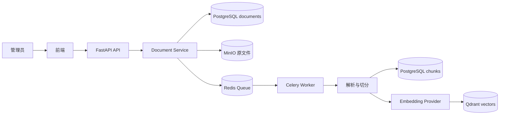
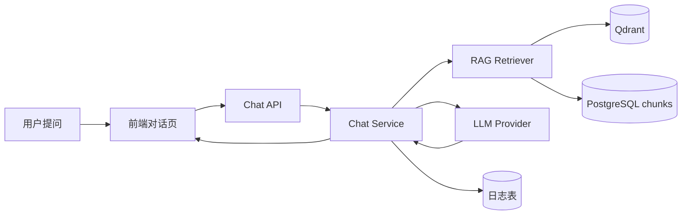

# Agentic RAG 企业知识库助手架构校准

> 阶段：需求收敛与架构校准
>
> 目的：把 `plan/VIBE_CODING_IMPLEMENTATION_PLAN.md` 中的大蓝图收敛成可分阶段落地的 MVP、增强项和模块边界。本文件只描述决策，不实现业务代码。

## 1. 阶段结论

本项目的第一版目标不是一次性做完整 Agentic RAG 平台，而是先跑通一个可演示、可验证、可扩展的企业知识库问答闭环：

```text
用户注册登录
-> 创建知识库
-> 管理员维护公开知识库文档，个人维护私人知识库文档
-> 后台解析、切分、向量化
-> 基于知识库提问
-> 返回带引用来源的答案
-> 保存会话和关键日志
```

当前阶段只做需求和架构校准，不写业务代码。原因是原始实施计划覆盖了鉴权、文档处理、RAG、高级检索、LangGraph Agent、记忆系统、评估和可观测性；如果不先定义 MVP 和增强边界，后续实现很容易范围失控，导致基础闭环还没稳定就开始堆高级能力。

## 2. MVP 范围

MVP 的判断标准：只保留能证明“企业文档可以被安全入库、检索、引用回答”的能力。

| 模块 | MVP 必做 | 验收标准 |
|---|---|---|
| 本地运行环境 | Docker Compose 启动 PostgreSQL、Redis、Qdrant、MinIO、backend、frontend、worker | 本地服务可启动，基础健康检查正常 |
| 用户与鉴权 | 注册、登录、JWT、当前用户接口 | 登录后可访问 `/api/me` |
| 数据隔离 | 用户、知识库成员、基础角色权限 | 用户不能访问无权限知识库、文档、会话和向量检索结果 |
| 知识库管理 | 创建、列表、详情、更新、删除 | 用户可管理自己的知识库 |
| 文档处理 | 公开知识库由管理员上传到 MinIO；私人知识库由 owner/editor 上传，异步解析 PDF、DOCX、TXT、MD、CSV，切分入库 | 文档状态能从 uploaded 流转到 indexed，`chunk_count > 0` |
| 向量入库 | Embedding Provider、Qdrant collection、chunk upsert | Qdrant 中存在带权限 payload 的 point |
| 基础 RAG | Dense retrieval、答案生成、引用结构 | 对知识库提问能返回答案和 citations |
| 对话体验 | 流式输出、历史会话、引用展示 | 前端可逐步显示回答，刷新后历史仍在 |
| 最小日志 | LLM 调用日志、检索日志的基础字段 | 能追踪一次问答的耗时、token、候选 chunk 和引用 |

MVP 暂不追求“效果最强”，而是追求“主链路真实可运行”。高级检索和 Agent 能力需要建立在这个闭环之上。

## 3. 增强项

以下能力有价值，但不进入第一轮 MVP 主线。它们应作为后续阶段逐步增加，且每一项都要有独立验收标准。

| 增强项 | 价值 | 放到后续的原因 |
|---|---|---|
| Query Planning、问题拆分 | 提升复杂问题召回率 | 需要先有稳定的基础 RAG 和日志 |
| Dense + BM25 Retrieval、RRF | 同时覆盖语义召回和精确词项命中 | 依赖稳定的 chunk 正文和基础检索日志 |
| 上下文压缩 | 提升最终上下文质量 | 需要控制压缩后的引用可追溯性 |
| LangGraph 多 Agent | 支持 Supervisor、Summary、Writing、Memory 等编排 | 应复用已稳定的 RAG service，不能提前重写检索逻辑 |
| 短期记忆与长期记忆 | 支持多轮上下文和用户偏好 | 容易引入记忆污染，必须在会话和日志稳定后实现 |
| RAG 评估脚本 | 量化 Recall@K、MRR、引用准确率 | 需要先有可重复的入库和问答流程 |
| 管理员控制台指标 | 展示 token、耗时、命中和反馈 | 需要日志表和真实数据积累 |
| OCR | 支持扫描件 | 成本和失败模式更复杂，不阻塞制度文档 MVP |
| SSO、LDAP、企业微信登录 | 企业集成能力 | 第一版先用邮箱密码和 JWT |
| Kubernetes、微服务拆分 | 部署扩展能力 | 第一版用 Docker Compose 和模块化单体即可 |

明确不做：实时协同编辑、完整计费系统、复杂审批流、插件市场式模型系统、过度前端动效。

## 4. 模块边界

### 4.1 前端

职责：

- 登录、管理员控制台、知识库、文档、对话、引用和日志等页面交互。
- 保存和携带 token。
- 渲染流式响应、引用来源和错误状态。

不负责：

- 权限判定的最终结果。
- RAG 检索逻辑。
- 文档解析、切分、Embedding。

### 4.2 API 层

职责：

- 定义 HTTP 路由、请求响应 schema、依赖注入。
- 获取当前用户并把请求交给 service。
- 做轻量参数校验。

不负责：

- 复杂业务流程。
- 直接操作多表复杂 SQL。
- 调用 LLM 或向量库的细节。

### 4.3 Service 层

职责：

- 承载业务流程，例如注册登录、知识库权限、上传文档、问答编排。
- 调用 repository、storage、worker、RAG pipeline 和 provider。
- 保证关键权限检查集中，例如 `ensure_kb_access(user_id, kb_id, role)`。

不负责：

- 前端展示格式。
- 底层数据库 session 细节。
- Agent 图节点内部状态机。

### 4.4 Repository 与数据库模型

职责：

- 定义表结构和持久化读写。
- 封装常用查询。
- 保证查询可以带上 `user_id`、`knowledge_base_id` 或成员权限过滤。

不负责：

- 业务流程编排。
- 文档解析和模型调用。

### 4.5 Worker 与文档处理

职责：

- 执行耗时任务：解析、清洗、切分、Embedding、向量 upsert。
- 更新文档状态和错误信息。
- 保持任务可重试、状态可追踪。

不负责：

- HTTP 请求响应。
- 前端进度展示细节。

### 4.6 Storage

职责：

- 封装 MinIO 原文件上传、读取、删除。
- 管理 object key 和 bucket。

不负责：

- 文档内容解析。
- 权限最终决策。

### 4.7 Provider

职责：

- 封装 LLM、Embedding 等外部模型调用。
- 屏蔽不同 provider 的请求格式差异。

不负责：

- RAG 流程决策。
- 业务权限判断。

### 4.8 RAG 模块

职责：

- 文档解析结果的切分策略。
- Embedding 调用、向量检索、引用结构、Prompt 模板。
- 后续扩展 query planning、hybrid retrieval、RRF 和 compression。

不负责：

- HTTP 路由。
- 用户登录状态。
- Agent 路由决策。

### 4.9 Agent 模块

职责：

- 后续使用 LangGraph 编排 Supervisor、RAG、Summary、Writing、Memory 节点。
- 记录 Agent trace。
- 复用已有 service 和 RAG pipeline。

不负责：

- 重新实现检索逻辑。
- 替代 service 层权限校验。
- 在 MVP 初期阻塞基础 RAG 闭环。

## 5. 核心数据流

### 5.1 文档入库链路



关键边界：

- 上传请求只允许管理员操作，只负责保存原文件、创建记录和投递任务。
- Worker 负责耗时处理和状态流转。
- PostgreSQL 存正文、metadata 和关系数据；Qdrant 存向量和检索 payload。

### 5.2 问答链路



关键边界：

- 检索必须带 `user_id` 和 `knowledge_base_id` 过滤。
- 回答必须返回引用对象，不能只返回纯文本。
- 日志记录用于调试和后续评估，不作为第一版复杂监控系统。

## 6. 关键架构约束

- 所有知识库、文档、chunk、会话查询都必须经过用户或成员权限过滤。
- 公开知识库文档上传和删除必须校验管理员身份，检索必须限制在当前用户 `security_level` 及以下；私人知识库创建后默认仅 owner 可见，文档由 owner/editor 维护，有成员权限的用户可读取库内全部内容。
- Qdrant payload 必须包含 `user_id`、`knowledge_base_id`、`document_id`、`chunk_id`，检索时必须加 filter。
- 文档处理是异步任务，失败要落到 `failed` 状态并保留 `error_message`。
- RAG pipeline 先用普通函数和 service 串起来，后续 LangGraph 节点复用这些能力。
- Provider 只封装 LLM、Embedding 两类模型，不做复杂插件系统。
- 第一版用 PostgreSQL Full Text Search 做关键词检索增强，不引入 Elasticsearch。
- 第一版只用 Docker Compose，不上 Kubernetes。

## 7. 需要后续实现时确认的点

- 流式接口如果坚持 `POST /stream`，前端更适合用 `fetch` + `ReadableStream`；如果使用浏览器原生 `EventSource`，接口通常需要 GET 形态。
- 重复文档的判断应优先按同一知识库内 `content_hash` 去重，避免不同知识库之间误伤。
- Embedding 维度应和知识库绑定，避免更换模型后旧向量不可用。
- 检索主链路不依赖 reranker，避免在基础效果还不稳定时增加额外模型成本。
- 长期记忆必须先定义写入规则，不能把所有用户消息都沉淀成记忆。

## 8. 阶段 1 完成标准

本阶段完成后，应能回答以下问题：

1. 第一版 MVP 的主链路是什么。
2. 哪些能力是 MVP 必做，哪些只是增强项。
3. 前端、API、service、repository、worker、storage、provider、RAG、Agent 的边界分别是什么。
4. 为什么现在不写鉴权、RAG、Agent 或项目骨架代码。
5. 后续每个阶段应该围绕什么验收标准推进。

如果能用“用户上传文档到获得带引用回答”的链路讲清楚系统，并能说明为什么 LangGraph 和记忆暂缓，那么阶段 1 就算完成。
