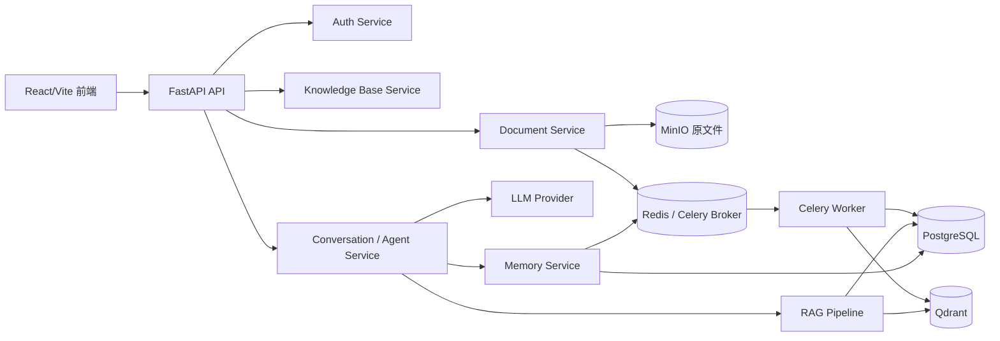
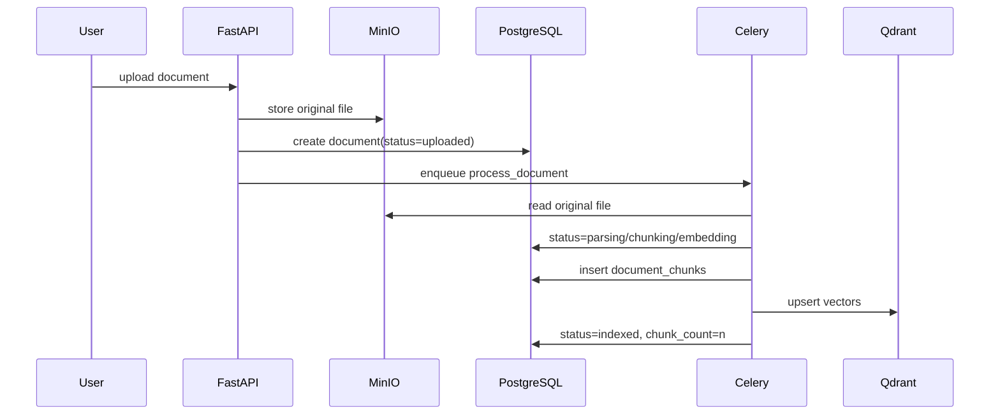
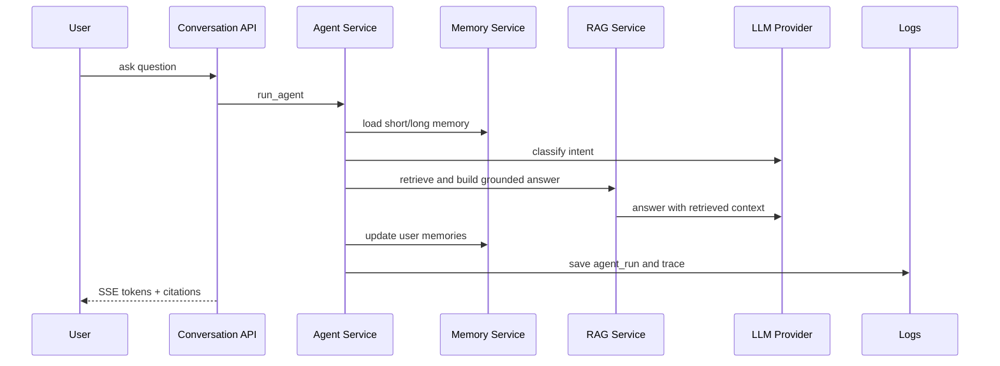

# 架构图说明

## 总体架构

说明：

- 前端只负责交互、token 携带、流式渲染和引用展示。
- FastAPI API 层负责路由、schema 和依赖注入。
- Service 层承载业务边界，例如鉴权、知识库权限、文档处理投递、对话编排。
- PostgreSQL 存关系数据、文档 chunk、会话、消息、检索日志、Agent trace 和长期记忆。
- Qdrant 存向量检索点位，payload 带知识库和文档边界。
- Redis 同时服务 Celery 队列和短期记忆。
- LLM Provider 隔离 OpenAI-compatible 调用细节；模型不可用时直接暴露错误。

## 文档入库链路

## 问答链路

