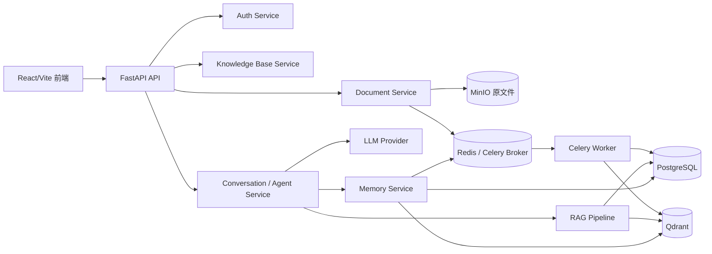
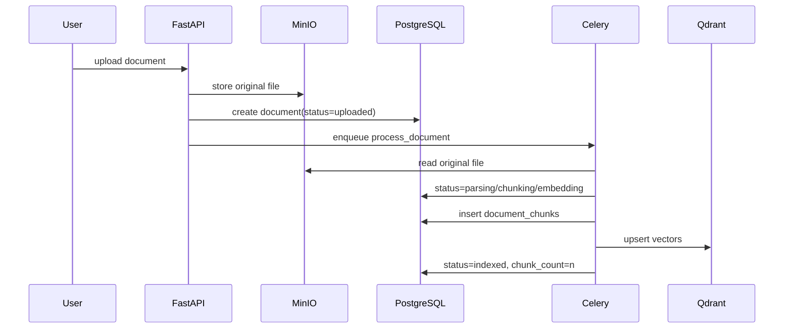
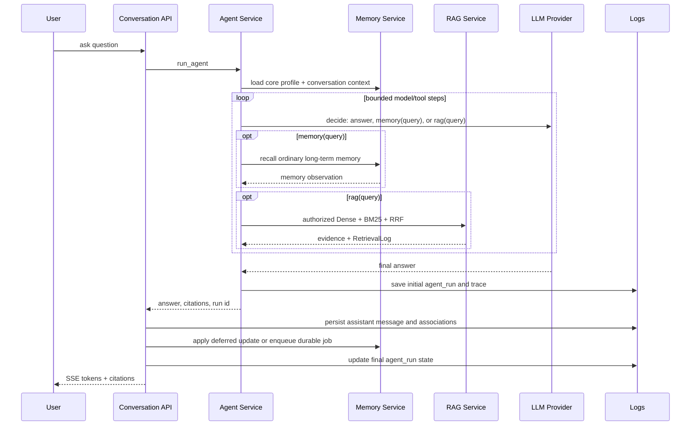

# 架构图说明

## 总体架构

说明：

- 前端只负责交互、token 携带、流式渲染和引用展示。
- FastAPI API 层负责路由、schema 和依赖注入。
- Service 层承载业务边界，例如鉴权、知识库权限、文档处理投递、对话编排。
- PostgreSQL 存关系数据、文档 chunk、会话、消息、检索日志、Agent trace 和长期记忆。
- Qdrant 存文档与长期记忆的可重建向量点；文档 payload 带知识库、文档和密级边界，记忆 payload 带用户与状态边界。
- Redis 同时服务 Celery 队列和短期记忆。
- LLM Provider 隔离 OpenAI-compatible 调用细节；模型不可用时请求明确失败，不用本地规则伪造答案。

## 文档入库链路

## 问答链路

图中的 Memory 更新发生在 assistant Message 提交之后：开发模板默认同步执行，生产模板默认创建 durable Celery job。Qdrant 只是记忆派生索引，PostgreSQL 始终保存权威状态。
