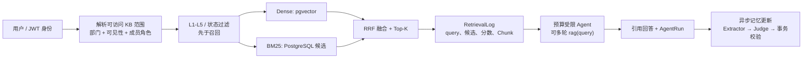

# Agentic RAG 项目：面试问题与参考回答

> 适用对象：项目作者本人。答案采用第一人称口径，重点不是逐字背诵，而是能解释设计取舍、边界和数据口径。
>
> 依据：当前仓库实现及 `docs/resume_metrics.md`（最近完整验证：2026-07-15）。

## 先校准简历表述

以下三点最容易被技术面试官追问，建议先修正或主动说明。

| 简历中的表述 | 应使用的准确口径 | 原因 |
|---|---|---|
| 技术栈包含独立向量库 | 当前正式实现是 **PostgreSQL + pgvector** | 当前 Dense 检索和长期记忆向量都落在 PostgreSQL 行内，不存在跨服务向量同步链路。|
| LongMemEval-S QA acc 83.33% | 这是 **单次 Top-5 Memory 检索 + Reader** 的 30 题分层子集结果；当前生产运行时 Agent 默认预算为 76.67%，上限探测为 80.00% | Reader-only、Agent 运行时和公开榜单不是同一评测口径，不能混写。|
| L1–L5 密级过滤 | 用户 `security_level` 与文档/Chunk `security_level` 均取 1–5；公开、部门 KB 要求 `chunk.level <= user.level`。私有 KB 的主要边界是成员权限 | 不能把“成员可访问私有 KB”误说成“私有 KB 无密级模型”。|

推荐的技术栈写法：**FastAPI、LangChain、PostgreSQL + pgvector、Redis、Celery、MinIO、SQLAlchemy、React、TypeScript、Docker Compose**。

## 一分钟项目介绍

> 我做的是一个面向企业内部知识和个人长期记忆的 Agentic RAG 系统。企业知识侧先按用户部门、知识库可见性、成员角色计算可访问 KB 集合，再在 Dense 与 BM25 两条检索路由中执行密级过滤；因此未授权 Chunk 不会进入候选集，更不会进入 LLM 上下文。检索用 PostgreSQL/pgvector 的 Dense、PostgreSQL 候选上的 BM25 和 RRF 融合；Agent 在固定预算内可针对证据缺口发起多轮独立查询，每轮的 query、候选、RRF 分数、最终 Chunk 和回答引用都会持久化。个人记忆则分为固定注入的核心画像、会话摘要、近期对话和按需向量召回的普通长期记忆，且不与企业制度证据混用。回复提交后，Celery 异步运行“候选提取—相关记忆召回—独立 Judge—确定性校验”的两阶段记忆更新。SciFact 完整 test split 上，Dense+BM25+RRF 的 Recall@10 是 83.22%；LongMemEval-S 的单次 Top-5 Memory + Reader QA 是 83.33%，这两个指标我会明确其评测边界。

## 面试官先看什么



---

## 一、总体架构与职责划分

### 1. 你解决的核心问题是什么？为什么不能只是“向量库 + prompt”？

**参考回答：**

我把问题拆成四个相互独立的约束：企业资料不能越权、回答要能回溯、复杂问题允许补充检索、用户偏好和企业事实不能混淆。单纯“top-k 向量检索 + prompt”只能解决部分语义召回，无法保证每一轮 Agent 检索仍在授权范围内，也无法保留从 query 到 Chunk 到最终引用的完整证据链。项目因此将授权、检索、Agent 编排、长记忆和审计分别落在服务层、检索层、运行时状态和持久化日志中；LLM 只能提出 query，不能自行指定 KB、部门或密级。

### 2. 为什么选 FastAPI、PostgreSQL、Redis、Celery、MinIO 这个组合？

**参考回答：**

FastAPI 用于异步 HTTP/SSE 和清晰的 Pydantic 契约；PostgreSQL 是用户、权限、会话、Chunk、审计日志和长期记忆的权威存储，pgvector 让向量与元数据在同一事务中写入；Redis 用于短期对话缓存、Celery broker、会话并发租约和任务状态；Celery 把文件解析、Embedding、摘要、记忆更新和清理等长任务从请求路径移出；MinIO 保存原始上传文件。这样原文、业务元数据、向量和审计状态都有明确归属，而不是把关键权限状态分散在多个可变副本中。

### 3. 为什么当前正式实现选 pgvector？

**参考回答：**

我的优先级是权限一致性和可审计性，而不是先追求独立向量服务的极致吞吐。Chunk、密级、文档状态和 embedding 同在 PostgreSQL，Dense 查询可在 SQL 中先按 KB、状态、模型维度和密级预过滤，命中后还可回表复核；长期记忆的内容和向量也能同事务提交，避免双写、重试和删除同步的问题。代价是当语料规模和高并发显著上升时，专用向量库可能更合适；届时我会把 PostgreSQL 保持为权限与内容真相源，向量库仅作为可重建索引，并在命中后回表校验。

### 4. 关键数据分别存在哪里？为什么这么分？

**参考回答：**

- PostgreSQL：用户、部门、KB 成员关系、文档/Chunk、embedding、会话消息、长期记忆、AgentRun、检索/召回日志、审计事件和 durable job。
- MinIO：原始 PDF、DOCX、TXT、MD、CSV 等对象。
- Redis：短期对话缓存、Celery broker、会话租约和临时协调状态。
- Celery：执行入口而非真相源；任务状态和幂等键仍落 PostgreSQL。

这个划分的原则是：任何需要权限判断、追溯、事务或恢复的状态不能只放在 Redis 或消息队列里。

### 5. 文档上传到可检索，经历了什么链路？

**参考回答：**

上传接口先校验操作者对 KB 的编辑权限和文档密级，将原文件放入 MinIO、文档元数据写入 PostgreSQL；随后 Celery Worker 解析文本、清洗、切分 Chunk、生成 embedding，并把 Chunk 内容、元数据、密级与 embedding 写入 PostgreSQL/pgvector。只有文档状态为 `indexed` 的 Chunk 才能被检索。异步化避免大文件解析和远程 embedding 阻塞接口；检索层还会再次检查 `indexed` 状态，因此处理中或失败文档不会误入上下文。

---

## 二、部门、角色和密级：最关键的安全追问

### 6. “部门与密级感知检索”具体怎么实现？请按一次请求说明。

**参考回答：**

请求进入后，服务层根据 `search_scope` 解析用户可访问的 KB：

1. `single`：要求用户对指定 KB 至少有 viewer 权限；
2. `department`：非管理员只能检索自己的部门 KB；
3. `public`：只检索公开 KB；
4. `accessible`：聚合用户可见的私有成员 KB、同部门 KB 和公开 KB。

解析出的 `knowledge_base_ids`、范围类型和用户最大密级会作为服务端参数传给检索器。Dense 和 BM25 路线都带 `knowledge_base_id IN (...)`、`chunk.security_level <= max_security_level`、`document.status = indexed` 等条件。Dense 命中后还会 SQL hydration，重读权威 Chunk 并复核 KB、状态和密级；最终日志读取时还会按来源 KB 重新授权。这使得模型从头到尾无法扩展自己的检索范围。

### 7. L1–L5 怎么定义？管理员和私有 KB 是什么语义？

**参考回答：**

系统把密级规范为 1 到 5。公开和部门知识库的文档/Chunk 必须满足 `document_or_chunk.security_level <= user.security_level`；管理员可以拥有最高安全级别。私有 KB 首先由 owner/member role 做隔离，创建后默认只有 owner 可见，因此它的主要安全边界是成员关系。面试时我会明确说明这是当前策略，不会笼统地说“所有 KB 完全同一套密级规则”。

### 8. 为什么要在召回前过滤，而不是把所有 Chunk 召回后让 LLM 判断？

**参考回答：**

因为一旦未授权内容进入候选或上下文，即便最终答案不展示，也已经发生数据暴露；而且模型不应承担权限决策。正确做法是把授权范围和密级作为检索 SQL 的硬条件，先缩小候选域，再排序。回表二次校验是防御纵深：即使将来改为独立向量库或遇到旧索引，也以 PostgreSQL 中权威权限与文档状态为准。

### 9. 用户检索完成后被移出部门或移除 KB 成员关系，历史回答和日志还能看吗？

**参考回答：**

不能仅凭历史记录放行。RetrievalLog 中保存了实际搜索的 KB ID、候选和选中 Chunk 的来源。读取历史检索日志时，系统会对每个来源 KB 再执行访问校验；如果任一来源已不可见，日志和相关 provenance fail-closed，不展示给用户。这样可以避免“今天失权、通过昨天的回答回看资料”的旁路。

### 10. 如何证明权限没有被绕过？测试了什么？

**参考回答：**

我把测试分为三层：范围解析测试，验证不同可见性、部门、成员角色和管理员身份得到正确 KB 集合；Dense/BM25 检索测试，验证低密级用户无法命中高密级 Chunk；API/历史读取测试，验证 KB 权限变化后 RetrievalLog 不再可读。关键不是只测前端按钮隐藏，而是直接调用服务和检索函数，确认未授权 Chunk 根本不存在于返回候选中。

### 11. 如果检索日志本身被篡改，或者缺少来源 KB ID，怎么办？

**参考回答：**

读取路径不把“不完整 provenance”视为可接受数据。如果多库检索日志的 candidate 或 selected chunk 缺来源 KB ID，且无法通过单库旧记录规则唯一归属，就按 provenance unavailable 拒绝读取。对于发生过 RAG 的 AgentRun，如果完成前发现没有真实 RetrievalLog，会把 run 标记失败并清空 answer/citations，而不是交付一个无法证明依据的回答。

---

## 三、混合检索与排序

### 12. Dense、BM25 和 RRF 各解决什么问题？

**参考回答：**

Dense 检索擅长同义改写和语义近似，但可能漏掉罕见术语、编号、专有名词或精确条款；BM25 对词项匹配和术语更稳健，但不擅长语义改写。RRF 不直接比较两路原始分数，而是融合排名：

```text
RRF(d) = Σ 1 / (k + rank_i(d))
```

其中同一 Chunk 在两路排名越靠前、出现越多，累计分越高。项目使用无权重 RRF，`k=60`，避免 Dense 相似度与 BM25 分值量纲不同造成硬拼分数的校准问题。

### 13. BM25 在这里是怎样实现的？这是 PostgreSQL 全文检索吗？

**参考回答：**

不是把它包装成 PostgreSQL 原生全文检索。当前实现先在 PostgreSQL 对 Chunk 正文和标题做受限词项预过滤，取回候选行后使用 BM25Okapi 计算 BM25 排名。这个做法清楚、容易验证，并与 Dense 路线使用同一授权和密级条件；代价是候选量很大时不如倒排索引或原生 FTS 高效。规模继续增长时，我会优先将 BM25 改为 PostgreSQL `tsvector`/GIN 或 Elasticsearch/OpenSearch，同时保持同样的 ACL 过滤和日志契约。

### 14. 你如何避免 RRF 融合后重复或丢失关键信息？

**参考回答：**

融合以 `chunk_id` 去重，同一 Chunk 保存它来自 Dense、BM25 还是两者，RRF 分数也记录到 selected chunk 日志。多轮检索时，跨批 Chunk 仍按 ID 去重，但最终上下文从不同批次轮询取证，避免第二轮新结果把第一轮关键证据完全挤出上下文。引用编号根据最终累积证据稳定分配，而不是让模型自由编造来源。

### 15. SciFact 的 83.22% Recall@10 是如何得出的？

**参考回答：**

使用 BEIR/SciFact 完整 test split：5,183 篇语料、300 条 query、339 个相关性标注；每个 abstract 作为一个文档级检索单元。对每条 query 输出前 10 个文档 ID，与公开 qrels 做确定性比较，再汇总标准 IR 指标。Dense+BM25+RRF 的 Recall@10 是 83.22%，同时 nDCG@10 为 68.47%、MRR@10 为 64.62%。它证明的是**文档排序召回能力**，不是回答准确率、权限正确率、引用正确率或真实生产效果。

### 16. 混合检索相对单路的收益是什么？为什么可信？

**参考回答：**

在同一语料、同一 query、相同 Top-10 和同一 qrels 判分下：Dense 的 Recall@10 为 76.91%，BM25 为 78.94%，Hybrid 为 83.22%；nDCG@10 也从 Dense 的 63.85% 提升到 68.47%。因为是固定公开标注和文档 ID 的比较，不依赖 LLM Judge 或关键词猜测，比较可信。需要保留的边界是：我没有声称这是 SciFact 官方榜单名次，也没有把这个离线检索分数等同于企业问答端到端指标。

### 17. 为什么 Precision@10 只有 9.33%，会不会检索质量很差？

**参考回答：**

不能单独解读。SciFact 的多数 query 只有约一个相关文档，而评测固定返回 10 个候选，理论上即使把唯一相关文档排在第一，Precision@10 也接近 10%。该场景更应该结合 Recall@10、MRR@10 和 nDCG@10 看“是否找回、首个命中位置和整体排序”。在真实产品里，我会再按上下文预算、引用覆盖率和人工答案正确性评估，而不是只盯一个 Precision。

### 18. 召回很高但回答仍错，你会先查哪里？

**参考回答：**

先将问题拆为四层：是否命中 gold/正确 Chunk（retrieval），正确证据是否被压缩或上下文截断（context construction），模型是否正确理解、做时间推理和引用（reader），是否在无证据时仍进行内部事实猜测（generation policy）。LongMemEval 中就有 3 题在相关 turn 全覆盖时仍失败，因此不能把所有失败归因于检索。排查时我会从 RetrievalLog、最终注入 Chunk、prompt/模型调用日志和最终引用逐层对齐。

### 19. 目前有没有 reranker？为什么不先加？

**参考回答：**

当前没有启用 cross-encoder reranker，日志字段也明确记录 `reranker_enabled=false`。我先把混合召回、权限和可追溯链路做成可验证的基础闭环，避免引入一个难解释、需要额外延迟和模型成本的组件后无法归因。下一步会用离线基准和真实业务标注做 ablation：只在 reranker 对 nDCG/answer quality 的增益能覆盖延迟与成本时启用，并在日志中保留重排前后排名和模型版本。

---

## 四、Agent、多轮查询与可追溯性

### 20. Agent 是如何决定是否要继续检索的？

**参考回答：**

这是一个受限工具循环，而不是无限自治 Agent。模型看到核心画像、会话摘要、近期对话和当前已积累证据后，可以直接回答，或调用 `memory(query)` / `rag(query)`。调用前 prompt 要求指出一个尚未解决的具体信息缺口；有充足证据后必须收敛。每次工具只接收一条独立 query，检索器内部不再隐式 LLM 改写或拆问，所以每轮行为易于审计。

### 21. 预算如何限制？默认是多少？

**参考回答：**

默认上限是 6 次模型调用、4 次总工具调用，其中最多 2 次 Memory、3 次 RAG；最后一次模型调用不再提供工具，要求基于现有证据回答或说明不足。系统也会阻止完全重复的规范化 query。这样主要是控制成本、延迟和“为增加信心而无止境检索”的行为。

我会主动说明当前发现的边界：工具预算主要在下一次模型调用前解绑耗尽的工具，执行入口还缺第二道硬校验，评测中曾观察到 1 个案例配置上限为 2 次 Memory 却执行了 3 次。它不影响模型调用硬上限，但这是需要补的生产问题；我的修复方向是在每个工具函数入口原子递增并校验配额，超限直接拒绝且写 trace，而不是只依赖可用工具列表。

### 22. 多轮检索一定更好吗？怎么避免浪费？

**参考回答：**

不一定。LongMemEval 运行时实验中，提升预算从默认到上限只带来 3.33 个百分点的 QA 增益，同时 token 增加 22.38%、端到端延迟增加 21.98%，而且个别类别退化。因此我的策略不是一律提高步骤，而是要求每次 query 必须针对不同证据缺口；一次无进展可以换实质不同 query 重试，连续无进展则停止该工具。下一步会将“证据增益/停止”从 prompt 约束加强为服务端可计算策略。

### 23. 你如何防止 Agent 通过 tool input 绕过权限？

**参考回答：**

`rag` 工具对模型只暴露 query 字符串，不接受 KB ID、部门、密级或用户 ID。运行开始时服务端已解析好 `KnowledgeBaseSearchScope`，工具执行时只能使用 state 中这份 scope。模型即使在 query 中写“搜索财务部 L5 文档”，也只会在当前授权 KB 和最大密级内做普通文本检索，不能改变 SQL 过滤条件。

### 24. 一次 RAG 调用会记录什么？最终怎样关联到答案？

**参考回答：**

每一次 `rag(query)` 都创建独立 RetrievalLog，保存实际 query、范围类型、搜索到的 KB ID、Dense/BM25 路由、全部候选、rank/RRF 分数、选中 Chunk、密级、压缩信息和创建时间。AgentRun 保存所有 `retrieval_log_ids`、RAG query 和累积 Chunk；assistant message 提交后，AgentRun 和所有检索日志都绑定到该最终回答。用户可根据引用回溯到检索批次和原始文档，而不是只看到一段模型生成文本。

### 25. 为什么要区分“用户消息 ID”和“最终 assistant 消息 ID”？

**参考回答：**

这是为了同时保留因果关系和展示关系。记忆更新、MemoryRecallLog 和 job 的来源是本轮 user message；而 AgentRun 和 RetrievalLog 最终服务的是 assistant answer，因此提交后绑定 assistant message。状态中仍保留 source user message ID。这样审计时能回答“哪个用户输入触发了这次检索/记忆更新”和“哪条回答使用了这些证据”，不会因覆盖单个外键而丢失其中一端。

### 26. 发生 RAG 但 RetrievalLog 写入失败，系统怎么做？

**参考回答：**

按 fail-closed 处理。发生过 RAG 的 run 在标记 completed 前必须存在真实 RetrievalLog；否则状态改为 failed，清空 answer 和 citations，并将失败持久化后报错。相比“带着不可追溯证据继续回答”，我选择宁可本次失败，因为这是企业资料问答的审计底线。

### 27. 你如何防范文档中的 prompt injection？

**参考回答：**

首先，检索内容和工具观察都是不可信数据，不能覆盖 system instructions；其次，LLM 无法通过文档文本获得新增工具、权限或更高密级。最后，企业事实回答要求引用累积证据；证据不足时要求明确说不足，不用模型常识补全内部事实。对于更高安全要求的场景，我还会增加文档安全扫描、危险指令标记、工具参数 schema 校验和输出策略检测。

---

## 五、分层长期记忆与召回

### 28. 长期记忆为什么分层，而不是每轮把历史对话全部塞进上下文？

**参考回答：**

全量历史会导致 token、延迟和噪声随会话长度增长，旧信息还可能压过当前问题。我的层次是：

- **核心画像**：例如称呼、稳定角色、语言和稳定偏好，固定注入；
- **会话摘要**：对较早会话的增量压缩；
- **近期对话**：保留原始人机消息，处理当前上下文；
- **普通长期记忆**：项目、决策、事件、工作流等，只由 Agent 以 `memory(query)` 按需向量召回。

这样把稳定且高价值的信息变成低成本固定上下文，把大量低频信息保留在可检索存储里。

### 29. 为什么核心画像固定注入，普通记忆不固定？

**参考回答：**

核心画像通常跨任务高复用、数量受控，固定注入能减少一次无意义的检索；普通记忆数量大、主题分散且可能过期，固定注入会污染所有问题并推高 token。因此普通记忆只在模型判断当前问题确实缺少用户历史信息时查询，结果再受条数和 token 预算控制。企业知识和个人记忆严格分离：memory 不检索 KB，也不能作为公司制度等事实的引用。

### 30. `memory(query)` 如何工作？

**参考回答：**

它只查询当前用户、active 状态且模型/维度一致的普通长期记忆。默认走 pgvector 语义 Top-K；若向量查询异常则回退到有界 PostgreSQL 候选，保证系统可继续运行但不保证极旧记忆的全局召回。每次查询都会写 MemoryRecallLog，结果会合并进运行时动态上下文；同一轮多次查询按 memory ID 去重。固定核心画像不通过这个工具重复召回。

### 31. LongMemEval-S 的 95.83% 和 83.33% 各是什么意思？

**参考回答：**

评测是 30 题分层子集，完整干扰历史为 14,841 个 turn；其中 24 题是非拒答题。`Turn Recall Any@5 = 95.83%` 表示在这 24 题里，Top-5 至少找回一个相关 turn 的比例；`Recall All@5 = 83.33%` 表示需要的相关 turn 都出现在 Top-5 的比例。`QA acc = 83.33%` 是把单次 Top-5 记忆直接交给 Reader 后，在全部 30 题上的结果。它不是生产 Agent 多轮端到端指标，也不是完整 LongMemEval 官方榜单成绩。

### 32. 为什么 Agent 运行时成绩低于 Reader-only？

**参考回答：**

Reader-only 相当于把检索好的 Top-5 直接给模型，只评估检索+阅读上限；生产 Agent 还要自己决定是否调用 Memory、如何组织 query、是否误调 RAG、如何在预算内收敛，且包含完整工具循环开销。默认预算运行时 Agent 的 QA 是 76.67%，这更接近真实链路。这个差距能帮助我定位后续优化应先做工具路由、证据缺口判断和硬预算，而不是简单归咎于向量检索。

### 33. 长期记忆会不会成为幻觉或过期信息来源？

**参考回答：**

会，所以我把它定位为个人上下文，不是企业事实权威来源。记忆带 status、revision、source message、时间和审计事件；替换后旧记录标为 `superseded`，不再被 active recall 命中。对企业制度、流程和数字，回答必须依赖授权知识库 Chunk 和引用；仅有 memory 时，模型应以“你之前提到”这类个人上下文口径表达，不能伪装成公司政策。

---

## 六、可审计记忆更新

### 34. 为什么记忆更新要放在回复提交后异步做？

**参考回答：**

候选提取、相关记忆召回和逐候选 Judge 会增加 LLM 调用与延迟。它们不应阻塞用户拿到本轮回答，因此我先可靠提交 user/assistant message、AgentRun 和检索日志，再创建 durable `UserMemoryUpdateJob` 投递 Celery。异步 job 记录 message ID、状态、attempt、lease 和 actions，可重试、可恢复、可审计；即使 Worker 暂时不可用，也不会因为只发了一条 broker 消息就永久丢失更新。

### 35. 两阶段记忆更新具体是什么？

**参考回答：**

第一阶段 Candidate Extractor 只看当前 user message 和 assistant answer，提取少量“值得长期保存的候选”；它不见旧记忆、不能指定目标 ID，也不能决定 update 或替换。之后服务层用候选文本召回潜在相关记忆：exact hash、canonical key/category、pgvector 语义近邻和最近有界候选。第二阶段 Memory Judge 对每个非 ignore 候选从 `independent / equivalent / refinement / replacement / uncertain / discard` 中选择一个结构化关系，且 target ID 必须来自本次提供的相关记忆集合。服务层再机械映射成 `create / ignore / update / supersede / pending / ignore`。

### 36. 为什么不能以向量相似度阈值直接合并或覆盖记忆？

**参考回答：**

相似不等于等价，更不等于新事实替代旧事实。例如“我偏好 Python”和“我用 Python 做过项目”词很近，但语义关系不同；时间变化的信息更不能仅因相似就覆盖。所以向量检索只用于给 Judge 提供有界候选，不设置“相似度超过阈值即合并”的规则。最终关系由结构化 Judge 判断，且还要经过后端校验和并发控制。

### 37. LLM 说“替换旧记忆”就直接写库吗？有哪些确定性防线？

**参考回答：**

不直接相信 LLM。后端要求 evidence 必须来自当前 user message：先作 Unicode NFKC、大小写和空白归一化，再验证 evidence 是用户原文子串；assistant 生成内容不能反过来成为事实来源。自动写入只接受 low sensitivity，token/password/私钥、联系方式、证件、银行卡、医疗和薪资等敏感模式会 fail-closed ignore。Judge 指向的 target 必须在本轮相关集合内，还要做 owner、revision、唯一约束和事务校验。LLM 的输出是建议，不是数据库权限。

### 38. update、supersede、pending、ignore 分别怎么理解？

**参考回答：**

- `update`：新候选是对同一事实的补充或细化，更新目标记忆；
- `supersede`：新事实明确使旧 active 记忆失效，创建/激活新记忆、旧记忆标为 `superseded`，并保存双向关系；
- `pending`：内容可能有价值但证据、关系或并发条件不够确定，等待人工审核；
- `ignore`：不持久化，例如敏感、无可靠证据、重复无新增价值或 Judge 异常。

被替换的历史不会被物理抹掉，因此可以审计“何时、依据什么改变了记忆”。

### 39. 异步任务怎样保证幂等、顺序和故障恢复？

**参考回答：**

job 先写 PostgreSQL，再尝试投递；`(user_id, message_id)` 有唯一约束，重复投递返回同一 job。Worker 通过 lease token 原子 claim，完成或失败更新必须携带相同 token，过期 worker 不能覆盖新 worker 的结果。同一用户的后续 job 在更早未完成 job 存在时不抢跑，减少历史事实覆盖新事实。Celery 使用 late ack、worker lost reject、退避重试；Beat 定期扫描过期 lease 或未投递 job 并重新派发。用户重试旧 job 时，若已经有更新的同用户 job，返回冲突，避免时间倒流。

### 40. 并发更新同一条记忆会怎么样？

**参考回答：**

Memory Judge 的上下文里带有目标记忆 revision。自动 update/supersede 执行前比较 expected revision；手工 PATCH 也必须携带 expected revision，不匹配返回 HTTP 409。多个 operation 在同一数据库事务中执行，任一步失败则全批回滚。数据库部分唯一索引再为 active canonical key/profile singleton 提供最后一道防线；若 Judge 后发生并发冲突，系统降级为 pending，而不是静默覆盖。

---

## 七、评测、结果与诚实边界

### 41. 你如何定义 Recall@10、MRR@10 和 nDCG@10？

**参考回答：**

`Recall@10` 是每个 query 的相关文档中有多少被前 10 找回，再做聚合；`MRR@10` 看第一个相关文档的倒数排名，越靠前越好；`nDCG@10` 衡量前 10 的整体排序质量，并对靠前位置赋更高权重。SciFact 这里使用公开 qrels 的文档级确定性比较。它们都属于检索指标，不是生成答案评分。

### 42. 为什么 LongMemEval 的结果不能说成“官方 83.33%”？

**参考回答：**

因为我用的是 30 题分层子集，且使用 LongMemEval 的官方分题型 Judge prompt，但 Judge 模型是 DeepSeek，不是其官方指定模型；Reader-only 又绕过了我的 Agent 运行时链路。因此正确说法是“在 LongMemEval-S 的 30 题分层子集上，单次 Top-5 Memory + Reader QA 为 83.33%”。我会附带非拒答题数、历史 turn 数、评测方式和模型信息，避免暗示是可横向比较的官方榜单结果。

### 43. 为什么项目定制 Agent trajectory 98.67% 不等于生产效果？

**参考回答：**

该评测的 25 个 golden cases、三轮共 75 条轨迹，使用受控 Memory/RAG observation，目标是隔离测试“该不该用工具、工具类型和调用次数是否正确”。它不测试真实语料的召回和最终业务答案，不能和 SciFact 或 LongMemEval 混在一起。我会把它表述为受控工具调度正确性，严格轨迹 74/75、工具类型集合 75/75，而非“真实业务准确率”。

### 44. 目前结果最大的局限是什么？

**参考回答：**

第一，LongMemEval 只有 30 题、每个非拒答子类只有 4 题，样本较小，LLM-as-Judge 的百分点差异不能过度解释。第二，SciFact 衡量公开语料文档排序，不含权限、Agent 或答案。第三，线上 3 题小评测只是 API、权限、异步入库和引用的 smoke，Recall@5 66.67% 不能作为公共 benchmark 成绩。第四，当前没有真实 reranker，且 Agent 工具入口缺少第二道硬预算校验。把这些边界讲清楚反而能证明我对评测负责。

### 45. 你会如何扩大评测与上线质量门禁？

**参考回答：**

我会补三组数据：带部门/密级和撤权后的权限对抗集；带可验证答案与引用 span 的企业问答集；更多轮、不同随机种子和独立 Judge 的长期记忆集。指标上分开报 ACL false-positive/false-negative、检索 Recall/nDCG、citation precision/coverage、answer correctness、拒答正确率、P50/P95 延迟和每问成本。上线使用版本化数据集与固定 prompt/model/embedding 配置，评测写隔离数据库，任何权限回归或 citation provenance 缺失均作为阻断项。

---

## 八、工程、性能与故障场景

### 46. 当前性能数据怎样说才不夸大？

**参考回答：**

SciFact 的本地排序阶段平均 1,274.85 ms，P50 1,225.08 ms，P95 2,215.76 ms，但不含远程 query embedding，不能说成完整 API 延迟。LongMemEval 默认预算 Agent 的平均端到端延迟为 39.59 秒，包含多轮模型和工具调用；这说明更高质量与交互体验之间仍有优化空间。端到端 smoke 从注册到索引、问答、引用和清理约 27.49 秒，但只是小规模验证，不代表压力容量。

### 47. 规模从几千篇文档增长到百万级，你会怎么演进？

**参考回答：**

先测瓶颈而不是盲目拆服务。数据库侧会对 `knowledge_base_id`、密级、状态等过滤列建立合适索引，pgvector 依据召回/延迟选择 HNSW 或 IVFFlat 并按 embedding 版本隔离；BM25 从进程内候选排序演进到 PostgreSQL FTS/专用倒排系统；文件解析与 embedding worker 水平扩容，限流和队列监控保护模型服务。无论向量或搜索引擎如何拆分，PostgreSQL 的权限和文档状态仍是最终权威，向量命中必须回表验证。

### 48. Redis、Celery 或 MinIO 不可用时，系统有什么语义？

**参考回答：**

Redis 不可用时，会话并发控制在生产链路 fail-closed，宁可本轮不可用也避免跨进程对话乱序；短期记忆可由 PostgreSQL message 回退。Celery 不可用时，已提交的 durable memory/document job 不会丢失，恢复任务会再派发；但新文档不会即时变为 indexed。MinIO 不可用会阻断需要对象读写的上传/下载操作；已持久化的 Chunk 检索不依赖每次读 MinIO。每种降级的前提是清楚界定“可继续”与“必须拒绝”，绝不把权限错误降级为允许。

### 49. 删除文档、知识库或用户时，怎么清理向量和对象？

**参考回答：**

Chunk 与 embedding 同属于 PostgreSQL 关系模型，删除文档后由外键 cascade 一并删除，减少独立向量索引残留。MinIO 对象清理由 external cleanup job 管理；先持久化清理任务再执行，保留结果和审计信息，失败可恢复。长期记忆支持 soft delete、restore 和明确 purge；purge 只对可精确定位的副本生效，不能误导为“自动删除所有聊天原文和所有下游备份”。

### 50. 你在项目里踩过什么坑，后来如何改进？

**参考回答：**

我会讲一个真实且可复盘的例子：最初容易把“模型的提示约束”当成工具预算保证，但运行时评测发现配额只是在下一次模型调用前解绑，工具执行入口仍可能被多调用一次。这个问题让我把安全与成本约束区分为“软引导”和“硬门禁”：prompt 负责帮助模型选择，服务端入口必须负责最终否决。后续我会在工具入口补原子计数/校验，并加入回归用例验证超限调用返回拒绝、trace 仍完整。这比声称系统没有已知问题更能体现工程判断。

---

## 九、高压追问的短答版本

| 面试官追问 | 20 秒回答 |
|---|---|
| “向量检索已经过滤了，为什么还要回表？” | “权限、密级和文档状态以业务库为准。回表是防止旧索引、向量库同步延迟或实现变更导致未授权内容直接进上下文。” |
| “RRF 为什么取 60？” | “采用常见的平滑常数，当前作为可配置值；我更看重在固定 benchmark 上与单路的消融比较，而不会把 60 当成普适最优。” |
| “83.22% 能说明 RAG 答得对吗？” | “不能，只说明 SciFact 上 Top-10 文档召回。回答正确性还需要 Reader、引用和业务集的单独评测。” |
| “为什么不用 LLM 直接判断记忆冲突？” | “LLM 负责结构化语义判断，但没有直接写库权限。证据归属、敏感信息、目标集合、revision、唯一约束和事务由后端强制验证。” |
| “多轮 Agent 怎么防循环？” | “模型调用、总工具、Memory、RAG 分别有预算；重复 query 被拦截，末次强制收敛。当前还需补工具入口的第二道硬校验。” |
| “用户说‘忘掉我’，如何处理？” | “区分 memory soft delete/restore/purge、对话原文和外部备份的保留策略；不能承诺一个 purge 自动抹掉所有下游副本。” |
| “向量检索在哪里？” | “当前正式链路使用 PostgreSQL+pgvector：文档 chunk 与长期记忆 embedding 均随业务数据持久化，并在查询时先做权限范围过滤。” |

## 十、建议现场演示顺序

1. 用两个不同部门、不同密级用户演示同一 query 返回不同证据，证明不是前端隐藏。
2. 展示一次多轮 `rag(query)` 的 AgentRun trace，以及每轮 RetrievalLog 的 query、routes、RRF 与选中 Chunk。
3. 打开最终回答的稳定引用，回到原始文档片段，再撤销用户对一个来源 KB 的权限，演示日志 fail-closed。
4. 发送一条“我以后偏好……”的用户消息，展示回答先完成、异步 job 再处理；然后展示 candidate、Judge 决策、memory event 和 revision。
5. 最后展示 `docs/resume_metrics.md` 的评测命令、数据范围和边界，而不是只展示一张高分截图。

## 十一、不要这样回答

- 不要把未部署的独立向量服务写成当前生产依赖。
- 不要把 SciFact Recall@10 说成“问答准确率 83.22%”。
- 不要把 LongMemEval-S 30 题子集、Reader-only 结果说成官方完整榜单或生产 Agent 端到端成绩。
- 不要说“LLM 会自动判断权限/冲突，所以安全”。权限、密级和写入安全来自服务端约束。
- 不要说“所有超限工具调用已被硬阻断”。当前代码的工具入口二次预算校验仍是待补项。
- 不要承诺“前端性能已完全优化”或“测试覆盖率 100%”；当前已有大量回归测试，但没有语句/分支覆盖率报告。

## 附：可复现的验证入口

```bash
python scripts/check_project.py
python scripts/benchmark_beir_scifact.py --embedding-workers 8 --route-limit 15
python scripts/evaluate_agent_trajectory.py --workers 4 --force
python scripts/evaluate_longmemeval_memory.py --per-type 4 --abstention 6 --force-reader
python scripts/evaluate_longmemeval_agent_runtime.py --per-type 4 --abstention 6 --budgets both --allow-database-seed
python scripts/smoke_demo.py --question "住宿报销上限是多少？"
```

运行 Agent 评测必须使用名称包含 `eval` 的隔离数据库；不得对生产数据执行带 `--allow-database-seed` 的命令。
